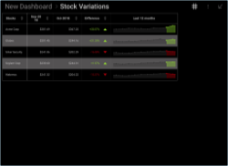
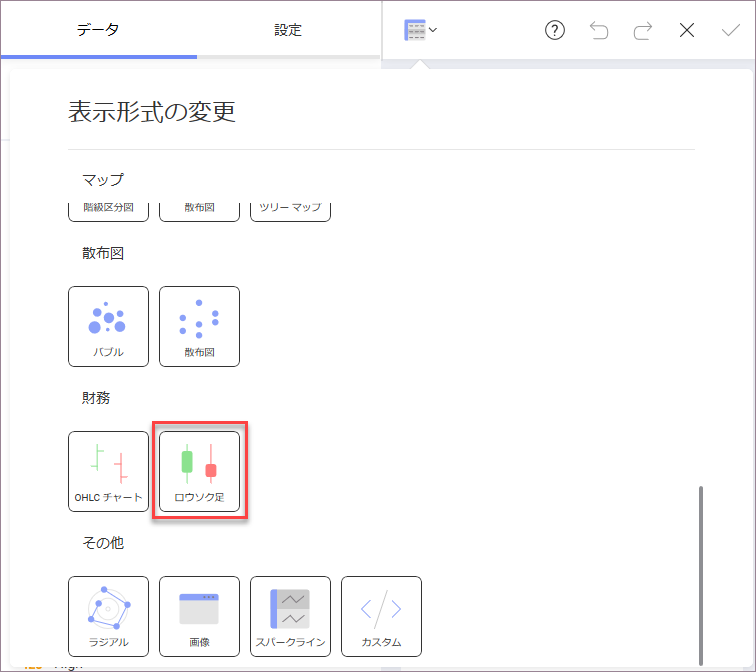
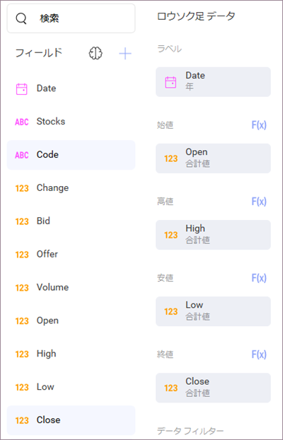

## その他の表示形式の追加

ダッシュボードにあるその他すべての表示形式で同じ [サンプル スプレッドシート](http://download.infragistics.com/reportplus/help/samples/Reveal_Dashboard_Tutorials.xlsx)を使用します。

>[!NOTE]
>[データソースを変更する](changing-data-source-visualization.md)場合は、データ ソース名の横にあるオーバーフロー ボタンまたは[新しいデータ ソース](creating-new-datasource.md)を選択する必要があります。表示形式を[複製](~/jp/general/overview.html#view-edit-mode)し、作成時間を短縮することもできます。

このセクションは以下の表示形式について説明します。

<table>
<colgroup>
<col style="width: 33%" />
<col style="width: 33%" />
<col style="width: 33%" />
</colgroup>
<tbody>
<tr class="odd">
<td>
 

<a href="#sis-stock-value-2018">Silver Security Stock Value 2018 (2018 年 Silver Security 株価指数)</a> 

</td>
<td>
 

<a href="#glb-fiscal-monthly">GLB Fiscal (Monthly) NYSE + BATS (Globex 月次会計; ニューヨーク証券取引所 + アドバンストオルタナティブトレーディングシステム) </a> 

</td>
<td>
 

<a href="#forecast-change-bid-offers">Forecast (Chg, Bid & Offers) - 2018 to 2023 (予測 (変動、買注文、売注文) - 2018 年 ～  2023 年</a> 

</td>
</tr>
<tr class="even">
<td>
 

<a href="#stock-variations">Stock Variations (株価の変動)</a> 

</td>
<td>
 

<a href="#stock-volumes">Stock Volumes (株式量)</a> 

</td>
<td></td>
</tr>
</tbody>
</table>

### Silver Security Stock Value 2018 (2018 年 Silver Security 株価指数)

SIS Stock Value 2018 表示形式は、2018 年の Soylent Corp 株の平均値を[テキスト ゲージ](~/jp/visualization-tutaorials/gauge-views.html#create-text-gauge)で表示します。この場合、変更されるのは選択したフィルターのみであるため、最初の手順で作成された最初の表示形式を複製できます。

1.  「Globex Stock Value 2018」 表示形式でオーバーフロー ボタンを開き、**[複製]** を選択します。

    

<!-- end list -->

2.  表示形式の名前を変更するには、オーバーフロー ボタンを開き、**[名前の変更]** を選択します。

    

    値を 「Silver Security Stock Value 2018」 に設定します。

    

<!-- end list -->

3.  オーバーフロー ボタンをもう一度選択し、**[編集]** を選択して編集モードに入ります。

    

<!-- end list -->

4.  この表示形式は、**Silver Security Corp** の株価 (2 番目に高い株価) を表示します。表示形式の複製を選択したため、テキスト ゲージに表示される数値は **Globex** に対応します。変更するには、**[データ フィルター]** の **Stocks** フィールドを選択します。次に、**Selected Value** を **Silver Security Corp** に変更し、*Globex の選択を解除します*。

    

    次に, **[フィルターの更新]** を選択します。

完了したら、右上の**ティック アイコン**を選択し、ダッシュボード エディターに戻ります。

### GLB Fiscal (Monthly) NYSE + BATS (Globex 月次会計; ニューヨーク証券取引所 + アドバンストオルタナティブトレーディングシステム)

GLB Fiscal 表示形式は、ニューヨーク証券取引所 (New York Stock Exchange - NYSE) と アドバンストオルタナティブトレーディングシステム (Better Alternative Trading System - BATS) の両方を考慮して、2018 年の Globex 株の価格変動を[ローソク足チャート](~/jp/visualization-tutorials/candlestick-chart.md)で表示します。
以下は作成方法です。

1.  ダッシュボードの右隅にある [+] ボタンを選択し、**Reveal\_Dashboard\_Tutorials** スプレッドシートで **Finance Dashboard** シートを選択します。次に、[データの選択] を選択します。

    

<!-- end list -->

2.  トップ バーのグリッド アイコンを選択し、**表示形式ピッカーを開き**、「ローソク足チャート」を選択します。

    

<!-- end list -->

3.  データ エディターで、**Date** フィールドをデータ エディターの [ラベル] プレースホルダーにドラッグアンドドロップし、**Open** を [始値] に、**High** を [高値] に、**Low** を [安値] に、**Close** を [終値] にドラッグアンドドロップします。

    

<!-- end list -->

4.  デフォルトで、[ラベル]の日付情報は年で表示されます。変更するには、データ エディターの [ラベル] プレースホルダーの **[日付]** を選択し、**[日付の集計]** を **[日]** に変更します。

    

    次に, **[フィールドの更新]** を選択します。

<!-- end list -->

5.  必要に応じて、[始値]、[高値]、[安値]、[終値]の値を選択し**、[小数桁]**を **[0]** に変更して、Y 軸の小数桁を削除できます。

    

    次に, **[フィールドの更新]** を選択します。

<!-- end list -->

6.  表示形式は GLB 株価を表示するため、その特定のオプションを表示するために **Stocks** の**フィルターを導入する**必要があります。**Stocks** を **[データ フィルター]** にドラッグアンドドロップし、**[値の選択]** を選択します。

    

    すべてのオプションをチェック解除し、**Globex** のみを選択します。

    

    次に、**[フィルターの作成]** を選択します。

<!-- end list -->

7.  2018 年の情報のみを表示するには、フィルターを導入する必要があります。これを行うには、**Date** をデータ エディターの **[データ フィルター]** プレースホルダーにドラッグアンドドロップし、**[フィルター タイプ]** で **[ルールによるフィルター]** を選択します。

    

    **[カスタム日付範囲]** ルールを選択し、1 月 1 日から 12 月 3 1日までを入力します。

    

    次に、**[フィルターの作成]** を選択します。

<!-- end list -->

8.  **表示形式のタイトルを 「GLB Fiscal (Monthly) NYSE + BATS」 に変更する**ため、「Finance Dashboard」 の横にある**鉛筆アイコンを選択します。**

完了したら、右上の**ティック アイコン**を選択し、ダッシュボード エディターに戻ります。

### Forecast (Chg, Bid & Offers) - 2018 to 2023 (予測 (変動、買注文、売注文) - 2018 年 ～  2023 年

Forecast 表示形式は、5 年間の株の変動、買注文、売注文を[折れ線チャート](~/jp/visualization-tutorials/simple-charts.md)で表示します。以下は作成方法です。

1.  ダッシュボードの右隅にある [+] ボタンを選択し、**Reveal\_Dashboard\_Tutorials** スプレッドシートで **Finance Dashboard** シートを選択します。次に、*[データの選択]* を選択します。

    

<!-- end list -->

2.  トップ バーのグリッド アイコンを選択し、**表示形式ピッカーを開き**、「折れ線チャート」を選択します。

    

<!-- end list -->

3.  データエ ディターで、**Date** フィールドを [ラベル] に、**Stocks** を [ラベル] の *[階層の追加]* セクションに、**Change**、**Bid**、**Offer** を **[値]** にドラッグアンドドロップします。

    

<!-- end list -->

4.  デフォルトで、[ラベル]の日付情報は年で表示されます。変更するには、データ エディターの [ラベル] プレースホルダーの **[日付]** を選択し、**[日付の集計]** を **[月]** に変更します。

    

    次に, **[フィールドの更新]** を選択します。

<!-- end list -->

5.  Y 軸の小数桁を削除するには、[値] フィールドを選択し、**[小数桁]** を **[0]** に変更します。

    

    次に, **[フィールドの更新]** を選択します。

<!-- end list -->

6.  **表示形式のタイトルを 「Forecast (Chg, Bid & Offers) - 2018 to 2023」 に変更する**ため、「Finance Dashboard」 の横にある**鉛筆アイコンを選択します。**

完了したら、右上の**ティック アイコン**を選択し、ダッシュボード エディターに戻ります。

### Stock Variations (株価の変動)

Stock Variations 表示形式は、12 か月間の株価の変化を[スパークライン チャート](~/jp/visualization-tutorials/sparkline-charts.md)で表示します。以下は作成方法です。

1.  ダッシュボードの右隅にある [+] ボタンを選択し、**Reveal\_Dashboard\_Tutorials** スプレッドシートで **Finance Dashboard** シートを選択します。次に、*[データの選択]* を選択します。

    

<!-- end list -->

2.  トップ バーのグリッド アイコンを選択し、**表示形式ピッカーを開き**、「スパークライン チャート」を選択します。

    

<!-- end list -->

3.  データ エディターで、**Date** フィールドを [日付] に、**Offer** フィールドを **[値]** に、**Stocks** を [カテゴリ] にドラッグアンドドロップします。

    

<!-- end list -->

4.  デフォルトで、**Offer** フィールドは数値として表示されます。通貨として表示するには、フィールドを選択し、**[タイプ]** **を [通貨]** に変更します。

    

    次に, **[フィールドの更新]** を選択します。

<!-- end list -->

5.  **過去 12 か月**のチャートは、デフォルトで折れ線チャートで表示されます。サンプルと一致させるために、代わりにエリア チャートを表示するように設定します。表示形式エディターの **[設定]** メニューに移動し、**[チャート タイプ]** ドロップダウンを開き、**[エリア]** を選択します。

    

<!-- end list -->

6.  **表示形式のタイトルを 「Stock Variations」 に変更する**ため、「Finance Dashboard」 の横にある**鉛筆アイコンを選択します**。

完了したら、右上の**ティック アイコン**を選択し、ダッシュボード エディターに戻ります。

### Stock Volumes (株式量)

Stock Volumes 表示形式は、1 年間の株式数を[リニア ゲージ](~/jp/visualization-tutorials/gauge-views#create-linear-gauge)で表示します。以下は作成方法です。

1.  ダッシュボードの右隅にある [+] ボタンを選択し、**Reveal\_Dashboard\_Tutorials** スプレッドシートで **Finance Dashboard** シートを選択します。次に、*[データの選択]* を選択します。

    

<!-- end list -->

2.  トップ バーのグリッド アイコンを選択し、**表示形式ピッカーを開き**、「スパークライン チャート」を選択します。

    

<!-- end list -->

3.  データ エディターで、**Stocks**フィールドを [ラベル] に、**Volume** をデータ エディターの [値] プレースホルダーにドラッグアンドドロップします。

    

<!-- end list -->

4.  2018 年の情報のみを表示するには、フィルターを導入する必要があります。これを行うには、**Date** をデータ エディターの [データ フィルター] プレースホルダーにドラッグアンドドロップし、**[フィルター タイプ]** で **[ルールによるフィルター]** を選択します。

    

    **[カスタム日付範囲]** ルールを選択し、1 月 1 日から 12 月 3 1日までを入力します。

    

    次に、**[フィルターの作成]** を選択します。

<!-- end list -->

5.  **表示形式のタイトルを「Stock Volumes」に変更する**ため、「Finance Dashboard」の横にある**鉛筆アイコンを選択します**。

完了したら、右上隅の**ティック アイコン**を選択し、ダッシュボード エディターに戻ります。

<a href="finance-applying-theme.md" class="previous">&laquo; 前へ</a>
<a href="finance-saving-dashboard.md" class="next">次へ &raquo;</a>
