## はじめての表示形式に書式を適用

データ エディターのプレース ホルダーにドラッグアンドドロップした生データはデフォルトでは書式設定されません。ドラッグした各フィールドを変更する必要があります。このウィジェットは、最も高い値の株式の 2018 年の平均株価を表示します (この場合、**Globex** になります)。特定のデータを選択するには、追加のフィルターを導入する必要があります。

### 実際の値の集計や書式を変更

表示形式に Soylent Corp の**平均**実際値を表示するには、データ エディターでフィールドを変更する必要があります。**値**プレース ホルダーで **[実際値]** を選択します。次に、[一般] 設定 で **[集計]** を **[平均]** に変更します。

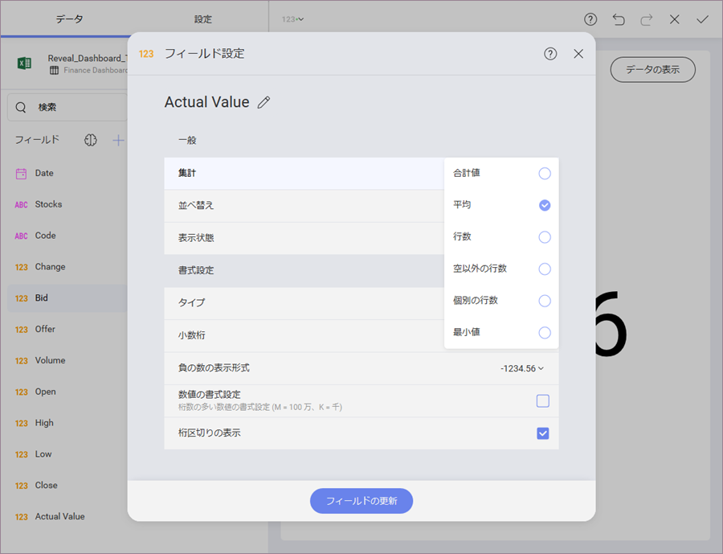

次に、[書式設定] で **[タイプ]** を **[通貨]** に変更します。

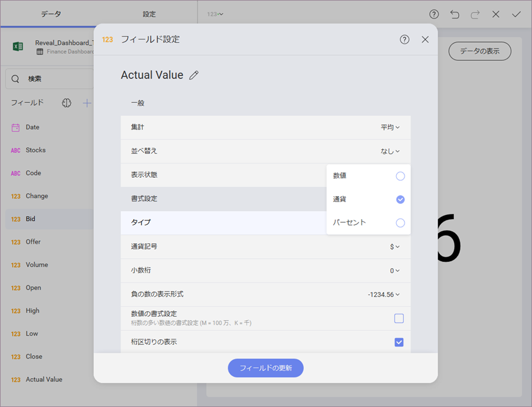

次に、**[フィールドの更新]** を選択します。

### カスタム日付範囲を追加

このウィジェットの場合、日付をフィルタリングし、元のスプレッド シートの完全なデータ範囲ではなく、2018 のみを表示する必要があります。これを行うには、**[日付]** フィールドを **[データ フィルター]** にドラッグアンドドロップし、**[ルールでフィルタリング]** を選択します。

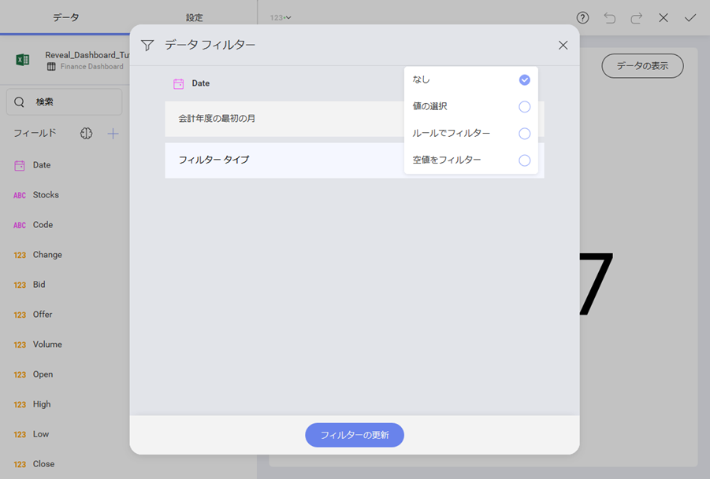

新しい [ルール] メニューで、**[カスタム日付範囲]** を選択します。

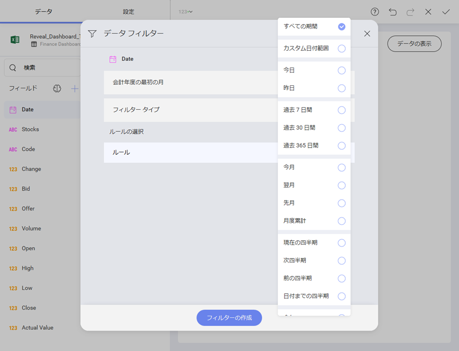

次に、1 月 1 日から 12 月 31 日までを入力し、**[フィルタの作成]** を選択します。

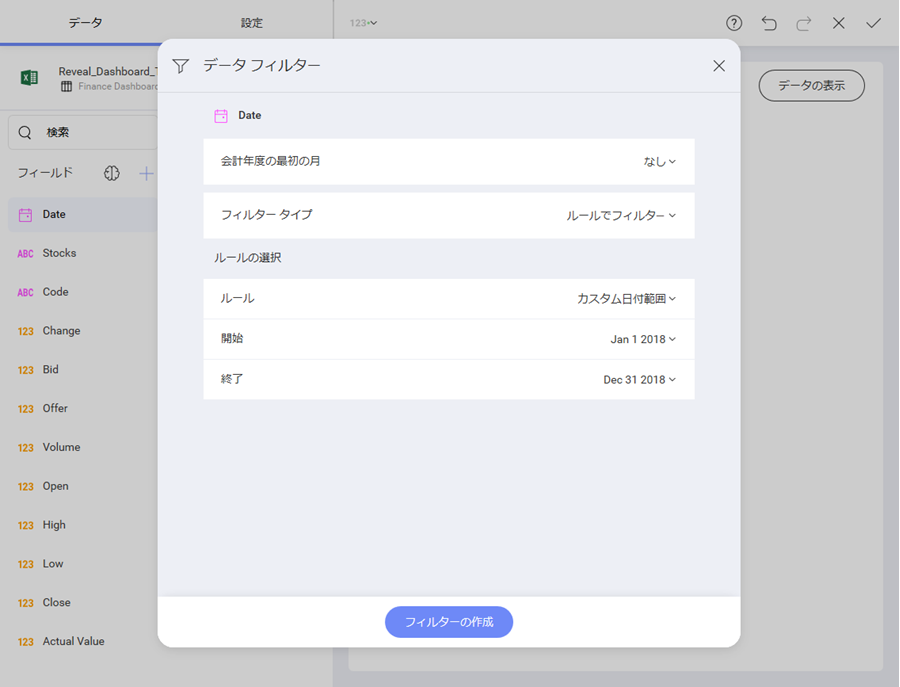

これで、表示形式は下のようになります:

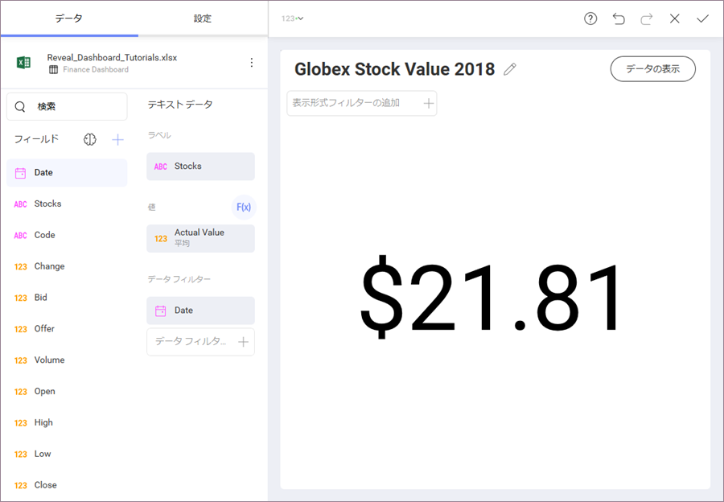

### 最高値の選択

テキスト ゲージはデータの最初の行の値のみを表示しますが、その後ろのデータをフィルターし、必要な特定の行を表示することもできます。以下はこの表示形式のデータです。表示形式の右上隅にある **[データの表示]** ボタンを選択します。

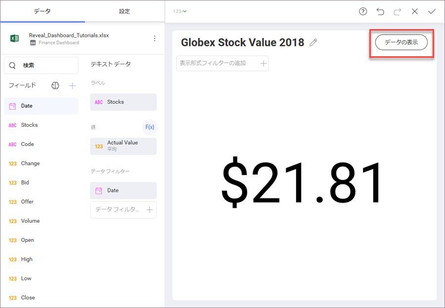

以下のテーブルが表示されます。

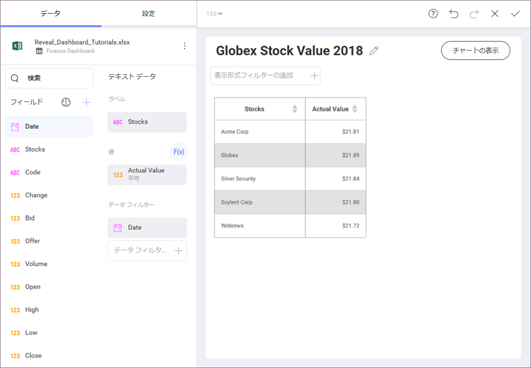

この場合、Globex は平均値が最も高い株です。それを表示するには、追加のフィルターを導入する必要があります。**[株式]** を **[データ フィルター]** にドラッグアンドドロップし、[フィルター タイプ] メニューで **[値の選択]** を選択します。

**Globex** を選択してから、**[フィルターの作成]** を選択します。

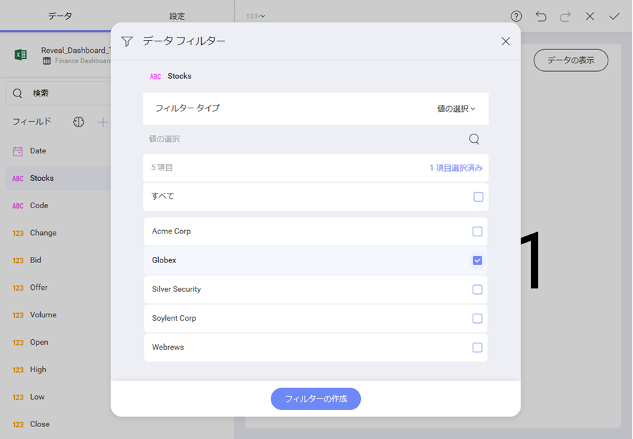

表示形式は以下のようになります。

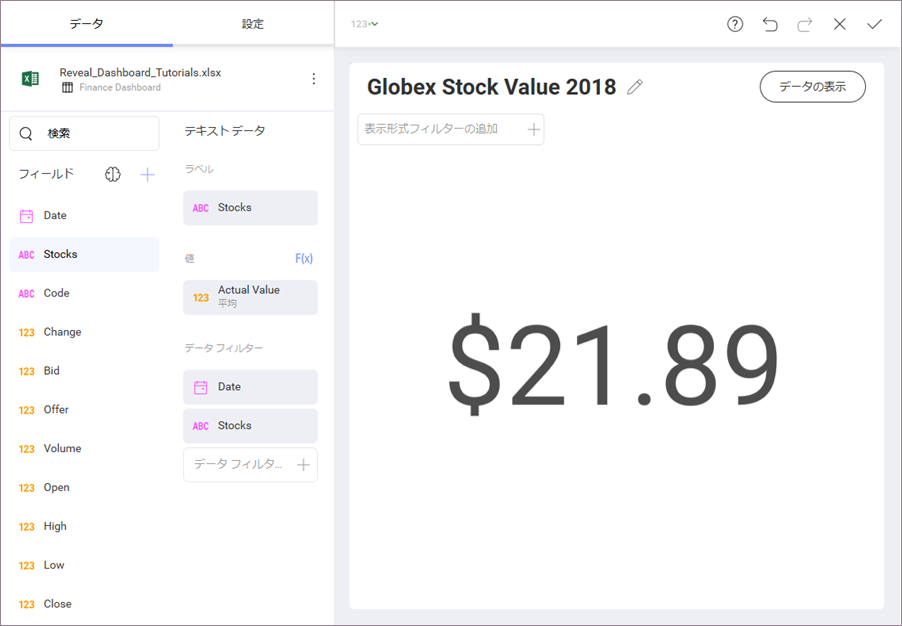

表示形式が正しいデータを表示していることを確認する場合は、右上隅の **[データの表示]** をもう一度選択できます。

株式のリストが長かった場合、最高値を簡単に特定できなかったかもしれません。
値を昇順/降順で並べ替え、より大きなテーブルで役立つようにすることができます。
[Manufacturing Dashboard チュートリアル](~/jp/dashboard-tutorials/manufacturing-dashboard/getting-started.md)の[労働](~/jp/dashboard-tutorials/manufacturing-dashboard/adding-other-visualizations.html#labor-cost)の表示形式には、それを適用する方法の説明があります。

### 条件付き書式設定を追加

色付きのインジケーターの形式で表示形式に追加情報を追加できます。これは、自分で定義できる 3 つの値のデータ範囲で株価がどこにあるかを示します。

表示形式エディターの **[設定]** セクションに移動します。**条件付き書式**セクションが表示されます。このセクションには、デフォルトで次の 3 つの範囲が構成されています。

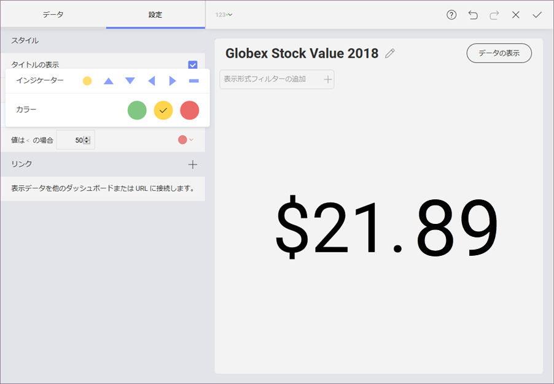

表示形式にインジケーターと色を追加するには、ドロップダウンのいずれかを開きます。
この場合、最高の範囲には緑色の上矢印緑、中程度の範囲には黄色い線、低い範囲には赤色の下矢印を追加します。表示形式が更新され、対応するインジケーターが表示されます。

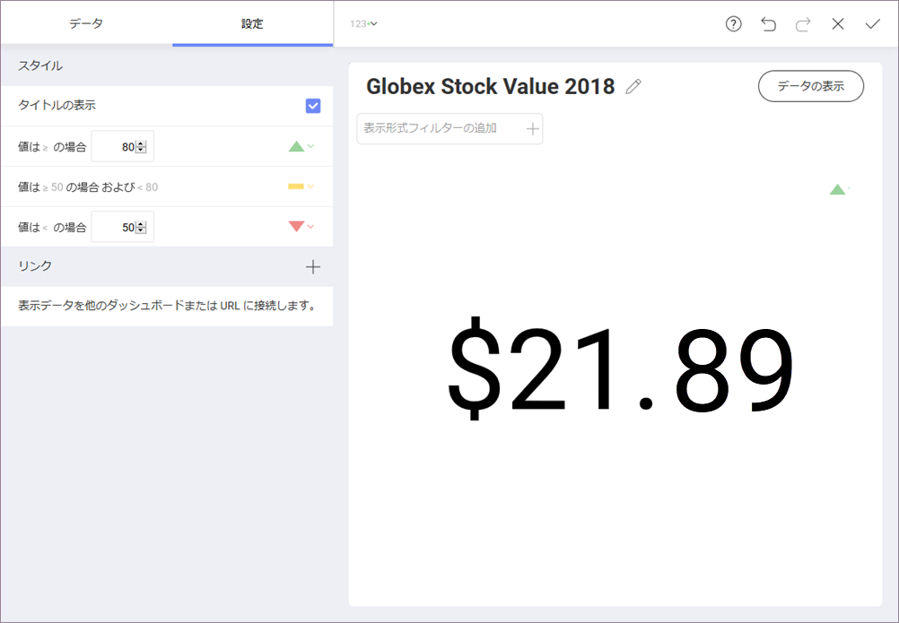

表示形式編集の完了後、右上隅の**ティック ボタン**を選択し、ダッシュボード エディターに戻ります。

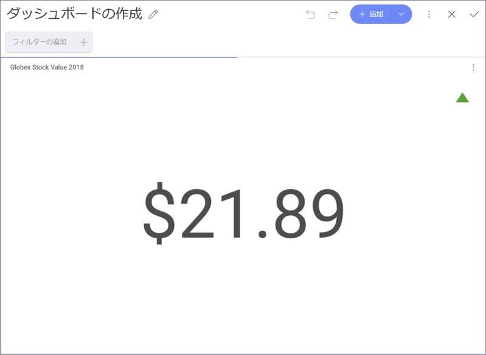

>[!NOTE]
>表示形式を選択し、隅を下または横にドラッグすると、表示形式のサイズを変更できます。

<a href="selecting-data-visualization.md" class="previous">&laquo; 前へ</a>
<a href="applying-theme.md" class="next">次へ &raquo;</a>