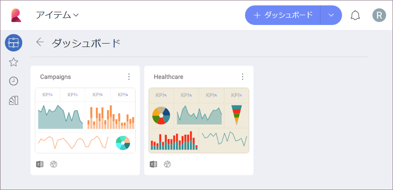
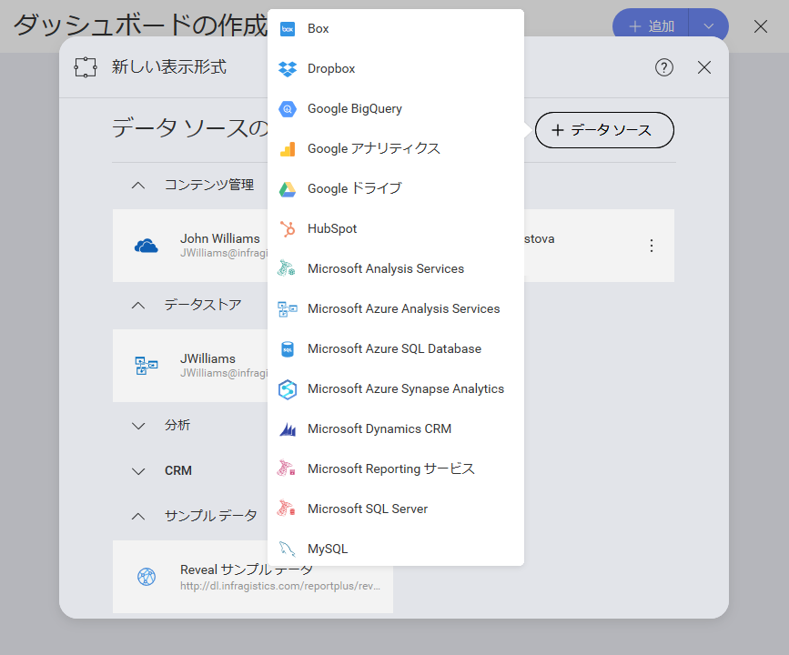
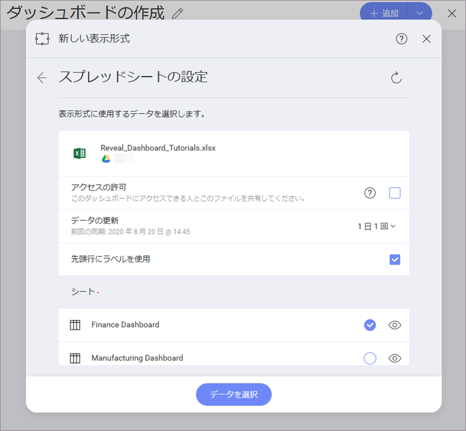

## ダッシュボードを作成してデータソースを追加

新しいダッシュボードを作成するには、初期画面の右上端にある **[+ ダッシュボード]** ボタンを選択し、*新規作成*メニューの **[ダッシュボード]** オプションを選択する必要があります。

### データ ソースを追加する

**[ダッシュボード]** を選択すると、**[新しい表示形式]** 画面が表示されます。
右上隅の [+] 記号を選択してから、[このセクション](getting-started.html#sample-datasheet)で言及されたサンプルデータシートを保存したデータソースを選択します。

>[!NOTE]
>各プロバイダーにデータソースを追加する方法については、[このトピック](~jp/datasources/overview.html)を参照してください。**[表示形式データ]** ダイアログでファイルを選択するときは、必ずサンプル スプレッドシートの **Finance Dashboard** を選択してください。次に、[データの選択] を選択します。

データを読み込んだ後、[グリッド ビュー](~jp/data-visualizations/visualization-types/grid-chart.html)は[表示形式エディター](../../../jp/data-visualizations/visualizations-editor.html)でデフォルトで選択されます。

<a href="getting-started.md" class="previous">&laquo; 前へ</a>
<a href="selecting-data-visualization.md" class="next">次へ &raquo;</a>
