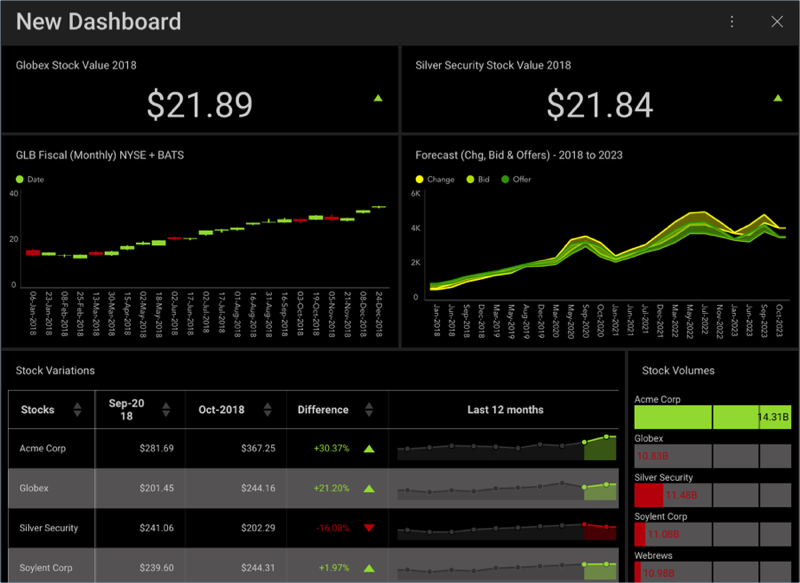

## Finance Dashboard チュートリアル

このチュートリアルでは、サンプル スプレッドシートで同様のデータを使用して作成した以下の Stock Market (Performance) ダッシュボードを表示する方法について説明します。

### ダッシュボードに含まれる項目

このダッシュボードは、例の会社の以下の情報を含みます:

  - 値別上位銘柄と最高値銘柄の YTD 値

  - 4 年間のすべての変更、入札、オファーの予測

  - 株価の変動と利用可能な株の量

<a name='sample-datasheet'>
### サンプル データシート

[ここ](http://download.infragistics.com/reportplus/help/samples/Reveal_Dashboard_Tutorials.xlsx)からサンプル データシートをダウンロードできます。その他すべてのダッシュボード [チュートリアル](dashboard-tutorials/overview.html)で同じサンプル スプレッドシートを使用します。

>[!NOTE]
>このリリースでは、ローカル ファイルとしての Excel ファイルはサポートされていません。チュートリアルを実行するには、[サポートされているクラウド サービス](~/jp/datasources/data-sources.html)のいずれかにファイルをアップロードしてください。

### ステップの概要

1.  [ダッシュボードを作成してデータ ソースを追加](creating-the-dashboard.html)

2.  [初めての表示形式を作成](selecting-data-visualization.html)

3.  [はじめての表示形式に書式を適用](applying-formatting-visualization.html)

4.  [ダッシュボードにテーマを適用](applying-theme.html)

5.  [その他の表示形式の追加](adding-other-visualizations.html) ([Silver Security Stock Value 2018](adding-other-visualizations.html#sis-stock-value-2018)、[GLB Fiscal (Monthly) NYSE + BATS](adding-other-visualizations.html#glb-fiscal-monthly)、[Forecast (Chg, Bid & Offer) - 2018 to 2013](adding-other-visualizations.html#forecast-change-bid-offers)、[Stock Variations](adding-other-visualizations.html#stock-variations)、[Stock Volumes](adding-other-visualizations.html#stock-volumes))

6.  [ダッシュボードの保存](saving-dashboard.html)

[作業の開始 »](creating-the-dashboard.html)
