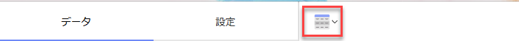
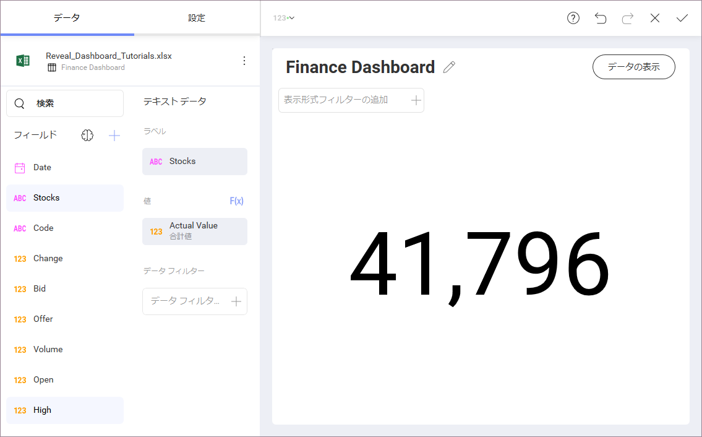
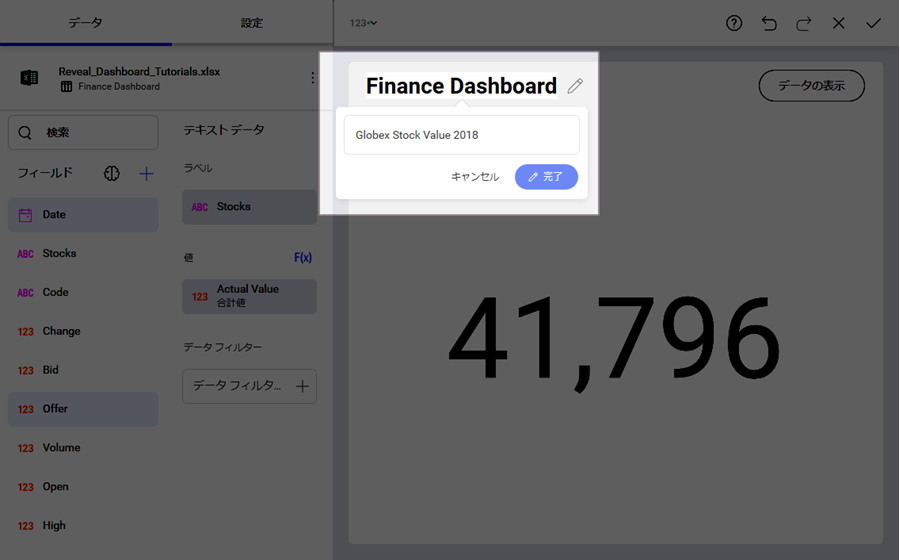
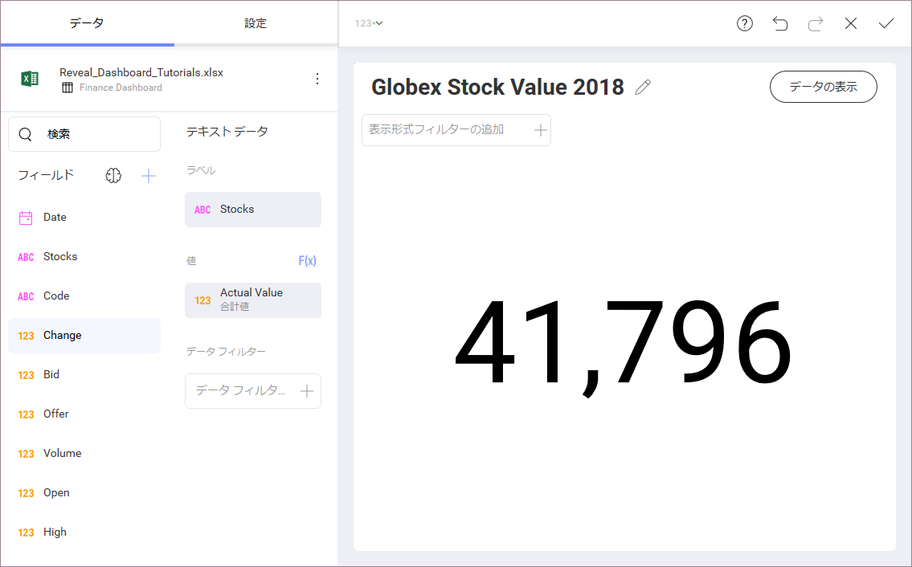

## 初めての表示形式作成 

チュートリアルのはじめの[サンプル ダッシュボード](finance-dashboard-tutorial.html)に Globex Stock Value 2018 表示形式を作成します。表示形式は[テキスト ゲージ](~/en/data-visualizations/gauge-views.html#text-gauge)を表示します。この表示形式は 2 つのフィールドを表示します:

  - 株

  - 実際値

まず、トップ バーのグリッド アイコンを選択し、**表示形式ピッカーを開きます**。

**表示形式を [テキスト ゲージ] に変更します**。

次に、以下の**ドラッグアンドドロップ**の操作を行います。

  - データ エディターの [ラベル] のプレースホルダーに *Stocks* を**ドラッグアンドドロップ**。

  - [値] のプレースホルダーに *Actual Values* をドラッグアンドドロップ。

最後に、Finance Dashboard タイトルの横にある鉛筆アイコンを選択して、**表示形式のタイトルを Globex Stock Value 2018 に変更します**。

表示形式は以下のようになります。

<a href="creating-the-dashboard.md" class="previous">&laquo; 前へ</a>
<a href="applying-formatting-visualization.md" class="next">次へ &raquo;</a>
