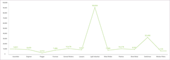
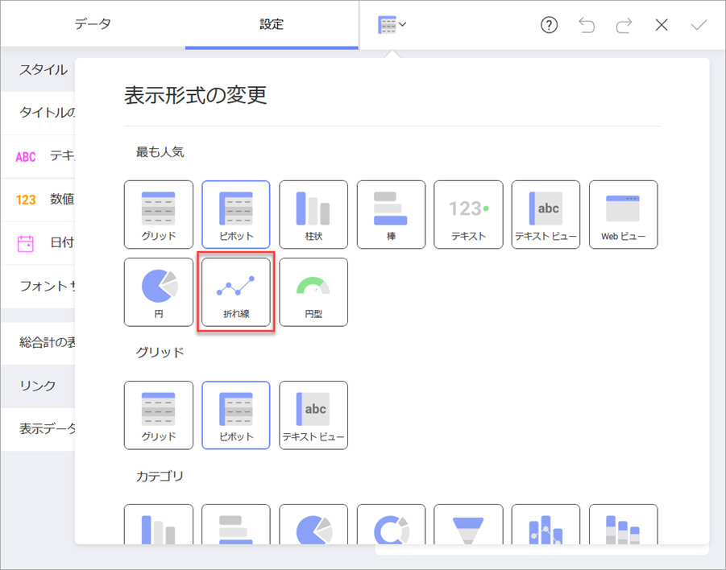
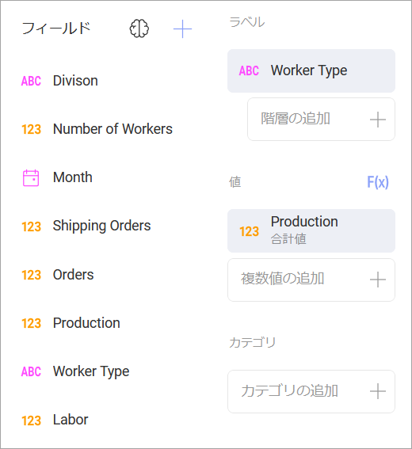
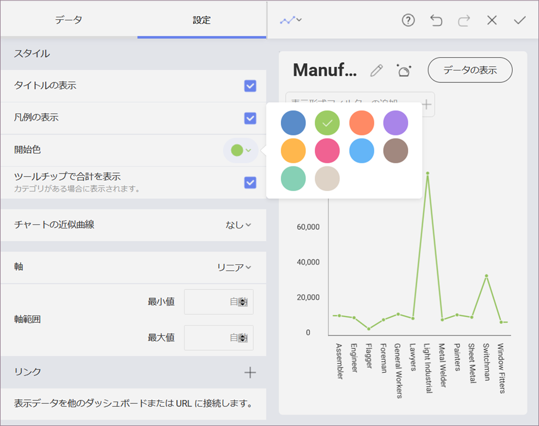
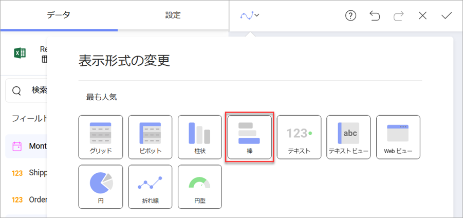

## その他の表示形式の追加

その他すべてのダッシュボードにある表示形式で同じ[サンプル スプレッドシート](http://download.infragistics.com/reportplus/help/samples/Reveal_Dashboard_Tutorials.xlsx)を使用します。

>[!NOTE]
>[データソースを変更する](changing-data-source-visualization.md)場合は、データ ソース名の横にあるオーバーフロー ボタンまたは[新しいデータ ソース](creating-new-datasource.md)を選択する必要があります。表示形式を[複製](overview.html#view-edit-mode)し、作成時間を短縮することもできます。

このセクションは以下の表示形式について説明します。

<table>
<colgroup>
<col style="width: 33%" />
<col style="width: 33%" />
<col style="width: 33%" />
</colgroup>
<tbody>
<tr class="odd">
<td>
 

<a href="#production">Production (製品)</a> 

</td>
<td>
 

<a href="#shipping">Shipping (配送)</a> 

</td>
<td>
 

<a href="#average-hours">Average Hours (平均時間)</a> 

</td>
</tr>
<tr class="even">
<td>
 

<a href="#headcount">Headcount (人数)</a> 

</td>
<td>
 

<a href="#labor-cost">Labor Cost (人件費)</a> 

</td>
<td></td>
</tr>
</tbody>
</table>

### Production (製品)

Production 表示形式は、12 か 月間の製造量を作業者タイプ別に [折れ線チャート](tutorial-simple-charts.md)で表示します。以下は作成方法です。

1.  ダッシュボードの右隅にある [+] ボタンを選択し、**Reveal\_Dashboard\_Tutorials** スプレッドシートで **Manufacturing Dashboard** シートを選択します。次に、*[データの選択]*を選択します。
    
    

2.  トップ バーのグリッド アイコンを選択し、**表示形式ピッカーを開き**、「折れ線チャート」を選択します。
    
    

3.  データ エディターで **[Worker Type]** フィールドを [ラベル] に、**[Production]** フィールドを [値] にドラッグアンドドロップします。
    
    

4.  **[Production]** フィールドには製造された製品の情報があるため、小数桁を削除する必要があります。[値] で **[Production]** を選択し、**[書式設定]** で **[小数桁]** を **[0]** に変更します。
    
    
    
    次に, **フィールドの更新**を選択します。

5.  折れ線チャートをサンプル表示形式の色と一致させるには、表示形式エディターの **[設定]** 画面で **[開始色]** を 5 番目の色に変更します。
    
    

6.  **表示形式のタイトルを 「Production」 に変更する**ため、「Manufacturing Dashboard」 の横にある**鉛筆アイコンを選択します**。

完了したら、右上の**ティック アイコン**を選択し、ダッシュボード エディターに戻ります。

### Shipping (配送)

Shipping 表示形式は、12 か 月間の出荷量を[エリア チャート](~/jp/visualization-tutorials/simple-charts.md)で表示します。以下は作成方法です。

1.  ダッシュボードの右隅にある [+] ボタンを選択し、**Reveal\_Dashboard\_Tutorials** スプレッドシートで **Manufacturing Dashboard** シートを選択します。次に、*[データの選択]*を選択します。
    
    

2.  トップ バーのグリッド アイコンを選択し、**表示形式ピッカーを開き**、「エリア型チャート」を選択します。
    
    

3.  データ エディターで、**[Month]** フィールドを [ラベル] に、**[Shipping Orders]** フィールドを [値] にドラッグアンドドロップします。
    
    

4.  デフォルトでは、情報の日付集計は **[年]** 設定されています。変更するには、**[ラベル]** プレースホルダーの **[日付]** を選択し、**[日付の集計]** を **[月]** に変更します。
    
    
    
    次に, **フィールドの更新**を選択します。

5.  **[Shipping Orders]** フィールドにはクライアントに出荷された製品に関する情報があるため、小数桁を削除する必要があります。[値] で **[Shipping Orders]** を選択し、**[書式設定]** で **[小数桁]** を **[0]** に変更します。
    
    
    
    次に, **フィールドの更新**を選択します。

6.  **表示形式のタイトルを 「Shipping」 に変更する**ため、「Manufacturing Dashboard」 の横にある**鉛筆アイコンを選択します**。

完了したら、右上の**ティック アイコン**を選択し、ダッシュボード エディターに戻ります。

### Average Hours (平均時間)

Average Hours 表示形式では、会社の機械に費やされた時間と、会社の従業員によってログに記録された時間の比較を[スプライン チャート](~/jp/visualization-tutorials/simple-charts.md)で月別に表示します。以下は作成方法です。

1.  ダッシュボードの右隅にある [+] ボタンを選択し、**Reveal\_Dashboard\_Tutorials** スプレッドシートで **Manufacturing Dashboard** シートを選択します。次に、*[データの選択]*を選択します。
    
    

2.  トップ バーのグリッド アイコンを選択し、**表示形式ピッカーを開き**、「エリア型チャート」を選択します。
    
    

3.  データ エディターで、**[Month]** フィールドを [ラベル] に、**[Machine Hours]** フィールドと **[Employee Hours]** フィールドの両方を [値] にドラッグアンドドロップします。
    
    

4.  デフォルトでは、情報の日付集計は **[年]** 設定されています。変更するには、**[ラベル]** プレースホルダーの **[日付]** を選択し、**[日付の集計]** を **[月]** に変更します。
    
    
    
    次に, **フィールドの更新**を選択します。

5.  サンプルの表示形式と一致させるには、[値]　プレースホルダーから **[Average Hours]** と **[Machine Hours]** の*両方*を選択して時間の小数桁を削除し、**[書式設定]** で **[小数桁]** を **[0]** に変更します。
    
    
    
    次に, **フィールドの更新**を選択します。

6.  **表示形式のタイトルを 「Average Hours」 に変更する**ため、「Manufacturing Dashboard」 の横にある**鉛筆アイコンを選択します**。

完了したら、右上の**ティック アイコン**を選択し、ダッシュボード エディターに戻ります。

### Headcount (人数)

Headcount 表示形式はカテゴリごとに分類された従業員の数を[棒チャート](~/jp/visualization-tutorials/simple-charts.md)で表示します。以下は作成方法です。

1.  ダッシュボードの右隅にある [+] ボタンを選択し、**Reveal\_Dashboard\_Tutorials** スプレッドシートで **Manufacturing Dashboard** シートを選択します。次に、*[データの選択]*を選択します。
    
    

2.  トップ バーのグリッド アイコンを選択し、**表示形式ピッカーを開き**、「エリア型チャート」を選択します。
    
    

3.  データ エディターで、**[Division]** フィールドを [ラベル] に、**[Number of Workers]** フィールドを [値] にドラッグアンドドロップします。
    
    

4.  **[Number of Workers]** フィールドには、人に関する情報が含まれているため、小数桁は表示されるべきではありません。それを[値] プレースホルダーから選択し、[**書式設定]** で **[小数桁]** を **[0]** に変更します。
    
    
    
    次に, **フィールドの更新**を選択します。

5.  棒チャートをサンプル表示形式の色と一致させるには、表示形式エディターの **[設定]** 画面で **[開始色]** を 4 番目の色に変更します。
    
    

6.  **表示形式のタイトルを「Headcount」に変更する**ため、「Manufacturing Dashboard」の横にある**鉛筆アイコンを選択します**。

完了したら、右上の**ティック アイコン**を選択し、ダッシュボード エディターに戻ります。

### Labor Cost (人件費)

Labor Cost 表示形式は、各従業員の最高から最低までの賃金を[縦棒チャート](~/jp/visualization-tutorials/simple-charts.md)で表示します。以下は作成方法です。

1.  ダッシュボードの右隅にある [+] ボタンを選択し、**Reveal\_Dashboard\_Tutorials** スプレッドシートで **Manufacturing Dashboard** シートを選択します。次に、*[データの選択]*を選択します。
    
    

2.  トップ バーのグリッド アイコンを選択し、**表示形式ピッカーを開き**、「エリア型チャート」を選択します。
    
    

3.  データ エディターで、**[Employee]** フィールドを [ラベル] に、**[Labor]** フィールドを [値] にドラッグアンドドロップします。
    
    

4.  [Labor] の数値は、小数桁のない通貨として表示するために書式設定する必要があります。これを行うには、[値] プレースホルダーで **[Labor]** フィールドを選択し、以下の変更を適用します。
    
    
    
      - **型**: 通貨
    
      - **小数桁**: 0
        
        また、表示形式は賃金を降順で表示します。同じダイアログで、**[並べ替え]** を [なし] から **[降順]** に変更します。
        
        
        
        次に, **フィールドの更新**を選択します。

5.  縦棒チャートをサンプル表示形式の色と一致させるには、表示形式エディターの **[設定]** 画面で **[開始色]** を 2 番目の色に変更します。
    
    

6.  **表示形式のタイトルを「Labor Cost」に変更する**ため、「Manufacturing Dashboard」の横にある**鉛筆アイコンを選択します**。

完了したら、右上の**ティック アイコン**を選択し、ダッシュボード エディターに戻ります。

<a href="manufacturing-applying-theme.md" class="previous">&laquo; 前へ</a>
<a href="manufacturing-saving-dashboard.md" class="next">次へ &raquo;</a>