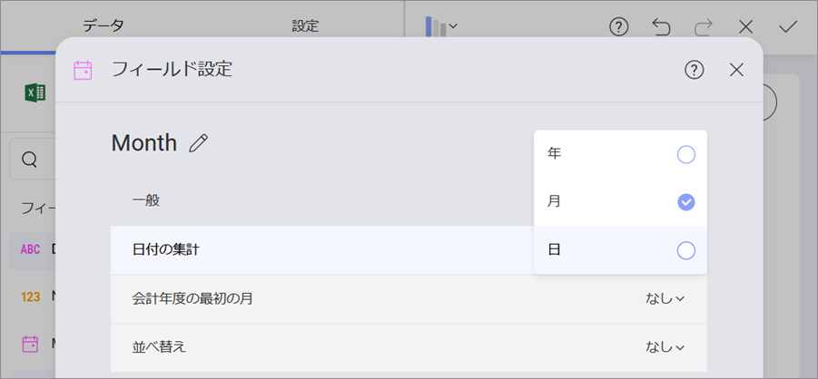

## はじめての表示形式に書式を適用 

データエディターのプレースホルダーへドラッグアンドドロップした生データはデフォルトでは書式設定されません。ドラッグした各フィールドを変更する必要があります。

### 日付の集計

ウィジェットをサンプル ダッシュボードと一致させるには、データ エディターのプレース ホルダーで **[月]** を選択し、[フィールド設定] メニューの **[日付の集計]** を選択する必要があります。

### 注文の書式

Y 軸に分数のない数値を表示するには、データ エディターの値プレース ホルダーにドロップされた **[注文]** フィールドの書式を変更する必要があります。それを選択し、**[フィルド設定]** メニューの **[書式]** で **[小数桁]** を [0] に変更します。

表示形式編集の完了後、右上角の**ティック ボタン**を選択し、ダッシュボード エディターに戻ります。

>NOTE
>表示形式を選択し、角を下または横にドラッグすると、表示形式のサイズを変更できます。

<a href="manufacturing-selecting-data-visualization.md" class="previous">&laquo; 前へ</a>
<a href="manufacturing-applying-theme.md" class="next">次へ &raquo;</a>