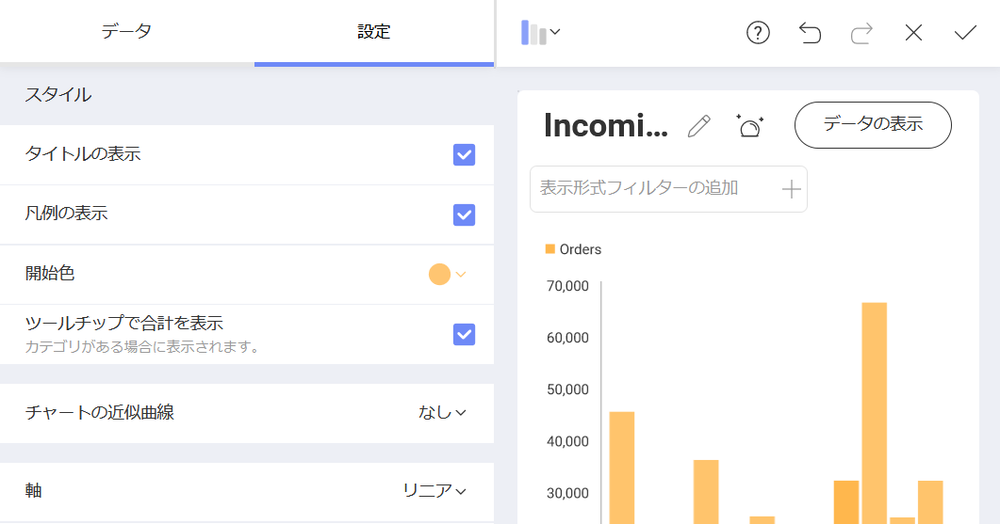

# ダッシュボードにテーマを適用

デフォルトで、**Mountain** テーマはダッシュボードに適用されます。右上隅のオーバーフローにある **[テーマ]** メニューを選択して変更できます。

このサンプルでは、**Ocean** テーマを使用します。ダッシュボード エディターで、**[テーマ]**を選択し、*Ocean テーマ* 項目を選択します。

## 表示形式の開始色を変更

表示形式の色をサンプルウィジェットの色とマッチさせるために、表示形式エディターに移動します。次に、**[設定]** に移動し、**スタート色** を 6 番目に変更します。

表示形式編集の完了後、右上隅の**ティック アイコン**を選択し、ダッシュボード エディターに戻ります。

<a href="applying-formatting-visualization.md" class="previous">&laquo; 前へ</a>
<a href="adding-other-visualizations.md" class="next">次へ &raquo;</a>