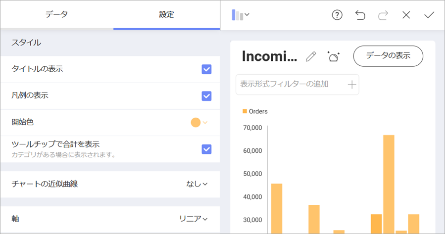

## ダッシュボードにテーマを適用

デフォルトで、**Mountain Theme** テーマはダッシュボードに適用されます。右上角のオーバーフローにある **[テーマ]** メニューを選択して変更できます。

このサンプルでは、**Ocean Theme** テーマを使用します。ダッシュボード エディターで、**[テーマ]**を選択し、*Ocean Theme* 項目を選択します。

### 表示形式の開始色を変更

表示形式の色をサンプルウィジェットの色とマッチさせるために、表示形式エディターへ移動します。 次に、**[設定]** に移動し、**スタート色** を 6 番目に変更します。

表示形式編集の完了後、右上角の**ティック アイコン**を選択し、ダッシュボード エディターに戻ります。 

<a href="manufacturing-applying-formatting-visualization.md" class="previous">&laquo; Previous Step</a>
<a href="manufacturing-adding-other-visualizations.md" class="next">Next Step &raquo;</a>