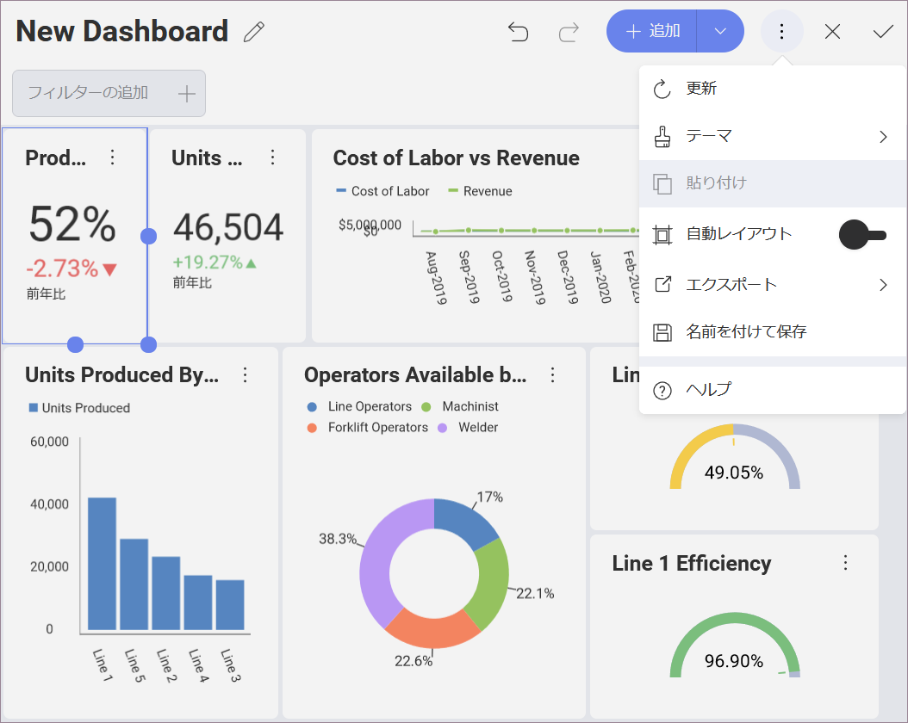

# ダッシュボードの保存 

ダッシュボードの作成後、作業を保存できます。ダッシュボード エディターの右上隅にあるオーバーフロー ボタンの **[名前を付けて保存]** オプションを選択します。

ダッシュボードを個人用スペース (**アイテム**) に保存するか、参加または作成したワークスペースを選択できます。

ダッシュボードの名前を選択し、準備ができた後 **[ここに保存]** をクリック/タップします。

<a href="adding-other-visualizations.md" class="previous">&laquo; 前へ</a>