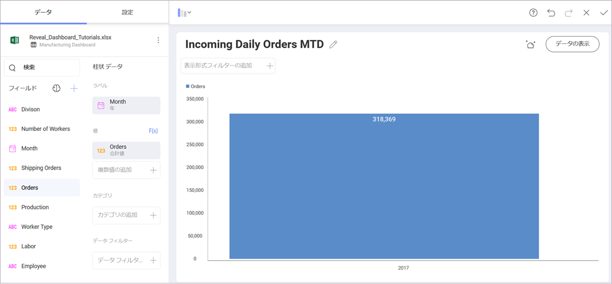

## 初めての表示形式を作成 

チュートリアルのはじめの[サンプル ダッシュボード](manufacturing-dashboard/overview.html)に Incoming Daily Orders MTD 表示形式を作成します。ウィジェットは[柱状チャート](~/en/data-visualizations/category-charts.html)を表示するため、1 つのフィールドを [ラベル] にドロップし、もう 1 つのフィールドを [値] にドロップするだけで済みます。

まず、トップ バーのグリッド アイコンを選択し、**表示形式ペインを開きます**。

**表示形式を [柱状] に変更します**。

次に、**ドラッグアンドドロップ**:

  - *Month* をデータ エディターの [ラベル] のプレースホルダーにドラッグアンドドロップ。

  - *Orders* を [値] のプレースホルダーにドラッグアンドドロップ。

最後に、Manufacturing Dashboard タイトルの横にある鉛筆を選択して、**表示形式のタイトルを Incoming Daily Orders MTD に変更します**。

表示形式は以下のようになります。

<a href="manufacturing-creating-the-dashboard.md" class="previous">&laquo; 前へ</a>
<a href="manufacturing-applying-formatting-visualization.md" class="next">次へ &raquo;</a>
 