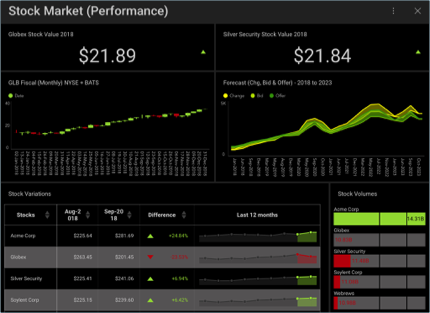
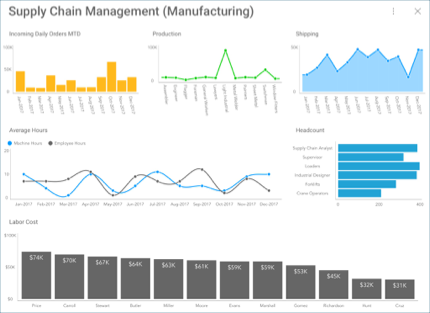
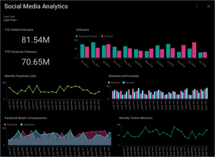

## ダッシュボード チュートリアル

このセクションでは、さまざまな Reveal ダッシュボードの作成方法を説明するチュートリアルがあります。データ表示については、[データ表示](data-visualizations.md)セクションをご覧ください。表示形式またはダッシュボードに適用可能なフィルターの詳細については、[「フィルター」](filters.md)トピックを参照してください。

<table>
<colgroup>
<col style="width: 50%" />
<col style="width: 50%" />
</colgroup>
<tbody>
<tr class="odd">
<td>
 

<a href="finance-dashboard/overview.md">Finance Dashboard</a> 

</td>
<td>
 

<a href="manufacturing-dashboard/overview.md">Manufacturing Dashboard</a> 

</td>
</tr>
<tr class="even">
<td>
 

<a href="sales-dashboard/overview.md">Sales Dashboard</a> 

</td>
<td>
 

<a href="social-dashboard/overview.md">Social Dashboard</a> 

</td>
</tr>
</tbody>
</table>
