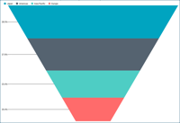
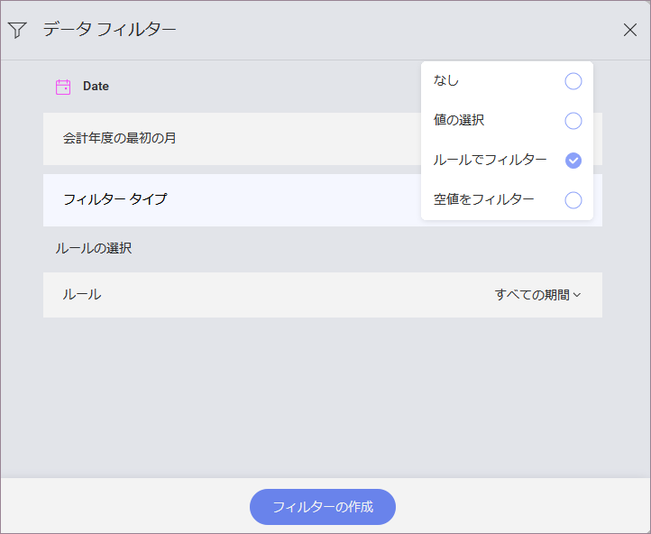
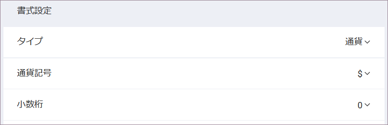
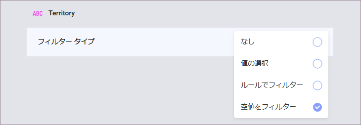
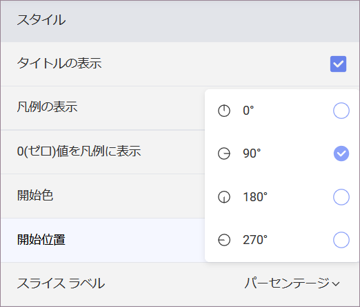

## その他の表示形式の追加 

その他すべてのダッシュボードにある表示形式で同じ[サンプル スプレッドシート](http://download.infragistics.com/reportplus/help/samples/Reveal_Dashboard_Tutorials.xlsx)を使用します。

>[!NOTE]
>[データソースを変更する](changing-data-source-visualization.md)場合は、データ ソース名の横にあるオーバーフロー ボタン、または[新しいデータ ソースを作成する](creating-new-datasource)を選択する必要があります。表示形式を[複製して](overview.md#view-edit-mode)作成時間を短縮することもできます。

このセクションは以下の表示形式について説明します。

<table>
<colgroup>
<col style="width: 25%" />
<col style="width: 25%" />
<col style="width: 25%" />
<col style="width: 25%" />
</colgroup>
<tbody>
<tr class="odd">
<td>
 

<a href="#win-lost-by-month">Win/Lost by Month (月別の勝敗)</a> 

</td>
<td>
 

<a href="#forecasted">Forecasted (予測)</a> 

</td>
<td>
 

<a href="#lost-opportunities">Lost Opportunities (機会損失)</a> 

</td>
<td>
 

<a href="#pipeline-by-territory">Pipeline by Territory (地域別パイプライン)</a> 

</td>
</tr>
<tr class="even">
<td>
 

<a href="#total-opportunities">Total Opportunities (機会の合計)</a> 

</td>
<td>
 

<a href="#revenue-by-territory">Revenue by Territory (地域別収益)</a> 

</td>
<td>
 

<a href="#pipeline-per-employee">Pipeline per Employee (従業員あたりのパイプライン)</a> 

</td>
<td>
 

<a href="#sales-by-product">Sales by Product (製品別売上高)</a> 

</td>
</tr>
</tbody>
</table>

### Win/Lost by Month

Win/Lost by Month 表示形式は、6ヶ月間の勝敗の回数を[棒チャート](~/jp/visualization-tutorials/simple-charts.md)で示します。以下は作成方法です。

1.  ダッシュボードの右隅にある [+] ボタンを選択します。[新しい表示形式] ダイアログで、**Data in Dashboard** セクションにある **Reveal\_Dashboard\_Tutorials** というスプレッドシートを選択します。**Sales Dashboard** オプションが選択されていることを確認し、 **[データを選択]** を押します。
    
    

2.  トップ バーのグリッド アイコンを選択し、**表示形式ピッカーを開き**、柱状チャートを選択します。
    
    

 

3.  データ エディターで、**Date** フィールドを [ラベル] に、**Win** と **Loss** フィールドを [値] にドラッグアンドドロップします。
    
    

 

4.  この表示形式で表示されるデータは、**月別**です。この形式にするには、ラベル プレース ホルダーで **[日付]** を選択し、**[日付の集計]** を **[月]** に変更します。
    
    
    
    次に, **[フィールドの更新]** を選択します。

 

5.  表示形式で 6ヶ月の期間を表示するには、フィルターを追加する必要があります。
    これを行うには、**Date** をデータ フィルターにドロップし、表示形式フィルター メニューにアクセスするために、それを選択します。その中で、**[フィルター タイプ]** の **[ルールでフィルターする]** を選択します。
    
    
    
    次に、**[ルール]** の **[カスタム日付範囲]** を選択し、以下のカスタム範囲を入力します。
    
    
    
    この後、**[フィールドの更新]** を選択します。

 

6.  **表示形式のタイトルを Win/Lost by Month に変更する**ため、Sales Dashboard の横にある**鉛筆アイコンを選択します**。完了したら、右上の**ティック アイコン**を選択し、ダッシュボード エディターに戻ります。

### Forecasted

Forecasted 表示形式は、6ヶ月間の予測を[バー チャート](~/jp/visualization-tutorials/simple-charts.md)で表示します。以下は作成方法です。

1.  ダッシュボードの右隅にある [+] ボタンを選択します。[新しい表示形式] ダイアログで、 **Data in Dashboard** セクションにある **Reveal\_Dashboard\_Tutorials** というスプレッドシートを選択します。**Sales Dashboard** オプションが選択されていることを確認し、 **[データを選択]** を押します。
    
    

 

2.  トップ バーのグリッド アイコンを選択し、**表示形式ピッカーを開き**、棒チャートを選択します。
    
    

 

3.  データ エディターで、**Date** フィールドを [ラベル] に、**Forecasted** フィールドを [値] にドラッグアンドドロップします。
    
    

 

4.  この表示形式で表示されるデータは、**月別**です。
    この形式にするには、ラベル プレース ホルダーで **[日付]** を選択し、**[日付の集計]** を **[月]** に変更します。また、**[並べ替え]** を **[降順]** に変更します。
    
    
    
    次に, **[フィールドの更新]** を選択します。

 

5.  **Forecasted** フィールドにセールス情報が含まれるため通貨の書式設定にする必要があります。[値] で **Forecasted** フィールドを選択し、以下の変更を適用します。
    
    
    
    a.  **[タイプ]** を **[通貨]** に変更します。
    
    b.  **[小数桁]** を **[0]** に変更します。
        次に, **[フィールドの更新]** を選択します。

 

6.  表示形式で 6ヶ月の期間を表示するには、フィルターを追加する必要があります。
    これを行うには、**Date** をデータ フィルターにドロップし、表示形式フィルター メニューにアクセスするために、それを選択します。その中で、**[フィルター タイプ]** の **[ルールでフィルターする]** を選択します。
    
    
    
    次に、**[ルール]** の **[カスタム日付範囲]** を選択し、以下のカスタム範囲を入力します。
    
    
    
    次に、**[フィールドの更新]** を選択します。

 

7.  同じ表示形式サンプルの色にあわせるために、**[設定]** セクションに移動し、3 番目の色に変更します。
    
    

 

8.  **表示形式のタイトルを Forecasted に変更する**ため、Sales Dashboard の横にある**鉛筆アイコンを選択します**。 完了したら、右上の**ティック アイコン**を選択し、ダッシュボード エディターに戻ります。

### Lost Opportunities

Lost Opportunities 表示形式は、[テキスト ゲージ](~/jp/visualization-tutorials/Gauge-Views.md#text-gauge)で機会損失の割合を表示します。以下は作成方法です。

1.  ダッシュボードの右隅にある [+] ボタンを選択します。[新しい表示形式] ダイアログで、 **Data in Dashboard** セクションにある **Reveal\_Dashboard\_Tutorials** というスプレッドシートを選択します。**Sales Dashboard** オプションが選択されていることを確認し、 **[データを選択]** を押します。
    
    

 

2.  トップ バーのグリッド アイコンを選択し、**表示形式ピッカーを開き**、テキスト ゲージを選択します。
    
    

 

3.  データ エディターで、**Lost Opportunites** フィールドを [値] にドラッグアンドドロップします。
    
    

 

4.  サンプル ダッシュボードで、機会損失はパーセンテージとして表されます。
    この書式を適用するには、値プレース ホルダーの Lost Opportunies フィールドを選択します。書式設定のメニューで:
    
    
    
    a.  **[タイプ]** を **[パーセント]** に変更します。
    
    b.  **[小数桁]** を **[0]** に変更します。次に, **[フィールドの更新]** を選択します。

サンプルの黄色のダッシュ インジケーターは、前回と比較して数値が安定していることを表します。このマーカーは、ゲージ設定のバンドの構成で作成します。以下は追加方法です。

1.  表示形式エディターの **[設定]** タブへ移動します。
    
    

 

2.  Sales Dashboard のスプレッド シートでは、表示形式がパーセンテージで表されている場合でも、Lost Opportunities は値として 0.56 に相当します。したがって、**[値比較タイプ]** へスクロールし、[数] に設定します。
    
    

 

3.  **しきい値を設定する**。この場合、バインドは 0.7～5 です。
    
    

 

4.  各バンドを選択し、**[色] と [インジケーター] の両方を選択します**。
    
    

 

5. **表示形式のタイトルを Lost Opportunities に変更する**ため、Sales Dashboard の横にある**鉛筆アイコンを選択します**。 完了したら、右上の**ティック アイコン**を選択し、ダッシュボード エディターに戻ります。

### Pipeline by Territory

Pipeline by Territory 表示形式は、[ファンネルチャート](~/jp/visualization-tutorials/simple-charts.md)平均的な販売見込みとそれらの位置を表示します。以下は作成方法です。

1.  ダッシュボードの右隅にある [+] ボタンを選択します。[新しい表示形式] ダイアログで、**Data in Dashboard** セクションにある **Reveal\_Dashboard\_Tutorials** というスプレッドシートを選択します。 **Sales Dashboard** オプションが選択されていることを確認し、 **[データを選択]** を押します。
    
    

 

2.  トップ バーのグリッド アイコンを選択し、**表示形式ピッカーを開き**、ファンネルチャートを選択します。
    
    

 

3.  データ エディターで、**Territory** を [ラベル] に、**Pipeline** を [値] にドラッグアンドドロップします。
    
    

 

4.  **Territory** には 4 つの地域しかないため、多くの空の値がありますが、元のデータ ソースの他の列には 1000 を超える値があります。値をフィルタリングするため、**Territory** をデータ フィルターにドラッグアンドドロップします。
    
    
    
    次に、[地域] を選択し、**[表示形式フィルター]** ダイアログにアクセスします。**[フィルター タイプ]** を **[空値をフィルター]** に変更し、[フィルターの作成] を選択します。
    
    

 

5. **表示形式のタイトルを Pipeline by Territory に変更する**ため、Sales
    Dashboard の横にある**鉛筆アイコンを選択します。** 完了したら、右上の**ティック アイコン**を選択し、ダッシュボード エディターに戻ります。完了したら、右上の**ティック アイコン**を選択し、ダッシュボード エディターに戻ります。

### Total Opportunities

Total Opportunities 表示形式は、12 か月間の会社の機会が表すによる収益を
[折れ線チャート](~/jp/visualization-tutorials/simple-charts)で表示します。以下は作成方法です。

1.  ダッシュボードの右隅にある [+] ボタンを選択します。[新しい表示形式] ダイアログで、**Data in Dashboard** セクションにある **Reveal\_Dashboard\_Tutorials** というスプレッドシートを選択します。**Sales Dashboard** オプションが選択されていることを確認し、**[データを選択]** を押します。
    
    

 

2.  トップ バーのグリッド アイコンを選択し、**表示形式ピッカーを開き**、折れ線チャートを選択します。
    
    

 

3.  データ エディターで、**Date** をラベルに、**Total Opportunities** を [値] にドラッグアンドドロップします。
    
    

 

4.  この表示形式で表示されるデータは、**月別**です。この形式にするには、ラベル プレース ホルダーで **[日付]** を選択し、**[日付の集計]** を **[月]** に変更します。
    
    
    
    次に, **[フィールドの更新]** を選択します。

 

5.  **Total Opportunities** フィールドにセールス情報が含まれるため通貨で書式設定する必要があります。[値] の **Total Opportunities** フィールドを選択し、次の変更を適用します。
    
    
    
    1.  **[タイプ]** を **[通貨]** に変更します。
    
    2.  **[小数桁]** を **[0]** に変更します。
        
        次に, **[フィールドの更新]** を選択します。

 

6.  表示形式で 12 ヶ月の期間を表示するには、フィルターを追加する必要があります。
    これを行うには、**Date** をデータ フィルターにドロップし、表示形式フィルター メニューにアクセスするために、それを選択します。その中で、**[フィルター タイプ]** の **[ルールでフィルターする]** を選択します。
    
    
    
    次に、**[ルール]** の **[カスタム日付範囲]** を選択し、以下のカスタム範囲を入力します。
    
    
    
    次に, **[フィルターの更新]** を選択します。

 

7.  同じ表示形式サンプルの色にあわせるために、**[設定]** セクションに移動し、7 番目の色に変更します。
    
    

 

8.  **表示形式のタイトルを Total Opportunities に変更する**ため、Sales Dashboard の横にある**鉛筆アイコンを選択します**。 完了したら、右上の**ティック アイコン**を選択し、ダッシュボード エディターに戻ります。

### Revenue by Territory

Revenue by Territory 表示形式には、会社の各地域における収益を[円チャート](~/jp/visualization-tutorials/simple-charts.md)で表示されます。以下は作成方法です。

1.  ダッシュボードの右隅にある [+] ボタンを選択します。[新しい表示形式] ダイアログで、**Data in Dashboard** セクションにある **Reveal\_Dashboard\_Tutorials** というスプレッドシートを選択します。**Sales Dashboard** オプションが選択されていることを確認し、 **[データを選択]** を押します。
    
    

 

2.  トップ バーのグリッド アイコンを選択し、**表示形式ピッカーを開き**、円チャートを選択します。
    
    

 

3.  データ エディターで、**Territory** を [ラベル] に、**Sales Territory** を [値] にドラッグアンドドロップします。
    
    

 

4.  サンプルの表示形式では、円チャートの開始位置が異なります。
    開始位置を変更するには、表示形式エディターの **[設定]** タブに移動し、**[開始位置]** を **[90°]** に変更します。
    
    

 

5.  **表示形式のタイトルを Revenue by Territory に変更する**ため、Sales Dashboard の横にある**鉛筆アイコンを選択します。** 完了したら、右上の**ティック アイコン**を選択し、ダッシュボード エディターに戻ります。

### Pipeline per Employee

Pipeline per Employee 表示形式は、従業員別の上位 10 位までの販売見込みを[柱状チャート](~/jp/visualization-tutorials/simple-charts.md)で示します。以下は作成方法です。

1.  ダッシュボードの右隅にある [+] ボタンを選択します。[新しい表示形式] ダイアログで、**Data in Dashboard** セクションにある **Reveal\_Dashboard\_Tutorials** というスプレッドシートを選択します。**Sales Dashboard** オプションが選択されていることを確認し、 **[データを選択]** を押します。
    
    

 

2.  トップ バーのグリッド アイコンを選択し、**表示形式ピッカーを開き**、縦棒チャートを選択します。
    
    

 

3.  データ エディターで、**Employee** を [ラベル] に、**Pipeline** を [値] にドラッグアンドドロップします。
    
    

 

4.  **Pipeline** の値は売り上げ見込みを参照するため、通貨で書式設定する必要があります。[値] で **Pipeline** フィールドを選択し、次の変更を適用します。
    
    
    
    1.  **[タイプ]** を **[通貨]** に変更します。
    
    2.  **[小数桁]**を **[0]** に変更します。
        
        次に、**[フィールドの更新]** を選択します。

 

5.  この表示形式は 見込み客のトップ 10 を表示するため、フィルターが必要です。
    これを行うには、**[データ フィルターの追加]** を選択し、リストの一番下までスクロールします。集計された **Pipeline** フィールドを選択します。
    
    
    
    次に、**[ルール]** の下の **[トップ アイテム]** を選択し、**10** と入力します。
    
    
    
    [フィルターを作成] を選択し、変更を適用します。

 

6.  同じ表示形式サンプルの色にあわせるために、**[設定]** セクションに移動し、5 番目の色に変更します。
    
    

 

7.  **表示形式のタイトルを Pipeline by Employee に変更する**ため、Sales Dashboard の横にある**鉛筆アイコンを選択します。** 完了したら、右上の**ティック アイコン**を選択し、ダッシュボード エディターに戻ります。

### Sales by Product

Sales by Product 表示形式は、さまざまな会社の製品とそれぞれの売上げの割合を[ドーナツ型チャート](~/jp/visualization-tutorials/simple-charts.md)で表示します。以下は作成方法です。

1.  ダッシュボードの右隅にある [+] ボタンを選択します。[新しい表示形式] ダイアログで、**Data in Dashboard** セクションにある **Reveal\_Dashboard\_Tutorials** というスプレッドシートを選択します。**Sales Dashboard** オプションが選択されていることを確認し、 **[データを選択]** を押します。
    
    

 

2.  トップ バーのグリッド アイコンを選択し、**表示形式ピッカーを開き**、円チャートを選択します。
    
    

 

3.  データ エディターで、**Product** を [ラベル] に、**Sales Product** を [値] にドラッグアンドドロップします。
    
    

 

4.  サンプルの表示形式では、円チャートの開始位置が異なります。開始位置を変更するには、表示形式エディターの **[設定]** タブに移動し、**[開始位置]** を **[90°]** に変更します。
    
    

 

5.  **表示形式のタイトルを Pipeline by Employee に変更する**ため、Sales Dashboard の横にある**鉛筆アイコンを選択します**。完了したら、右上の**ティック アイコン**を選択し、ダッシュボード エディターに戻ります。

<a href="sales-applying-theme.md" class="previous">&laquo; 前へ</a>
<a href="sales-saving-dashboard.md" class="next">次へ &raquo;</a>