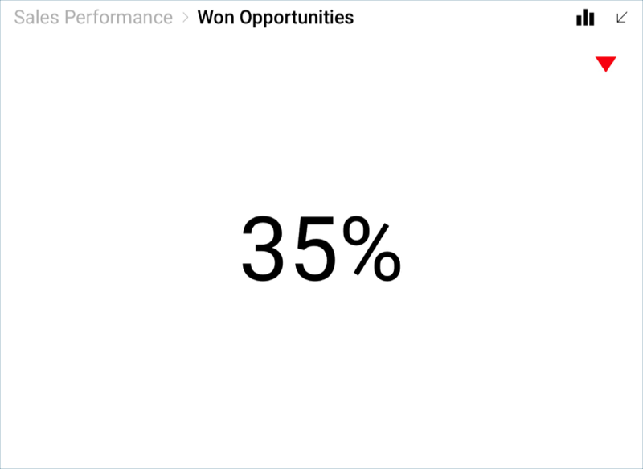
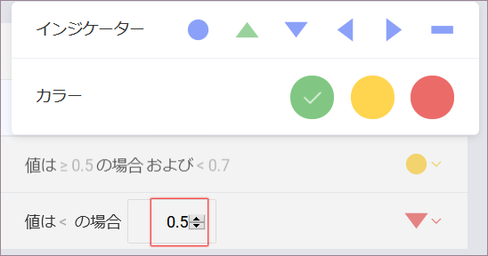

## はじめての表示形式に書式を適用

データエディターのプレースホルダーにドラッグアンドドロップした生データはデフォルトでは書式設定されません。ドラッグした各フィールドを変更する必要があります。

### 機会をパーセンテージで書式設定して小数桁を削除

サンプル ダッシュボードに獲得した機会がパーセンテージで表示されます。
以下はこの書式に合わせる方法です。

1.  データ エディターの値プレースホルダーで **Won Opportunities** フィールドを選択します。

2.  書式設定のメニューに:

    

    1.  **タイプ**を**パーセント** に変更します。

    2.  **小数桁**を **0** に変更します。

次に、**フィールドの更新**を選択します。

### 赤インジケーターの追加

サンプル ダッシュボードの **Won Opportunities** 表示形式に表示される赤矢印のインジケーターは、受注済商談が減少していることを示します。このマーカーは、ゲージ設定の[バンド構成](~/jp/data-visualizations/visualization-types/gauge-charts.html#bands-configuration)で作成します。

下は構成する方法です:

1.  表示形式エディターの **[設定]** タブに移動します。

    

2.  [セールス ダッシュボード] のスプレッド シートでは、表示形式がパーセンテージで表されている場合でも、「受注済商談」は値として 0.35 に相当します。したがって、**値比較タイプ**へスクロールし、[数]に設定します。

    

3.  **範囲を設定する**。この場合、範囲は 0.7～0.5 です。

    

4.  各バンドを選択し、**色とインジケーターの両方を選択します**。デフォルトで、最高値は緑に、最低値は赤に設定されます。

    

表示形式編集の完了後、右上隅の**ティック ボタン**を選択し、ダッシュボード エディターに戻ります。

>[!NOTE]
>表示形式を選択し、隅を下または横にドラッグすると、表示形式のサイズを変更できます。

<a href="selecting-data-visualization.md" class="previous">&laquo; 前へ</a>
<a href="applying-theme.md" class="next">次へ &raquo;</a>
