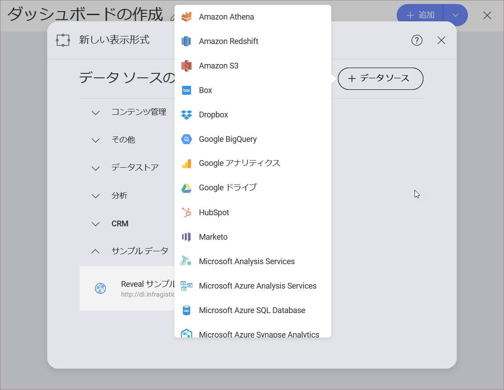
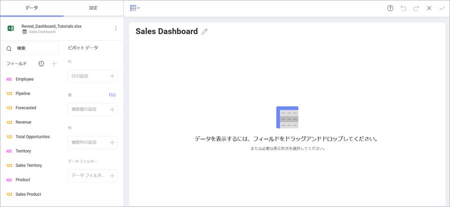

## ダッシュボードを作成してデータソースを追加  

新しいダッシュボードを作成するには、初期画面の右上端にある **[+ダッシュボード]** ボタンを選択し、*新規作成*メニューの **[ダッシュボード]** オプションを選択する必要があります。

### データ ソースを追加する

**[ダッシュボード]** を選択すると、**[新しい表示形式]** 画面が表示されます。
右上隅の [+] 記号を選択してから、[このセクション](Finance-Dashboard-Tutorial.html#sample-datasheet)で言及されたサンプル データシートを保存したデータソースを選択します。

>[!NOTE]
>各プロバイダーにデータソースを追加する方法については、[このトピック](~/jp/datasources/data-sources.md)を参照してください。

**[表示形式データ]** ダイアログでファイルを選択するときは、必ずサンプル スプレッドシートの **[Sales Dashboard]** シートを選択してください。次に、[データの選択] を選択します。

データを読み込んだ後、[グリッド ビュー](~/jp/data-visualizations/grid-view.md)は[表示形式エディター](~/jp/data-visualizations/visualizations-editor.md)でデフォルトで選択されます。

<a href="sales-dashboard-tutorial.md" class="previous">&laquo; Sales Dashboard</a>
<a href="sales-selecting-data-visualization.md" class="next">次へ &raquo;</a>
