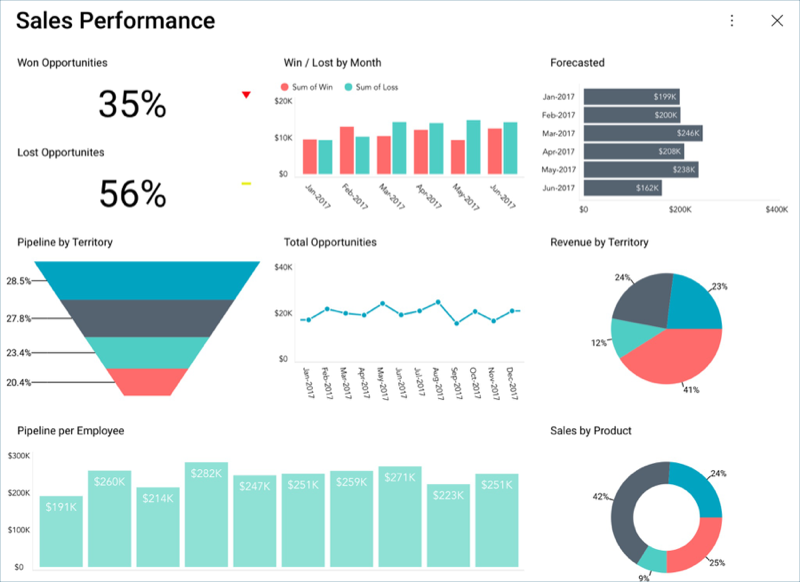

## Sales Dashboard チュートリアル

このチュートリアルでは、サンプル スプレッドシートで同様のデータを使用して作成した以下の Sales Performance ダッシュボードを表示する方法について説明します。

### ダッシュボードに含まれる項目

このダッシュボードは、サンプル企業の以下の情報を含みます:

  - チームと地域の現在の販売実績

  - 販売目標未達成と達成した製品ライン

  - Win/Loss メトリックス

### サンプル データシート

[ここ](http://download.infragistics.com/reportplus/help/samples/Reveal_Dashboard_Tutorials.xlsx)からサンプル データシートをダウンロードできます。その他すべてのダッシュボード [チュートリアル](../../../jp/dashboard-tutorials/overview.html)で同じサンプル スプレッドシートを使用します。

>[!NOTE]
>このリリースでは、ローカル ファイルとしての Excel ファイルはサポートされていません。チュートリアルを実行するには、[サポートされているクラウド サービス](../../../jp/datasources/overview.html)のいずれかにファイルをアップロードしてください。

### ステップの概要

1.  [ダッシュボードを作成してデータ ソースを追加](creating-the-dashboard.html)

2.  [初めての表示形式を作成](selecting-data-visualization.html)

3.  [はじめての表示形式に書式を適用](applying-formatting-visualization.html)

4.  [ダッシュボードにテーマを適用](applying-theme.html)

5.  [その他表示形式の追加](adding-other-visualizations.html) ([Win/Lost by Month](adding-other-visualizations.html#win-lost-by-month)、
[Forecasted](adding-other-visualizations#forecasted)、[Lost Opportunities](adding-other-visualizations.html#lost-opportunities)、[Pipeline by Territory](adding-other-visualizations.html#pipeline-by-territory)、[Total Opportunities](adding-other-visualizations.html#total-opportunities)、[Revenue by Territory](adding-other-visualizations.html#revenue-by-territory)、[Pipeline per Employee](adding-other-visualizations.html#pipeline-per-employee)、[Sales by Product](adding-other-visualizations.html#by-product))

6.  [ダッシュボードの保存](saving-dashboard.html)

<a href="creating-the-dashboard.md" class="next">作業の開始 &raquo;</a>