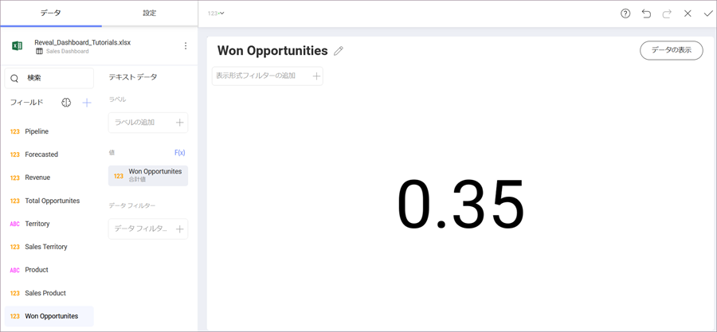

# 初めての表示形式を作成

チュートリアルのはじめの[サンプル ダッシュボード](getting-started.md)に Won Opportunities 表示形式を作成します。表示形式は[テキスト ゲージ](~/jp/data-visualizations/visualization-types/gauge-charts.html#text-gauge)を表示します。

まず、トップ バーのグリッド アイコンを選択し、**表示形式ピッカーを開きます**。

**表示形式を [テキストゲージ] に変更します**。

次に、データ エディターの [値] プレースホルダーへ **Won Opportunities** フィールドを**ドラッグアンドドロップします**。

最後に、Sales Dashboard タイトルの横にある鉛筆アイコンを選択して、**表示形式のタイトルを Won Opportunities に変更します**。

表示形式は以下のようになります。

<a href="creating-the-dashboard.md" class="previous">&laquo; 前へ</a>
<a href="applying-formatting-visualization.md" class="next">次へ &raquo;</a>
