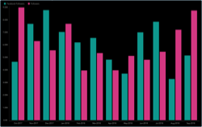
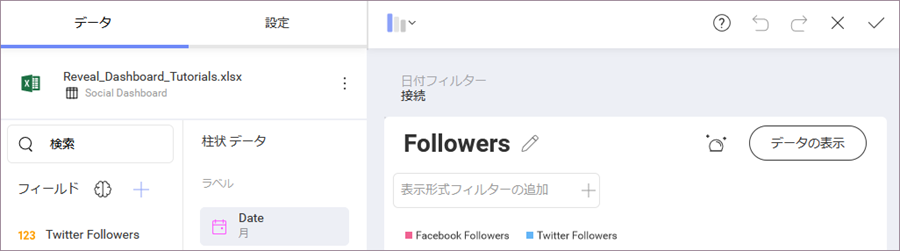
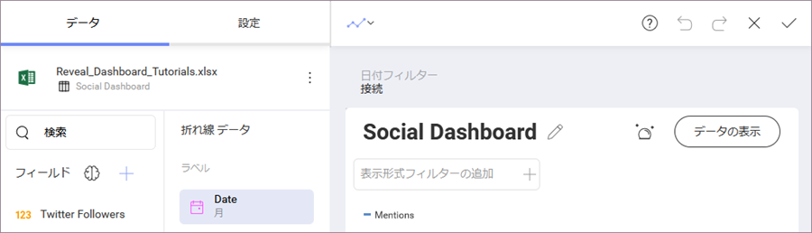

## その他の表示形式を追加する 

ダッシュボードにあるその他すべての表示形式で同じ[サンプル スプレッドシート](http://download.infragistics.com/reportplus/help/samples/Reveal_Dashboard_Tutorials.xlsx)を使用します。

NOTE

[データソースを変更する](~/jp/datasources/changing-data-source-visualization.html)場合は、データ ソース名の横にある**オーバーフロー ボタン**または [新しいデータ ソース](~/jp/datasources/creating-new-datasource.html)を選択する必要があります。表示形式を [複製し](../../general/overview.md#view-edit-mode)、作成時間を短縮することもできます。

このセクションは以下の表示形式について説明します。

<table>
<colgroup>
<col style="width: 33%" />
<col style="width: 33%" />
<col style="width: 33%" />
</colgroup>
<tbody>
<tr class="odd">
<td>
 

<a href="#followers">Followers (フォロワー)</a> 

</td>
<td>
 

<a href="#ytd-facebook-followers">YTD Facebook Followers (YTD Facebook フォロワー )</a> 

</td>
<td>
 

<a href="#monthly-facebook-likes">月ごとの Facebook いいね!</a> 

</td>
</tr>
<tr class="even">
<td>
 

<a href="#retweets-favorites">Retweets &amp; Favorites (リツイート & お気に入り)</a> 

</td>
<td>
 

<a href="#facebook-reach-impressions">Facebook Reach vs. Impressions (Facebook リーチ vs. インプレッション数)</a> 

</td>
<td>
 

<a href="#monthly-twitter-mentions">Monthly Twitter Mentions (月ごとの Twitter メンション )</a> 

</td>
</tr>
</tbody>
</table>

### Followers

Followers 表示形式はソーシャル メディア チャネルごとに分類されたフォロワーの数を[柱状チャート](~/jp/visualization-tutorials/simple-charts.html)で表示します。以下は作成方法です。

1.  ダッシュボードの右隅にある [+] ボタンを選択します。[新しい表示形式] ダイアログで、**Data inDashboard** セクションにある **Reveal\_Dashboard\_Tutorials** というスプレッドシートを選択します。**Social Dashboard** オプションが選択されていることを確認し、 **[データを選択]** を押します。
    
    

2.  トップ バーのグリッド アイコンを選択し、**表示形式ピッカーを開き**、柱状チャートを選択します。
    
    

3.  データ エディターで、**Date** フィールドをラベルに、**Facebook Followers** と **Twitter Followers** フィールドを値にドラッグアンドドロップしします。
    
    

4.  デフォルトでは、Facebook と Twitter の両方のフォロワー数が小数第 2 位まで表されます。これを変更するには、**データ エディターで [フィールド] を選択し**、**[書式設定]** で両方のフィールドの **[小数の桁]** を **[0]** に変更します。
    
    

5.  サンプル フォロワーの表示形式では、日付は月として表示されています。
    ラベルの **[日付]** フィールドを選択し、**[日付の集計]** を **[月]** に設定します。次に, **[フィールドの更新]** を選択します。
    
    

6.  **[日付フィルター]** で **[接続]** を選択し、表示形式を既存のダッシュボード フィルターに接続します。このメニューは、Social Dashboard の上にあります。
    
    

7.  **表示形式のタイトルを Followers に変更する**ため、Social Dashboard の横にある**鉛筆アイコンを選択します**。 完了したら、右上の**ティック アイコン**を選択し、ダッシュボード エディターに戻ります。

### YTD Facebook Followers

YTD Facebook Followers 表示形式は、[テキスト ゲージ](~/jp/visualization-tutorials/gauge-views.md#createtextgauge)でそのソーシャル メディア チャネルのフォロワー数を示します。以下は作成方法です。

1.  ダッシュボードの右隅にある [+] ボタンを選択します。[新しい表示形式] ダイアログで、**Data inDashboard** セクションにある **Reveal\_Dashboard\_Tutorials** というスプレッドシートを選択します。**Social Dashboard** オプションが選択されていることを確認し、 **[データを選択]** を押します。
    
    

2.  トップ バーのグリッド アイコンを選択し、**表示形式ピッカーを開き**、テキストを選択します。
    
    

3.  データエディターで、**Facebook Followers** フィールドを値プレースホルダにドラッグアンドドロップします。
    
    

4.  **[日付フィルター]** で **[接続]** を選択し、表示形式を既存のダッシュボード フィルターに接続します。このメニューは、ソーシャル ダッシュボードの上にあります。
    
    

5.  **表示形式のタイトルを YTD Facebook Followers に変更する**ため、 Social Dashboard の横にある**鉛筆アイコンを選択します**。 完了したら、右上の**ティック アイコン**を選択し、ダッシュボード エディターに戻ります。

### Monthly Facebook Likes

Monthly Facebook Likes 表示形式は、[折れ線チャート](~/jp/visualization-tutorials/simple-charts.html)で会社の月ごとの Facebook の「いいね」数を示します。以下は作成方法です。

1.  ダッシュボードの右隅にある [+] ボタンを選択します。[新しい表示形式] ダイアログで、**Data inDashboard** セクションにある **Reveal\_Dashboard\_Tutorials** というスプレッドシートを選択します。**Social Dashboard** オプションが選択されていることを確認し、 **[データを選択]** を押します。
    
    

2.  トップ バーのグリッド アイコンを選択し、**表示形式ピッカーを開き**、折れ線チャートを選択します。
    
    

3.  データ エディターで、**Date** フィールドを [ラベル] にドラッグアンドドロップし、**Likes** をデータ エディターの [値] プレースホルダーにドラッグアンドドロップします。
    
    

4.  月ごとの Facebook いいね! のサンプル表示形式では、日付は月として表示されます。ラベルの **[日付]** フィールドを選択し、**[日付の集計]** を **[月]** に設定します。次に, **[フィールドの更新]** を選択します。
    
    

5.  デフォルトで、いいね! は小数第 2 位まで表されます。これを変更するには、**[データ エディター] で [フィールド] を選択し**、**[書式設定]** で両方のフィールドの **[小数の桁]** を **[0]** に変更します。
    
    

6.  同じ表示形式サンプルの色にマッチするために、**[開始色]** を **[表示形式設定] ペイン**で 4 番目の色に設定します。
    
    

7.  **[日付フィルター]** で **[接続]** を選択し、表示形式を既存のダッシュボード フィルターに接続します。このメニューは、ソーシャル ダッシュボードの上にあります。
    
    

8.  **表示形式のタイトルを Monthly Facebook Likes に変更する**ため、Social Dashboard の横にある**鉛筆アイコンを選択します**。完了したら、右上の**ティック アイコン**を選択し、ダッシュボード エディターに戻ります。

### Retweets &amp; Favorites

Retweets &amp; Favorites の表示形式は[柱状チャート](~/jp/visualization-tutorials/simple-charts.html)で会社の月ごとの Twitter のリツイート&; お気に入り数を示します。以下は作成方法です。

1.  ダッシュボードの右隅にある [+] ボタンを選択します。新しい表示形式ダイアログで、**Data inDashboard** セクションにある **Reveal\_Dashboard\_Tutorials** というスプレッドシートを選択します。**Social Dashboard** オプションが選択されていることを確認し、 **[データを選択]** を押します。
    
    

2.  トップ バーのグリッド アイコンを選択し、**表示形式ピッカーを開き**、柱状チャートを選択します。
    
    

3.  データ エディターで、**Date** フィールドを [ラベル] に、**Retweets** と **Favorites** フィールドを [値] にドラッグアンドドロップします。
    
    

4.  リツイート＆お気に入りのサンプル表示形式では、日付は月として表示されます。ラベルの **[日付]** フィールドを選択し、**[日付の集計]** を **[月]** に設定します。次に, **[フィールドの更新]** を選択します。
    
    

5.  デフォルトで、リツイート＆お気に入りはで小数第2位まで表示されます。これを変更するには、[データ エディター] で [フィールド] を選択し、**[書式設定]** で両方のフィールドの **[小数の桁]** を **[0]** に変更します。
    
    

6.  同じ表示形式サンプルの色にあわせるために、**[設定]** セクションに移動し、開始色を 6 番目の色に変更します。
    
    

7.  **[日付フィルター]** で **[接続]** を選択し、表示形式を既存のダッシュボード フィルターに接続します。このメニューは、Social Dashboard の上にあります。
    
    

8.  **表示形式のタイトルを Retweets &amp; Favorites に変更する**ため、Social Dashboard の横にある**鉛筆アイコンを選択します**。 完了したら、右上の**ティック アイコン**を選択し、ダッシュボード エディターに戻ります。

### Facebook Reach vs. Impressions

Facebook Reach vs. Impressions の数表示形式は[エリア チャート](~/jp/visualization-tutorials/simple-charts.html)で会社の Facebook のリーチ vs. インプレッション数を示します。以下は作成方法です。

1.  ダッシュボードの右隅にある [+] ボタンを選択します。[新しい表示形式] ダイアログで、**Data inDashboard** セクションにある **Reveal\_Dashboard\_Tutorials** というスプレッドシートを選択します。**Social Dashboard** オプションが選択されていることを確認し、 **[データを選択]** を押します。
    
    

2.  トップ バーのグリッド アイコンを選択し、**表示形式ピッカーを開き**、エリア型チャートを選択します。
    
    

3.  [データ エディター] で、**Date** フィールドを [ラベル] に、**Post Reach** と **Impressions** をデータ エディターの [値] プレースホルダーにドラッグアンドドロップします。
    
    

4.  Facebook リーチ vs. インプレションのサンプル表示形式では、日付は月として表示されます。ラベルの **[日付]** フィールドを選択し、**[日付の集計]** を **[月]** に設定します。次に, **[フィールドの更新]** を選択します。
    
    

5.  デフォルトでは、ポスト リーチ vs. インプレションは小数第 2 位まで表示されます。これを変更するには、**[データ エディター] で [フィールド] を選択し**、**[書式設定]** で両方のフィールドの **[小数の桁]** を **[0]** に変更します。
    
    

6.  **[日付フィルター]** で **[接続]** を選択し、表示形式を既存のダッシュボード フィルターに接続します。このメニューは、Social Dashboard の上にあります。
    
    

7.  **表示形式のタイトルを Facebook Reach vs. Impressions に変更する**ため、Social Dashboard の横にある**鉛筆アイコンを選択します。**

完了したら、右上の**ティック アイコン**を選択し、ダッシュボード エディターに戻ります。

### Monthly Twitter Mentions

Monthly Twitter Mentions の表示形式は、[折れ線チャート](~/jp/visualization-tutorials/simple-charts.html)で会社の Twitter のメンション数を示します。以下は作成方法です。

1.  ダッシュボードの右隅にある [+] ボタンを選択します。[新しい表示形式] ダイアログで、**Data inDashboard** セクションにある **Reveal\_Dashboard\_Tutorials** というスプレッドシートを選択します。**Social Dashboard** オプションが選択されていることを確認し、 **[データを選択]** を押します。
    
    

2.  トップ バーのグリッド アイコンを選択し、**表示形式ピッカーを開き**、折れ線チャートを選択します。
    
    

3.  データ エディターで、**Date** フィールドを [ラベル] に、**Mentions** をデータ エディターの [値] プレースホルダーにドラッグアンドドロップします。月ごと Twitter メンションのサンプル表示形式では、日付は月として表示されます。
    
    

4.  ラベルの **[日付]** フィールドを選択し、**[日付の集計]** を **[月]** に設定します。次に、**[フィールドの更新]** を選択します。
    
    

5.  デフォルトで、メンションは小数第 2 位まで表示されます。これを変更するには、**[データ エディター] で [フィールド] を選択し**、**[書式設定]** で両方のフィールドの **[小数の桁]** を **[0]** に変更します。
    
    

6.  **[日付フィルター]** で **[接続]** を選択し、表示形式を既存のダッシュボード フィルターに接続します。このメニューは、Social Dashboard の上にあります。
    
    

7.  **表示形式のタイトルを Monthly Twitter Mentions に変更する**ため、Social Dashboard の横にある**鉛筆アイコンを選択します**。 完了したら、右上の**ティック アイコン**を選択し、ダッシュボード エディターに戻ります。

<a href="social-applying-theme.md" class="previous">&laquo; 前へ</a>
<a href="social-saving-dashboard.md" class="next">次へ &raquo;</a>