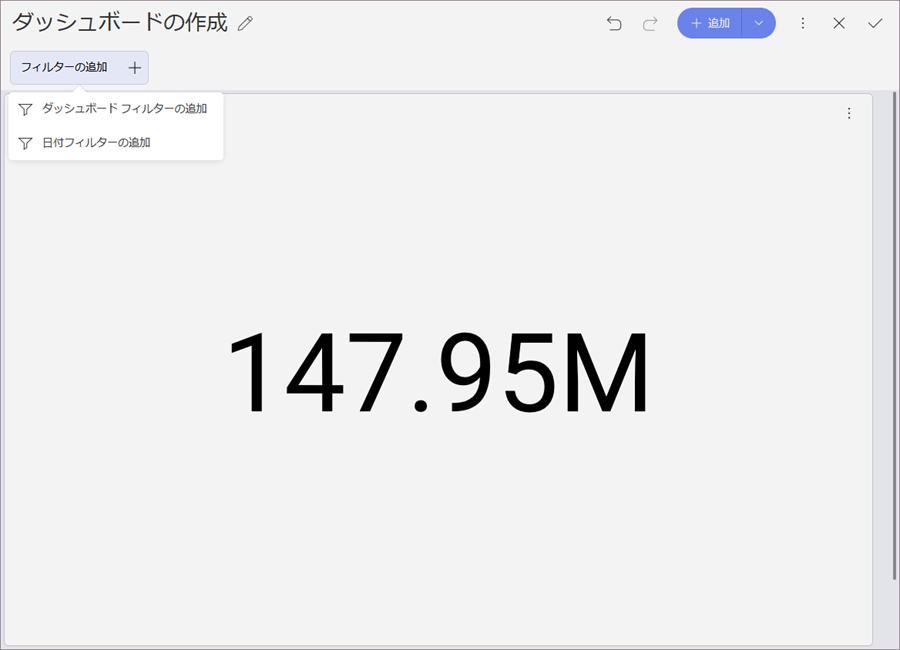
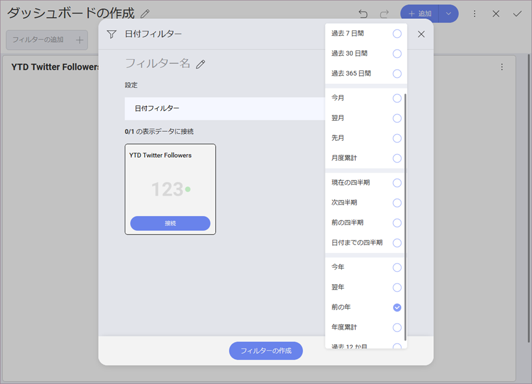
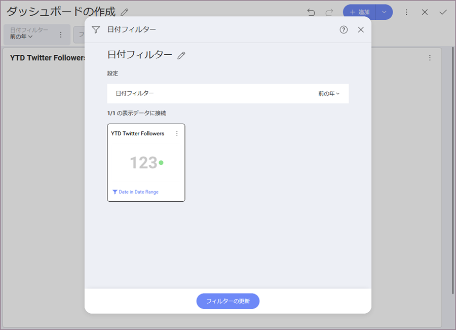
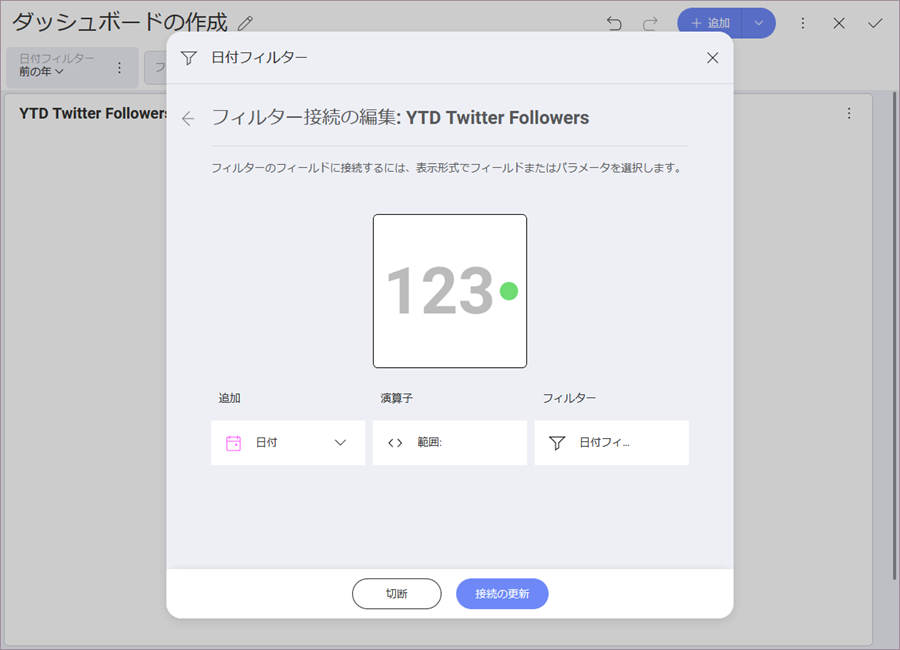
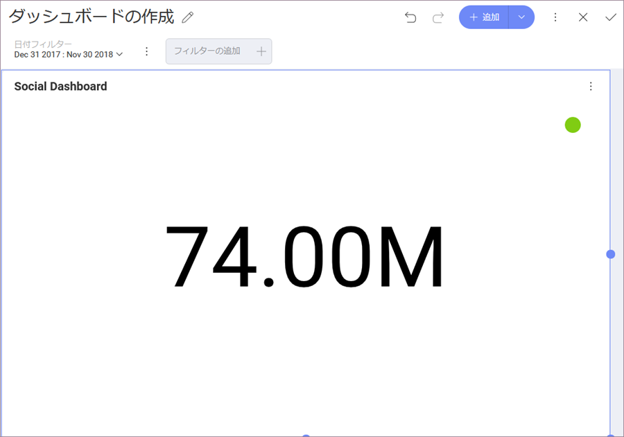

## ダッシュボード フィルターの作成と表示形式の接続 

[このチュートリアルの最初のページ](social-dashboard-tutorial.html)に表示されるダッシュボードは、[日付範囲ダッシュボード フィルター](date-range-filter.html)に接続されます。これらのフィルターは、時系列のシナリオ分析を可能にします。すべての表示形式へ接続するとダッシュボード全体を動的にフィルターできます。

フィルターの作成方法:

1.  ダッシュボード名の下の **[フィルターの追加]** ボタンをクリックし、**[日付フィルターの追加]** をクリックします。
    
    

2.  **[日付フィルター]** の下の **[前の年]** を選択します。
    
    

日付フィルターを作成したら、それを既存の表示形式に接続する必要があります。以下は変更手順です。

1.  **YTD Twitter Followers** 表示形式の **[接続]** ボタンを選択します。Reveal は、ダッシュボード フィルターを表示形式のフィールドに接続しようとします。
    
    
    
    **[日付フィルター]** を選択すると、必要に応じて接続を編集できます。
    
    

2.  **[バインディングの更新]** を選択します。

表示形式は以下のようになります。

<a href="social-selecting-data-visualization.md" class="previous">&laquo; 前へ</a>
<a href="social-applying-theme.md" class="next">次へ &raquo;</a>