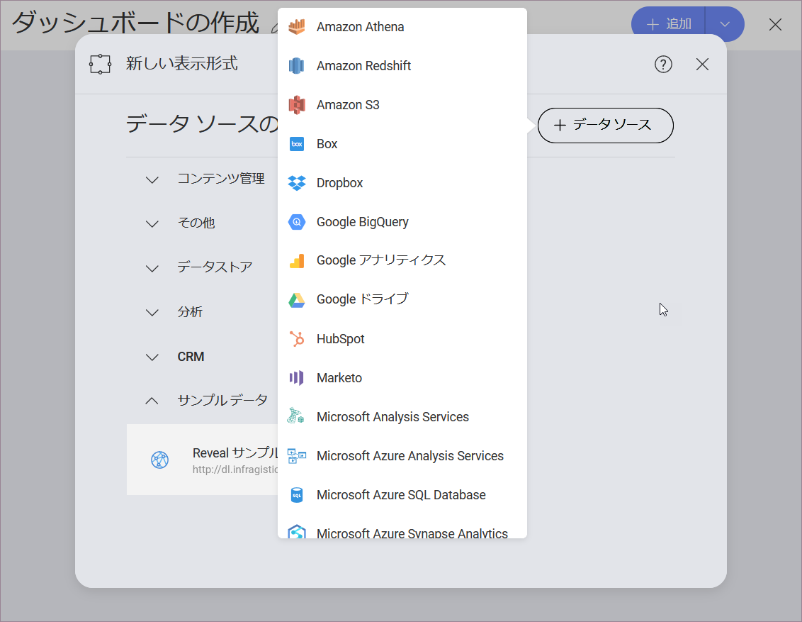

## ダッシュボードを作成してデータソースを追加

新しいダッシュボードを作成するには、初期画面の右上端にある **[+ダッシュボード] ボタンを選択し、*新規作成*メニューの **[ダッシュボード]** オプションを選択する必要があります。**

### データ ソースを追加する

**[ダッシュボード]** を選択すると、**[新しい表示形式]** 画面が表示されます。
右上隅の [+] 記号を選択してから、[このセクション](~/jp/dashboard-tutorials/finance-dashboard/index.html#sample-datasheet)で言及されたサンプル データシートを保存したデータソースを選択します。

>[!NOTE]
>各プロバイダーにデータソースを追加する方法については、[このトピック](~/jp/datasources/data-sources.html)を参照してください。

**[表示形式データ]**ダイアログでファイルを選択するときは、必ずサンプル スプレッドシートの **[Social Dashboard]** シートを選択してください。
次に、[データの選択] を選択します。

データを読み込んだ後、[グリッド ビュー](~/jp/data-visualizations/grid-view.html)は[表示形式エディター](~/jp/data-visualizations/visualizations-editor.html)でデフォルトで選択されます。

 

<a href="social-dashboard-tutorial.md" class="previous">&laquo; Social Dashboard</a>
<a href="social-selecting-data-visualization.md" class="next">次へ &raquo;</a>

