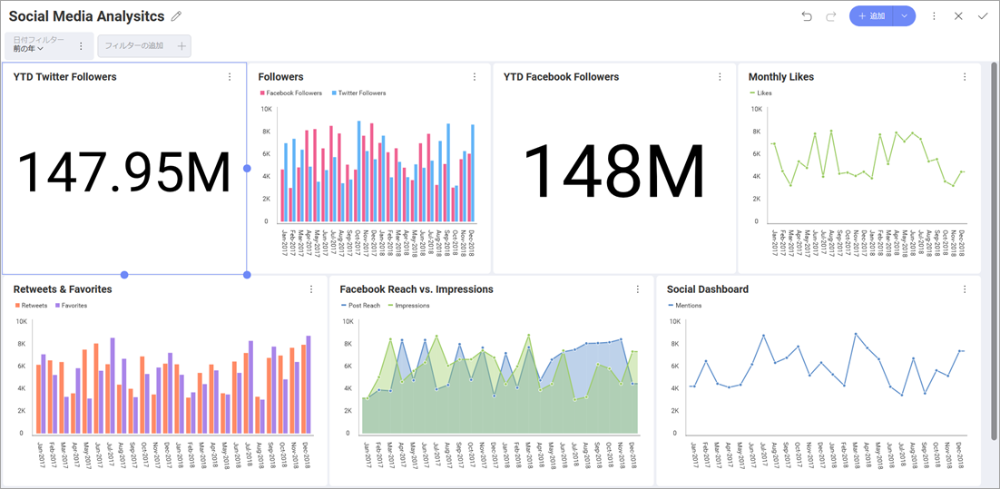

## Social Dashboard チュートリアル

このチュートリアルでは、同様のデータを含むサンプル スプレッドシートを使用して作成した、以下の ソーシャル メディア分析ダッシュボドを表示する方法について説明します。

### ダッシュボードに含まれる項目

このダッシュボードは、サンプル企業の以下の情報を含みます:

  - ソーシャル メディア プラットフォーム別に分類されたフォロワー

  - いいね!、お気に入り、顧客リーチ

  - メンションとリツイート

### サンプル データシート

[ここ](http://download.infragistics.com/reportplus/help/samples/Reveal_Dashboard_Tutorials.xlsx)からサンプル データシートをダウンロードできます。その他すべてのダッシュボード [チュートリアル](~/jp/dashboard-tutorials/overview.md)で同じサンプル スプレッドシートを使用します。

>[!NOTE]
このリリースでは、ローカル ファイルとしての Excel ファイルはサポートされていません。チュートリアルを実行するには、[サポートされているクラウド サービス](~/jp/datasources/data-sources.md)のいずれかにファイルをアップロードしてください。

### ステップの概要

1.  [ダッシュボードを作成してデータ ソースを追加](creating-the-dashboard.md)

2.  [初めての表示形式を作成](selecting-data-visualization.md)

3.  [ダッシュボード フィルターの作成と表示形式の接続](creating-dashboard-filter-connecting-visualization.md)

4.  [ダッシュボードにテーマを適用](applying-theme.md)

5.  [その他の表示形式の追加](adding-other-visualizations.md) ([フォロワー](adding-other-visualizations.md#followers)、[YTD Facebook フォロワー](adding-other-visualizations#ytd-facebook-followers)、[月ごとの Facebook いいね!](adding-other-visualizations.md#monthly-facebook-likes)、[リツイート& お気に入り](adding-other-visualizations.md#retweets-favorites)、[Facebook リーチ vs. インプレッション数](adding-other-visualizations.md#facebook-reach-impressions)、[月ごとの Twitter メンション数](adding-other-visualizations.md#monthly-twitter-mentions))

6.  [ダッシュボードの保存](saving-dashboard.md)

[作業の開始 »](creating-the-dashboard.md)

