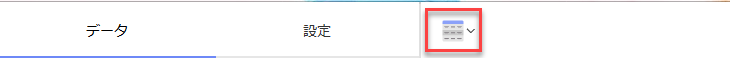
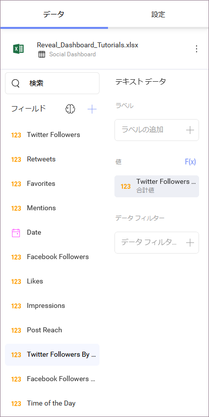
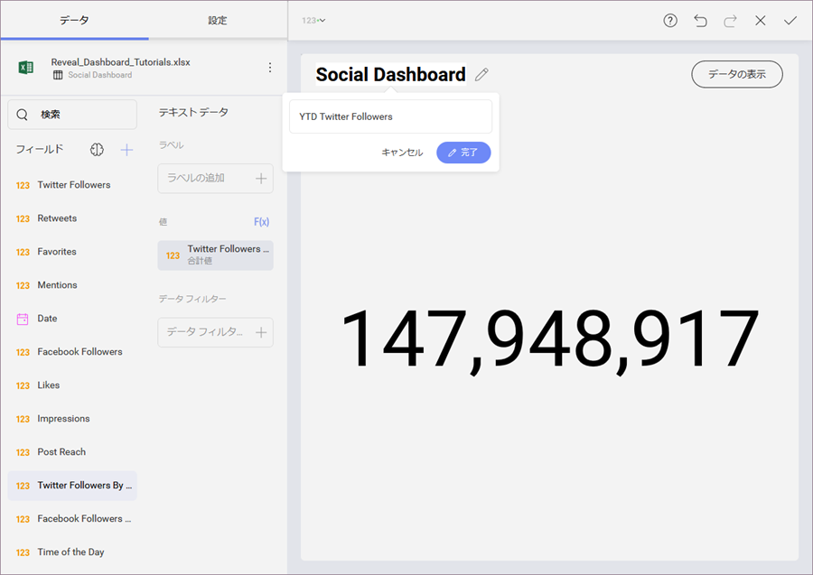
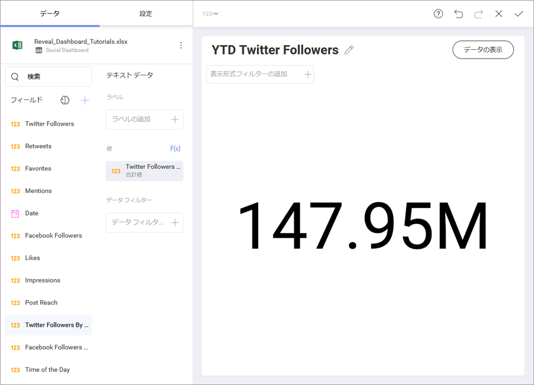

## 初めての表示形式を作成  

チュートリアルのはじめの[サンプル ダッシュボード](overview.html)に YTD Twitter Followers 表示形式を作成します。表示形式は[テキスト ゲージ](~/en/data-visualizations/gauge-views.md#text-gauge)を表示します。

まず、トップ バーのグリッド アイコンを選択し、**表示形式ペインを開きます**。

**表示形式を [テキスト ゲージ] に変更します**。

次に、データ エディターの [値] プレースホルダーへ **Twitter Followers by Year** フィールドを**ドラッグアンドドロップします**。

最後に、Social Dashboard タイトルの横にある鉛筆を選択して、**表示形式のタイトルを YTD Twitter Followers に変更します**。

表示形式は以下のようになります。

完了すると、右上隅の**ティック アイコン**を選択して、ダッシュボード エディターに戻ります。

<a href="social-creating-the-dashboard.md" class="previous">&laquo; 前へ</a>
<a href="social-creating-dashboard-filter-connecting-visualization.md" class="next">次へ &raquo;</a>

