# ダッシュボードの作成

Reveal のダッシュボード作成には以下のオプションが含まれます:

1.  [ダッシュボード作成メニューにアクセス](#access-dashboard-creation-menu)

2.  [データ ソースの追加](#add-data-source)

3.  [表示形式の変更](#modify-visualization) (オプション)

4.  [ダッシュボードの保存](#save-dashboard)

## ダッシュボード作成メニューにアクセス

**[+ ダッシュボード]** または **[ダッシュボードの作成]** **(分析)** の青いボタンをクリックまたはタップして、ダッシュボードを作成できます。

   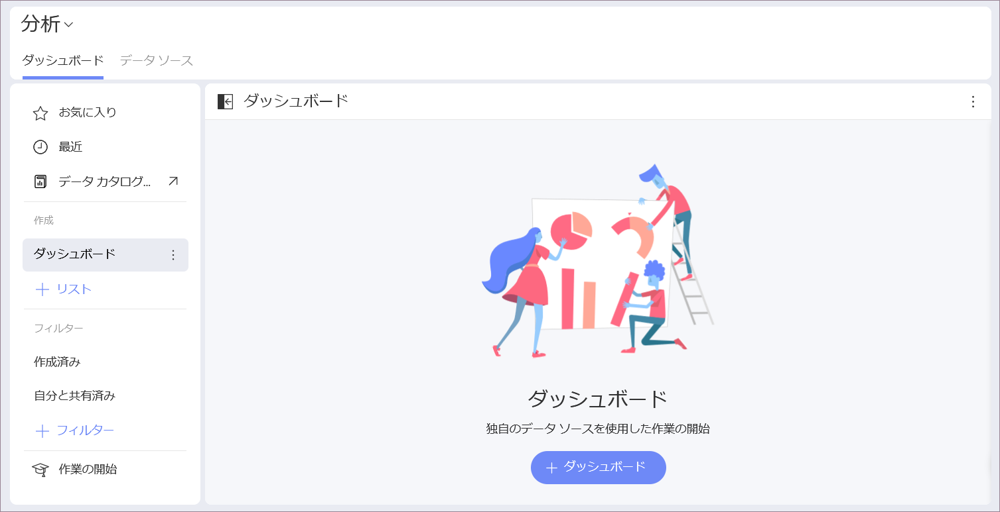

[新しい表示形式] のダイアログが表示されます。データ ソースを使用して表示形式を作成します。

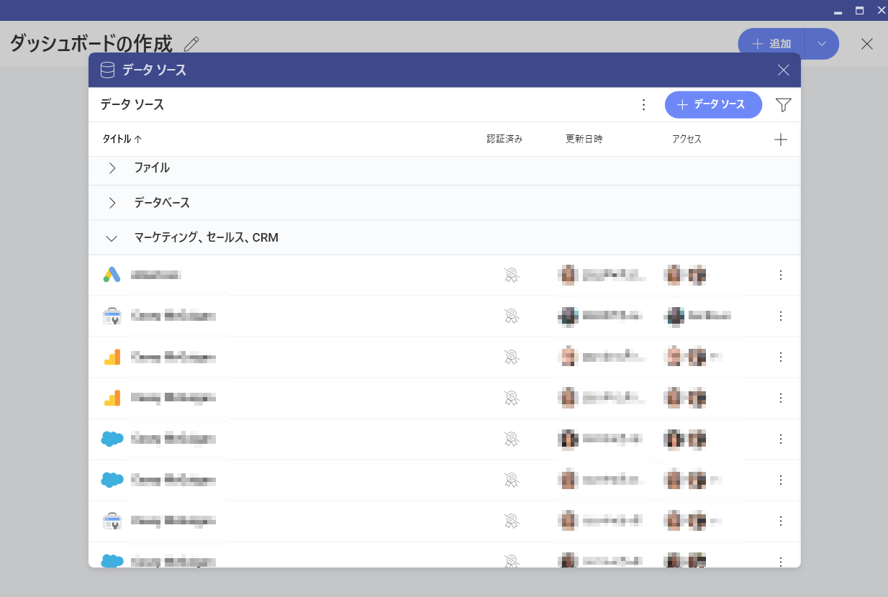

## データ ソースの追加

データ ソースがデータ ソース リストにない場合は、右上隅にある **[+ データ ソース]** ボタンを選択します。新しいダイアログが表示され、すべてのデータ ソース カテゴリと使用可能なデータ ソースが表示されます。必要なデータ ソースが表示されるまで、上下にスクロールしてください。

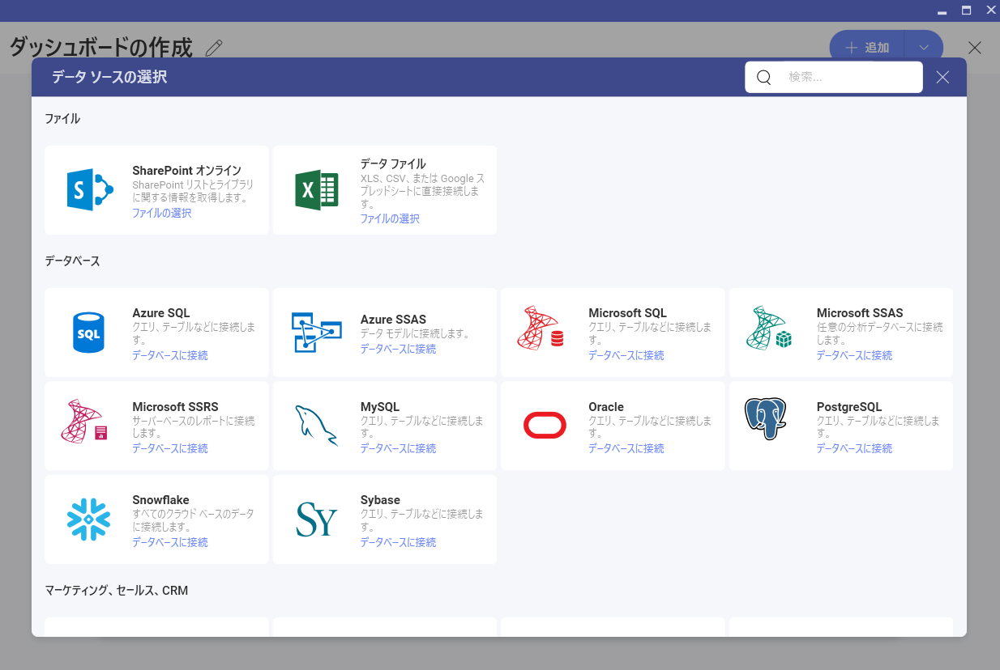

データ ソースがコンテンツ マネージャーのスプレッドシートの場合、可覚化で使用する特定のシートを選択できます。

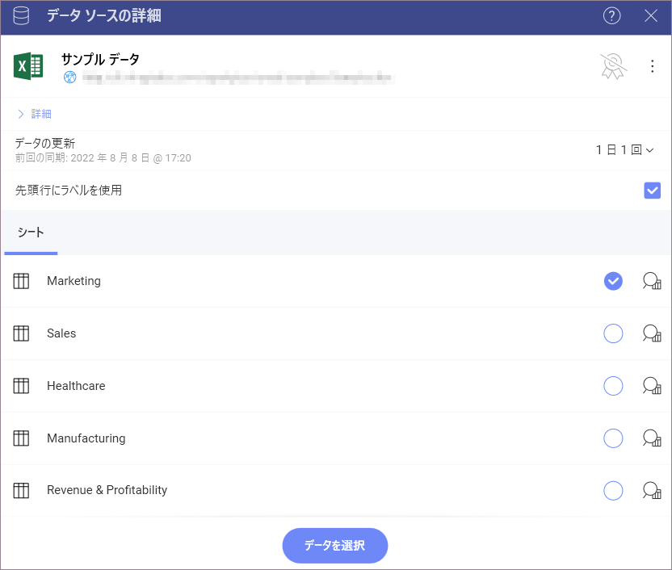

### 使用可能なコンテンツ

Reveal では [Dropbox](../datasources/supported-data-sources/Dropbox.html)、[OneDrive](../datasources/supported-data-sources/OneDrive.html)、[Box](../datasources/supported-data-sources/Box.html)、[Google Drive](../datasources/supported-data-sources/Google-Drive.html) などの複数のコンテンツ ソースを追加でき、それらの使用可能なフォルダー、ファイル、スプレッドシートを閲覧できます。

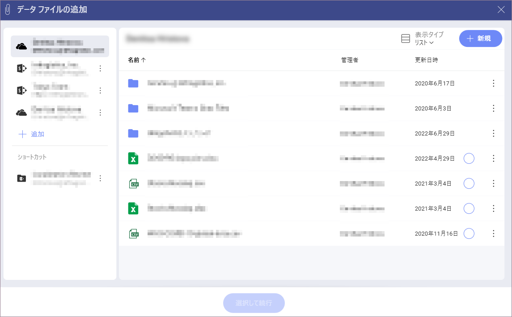

さらに、[SharePoint](../datasources/supported-data-sources/SharePoint.html) データ ソースを追加することもできるため、リストまたはライブラリにアクセスする機能が使用可能です。

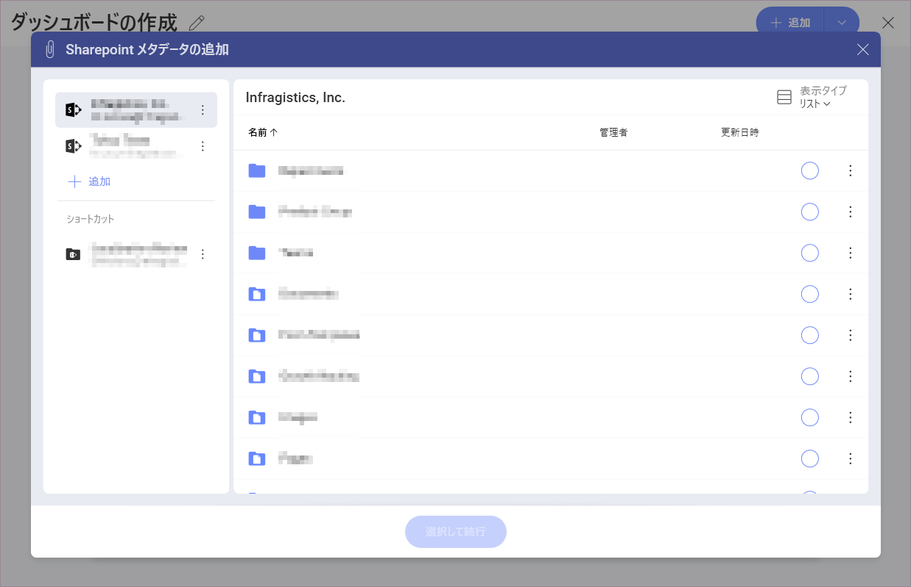

## 表示形式の変更

データ ソースを追加した後、表示形式エディターが表示されます。By default, the Column visualization will be selected.

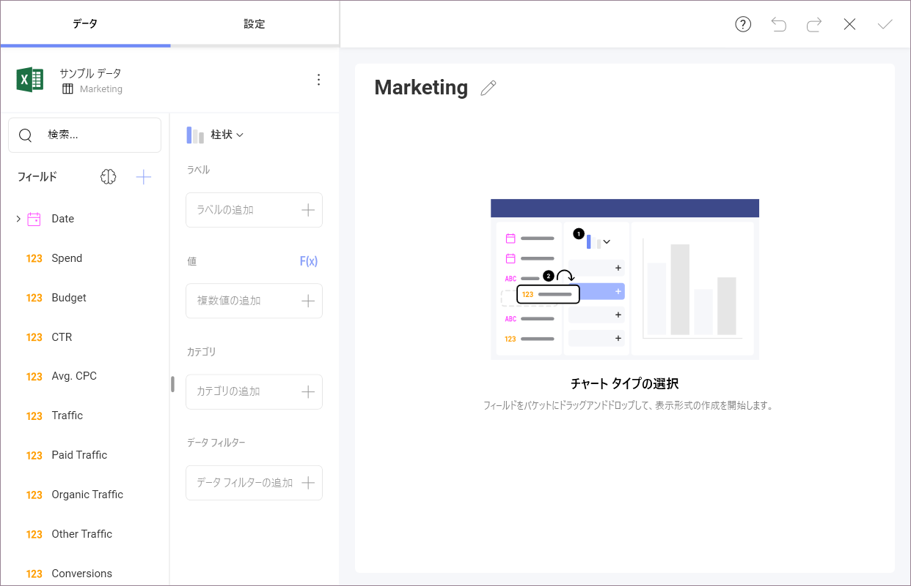

Reveal では、情報を可覚化する方法をカスタマイズするためのいくつかのオプションがあります。上部バーの**ピボット アイコン**を選択してオプションにアクセスできます。

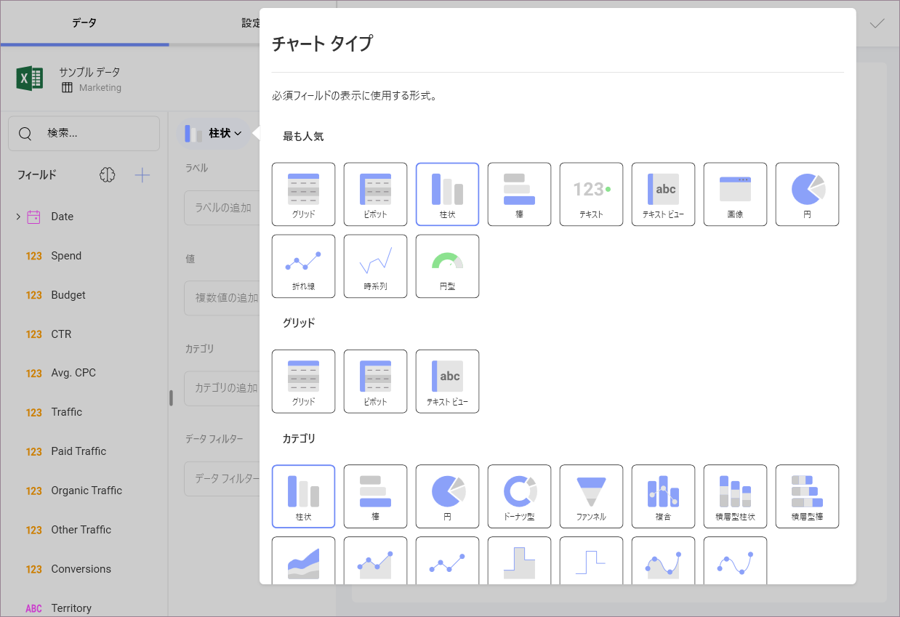

表示形式にラベルと値を追加し、右側のペインでプレビューします。必要に応じて、表示形式設定を変更してフィルターを追加できます。

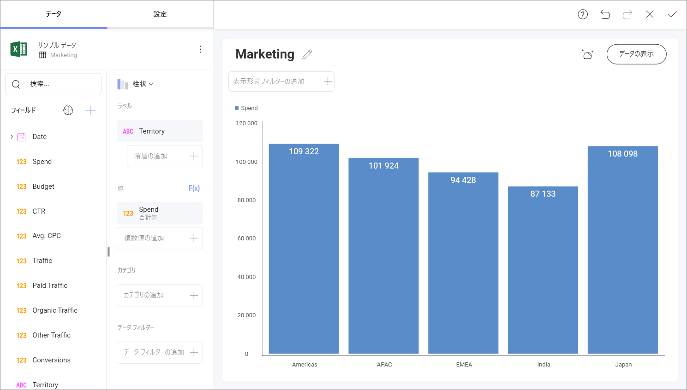

表示形式を変更した後**ダッシュボード エディター**に移動されます。右上側に **[元に戻す]**、**[やり直し]**、および **[+ 追加]** の分割ボタンが表示されます。これらのボタンの横には、ダッシュボードのオーバーフロー メニューもあります。そこで、ダッシュボードの **[テーマ]** の変更、**[自動レイアウト]** のオン/オフ、ダッシュボードの **[エクスポート]**、またはダッシュボードに **[名前をつけて保存]** ボタンを選択できます。

表示形式の右上隅にあるオーバーフロー メニューを使用して、表示形式の **[名前の変更]**、**[編集]**、**[コピー]**、または **[複製]** できます。 

>[!NOTE] 
>表示形式のコピーと複製の違いは、複製は同じダッシュボード内でのみ機能し、コピー オプションを使用すると、表示形式を同じダッシュボードまたは異なるダッシュボードに配置できることです。

表示形式をコピーした後、表示形式を貼り付けるダッシュボードのオーバーフロー メニュー内の [貼り付け] オプションを見つけます。

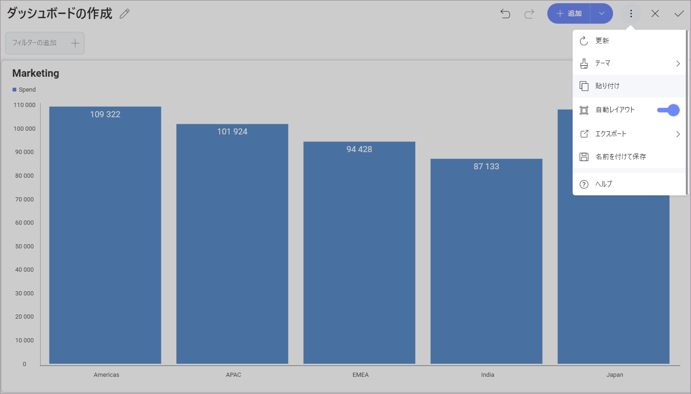

## テーマの適用

ダッシュボードに移動された後、[テーマ] を選択し、以下に示すように **Mountain テーマ** と **Ocean テーマ** を切り替えることができます。

## ダッシュボードの保存

ダッシュボードの準備後、右上側の**ティック アイコン**を選択してあるいはオーバーフロー メニューの [**名前を付けて保存**] オプションにアクセスして、ダッシュボードを保存します。

**[分析]** > **[ダッシュボード]** の下にダッシュボードを保存するか、参加または作成したワークスペースのいずれかを選択できます。ダッシュボードの名前を選択し、準備ができた後 [ここに保存] をクリック/タップします。

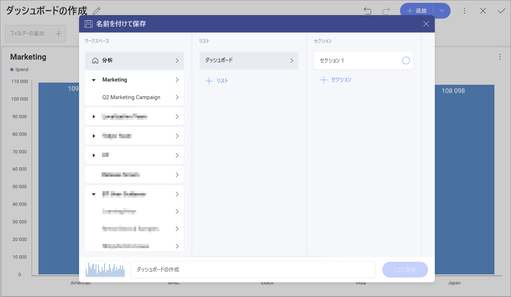

**[名前を付けて保存]** メニューで、右上隅にある **[+ リスト]** ボタンと **[+ セクション]** ボタンをクリックして、リストとセクションを作成し、スペースを整理することができます。
