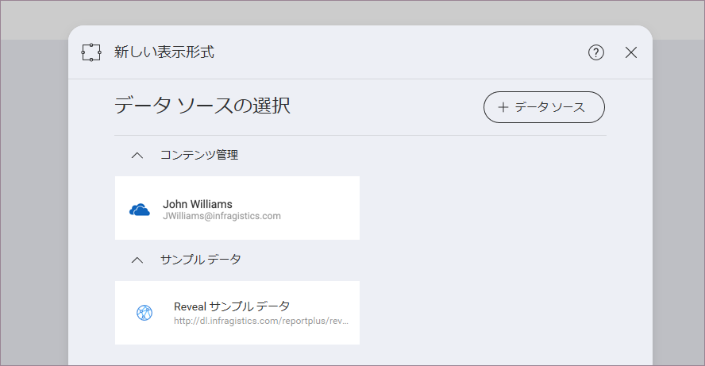
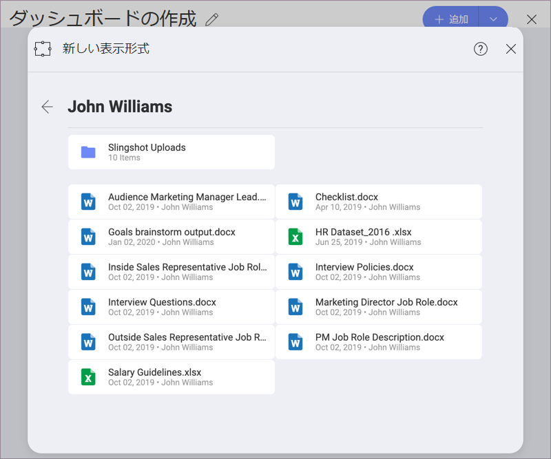

## ダッシュボードの作成

Reveal のダッシュボード作成には以下のオプションが含まれます。

1.  [ダッシュボード作成メニューにアクセス](#access-dashboard-creation-menu)。

2.  [データ ソースの追加](#add-data-source)。

3.  *オプション* [表示形式の変更](#modify-visualization)。

4.  [ダッシュボードの保存](#save-dashboard)。

### ダッシュボード作成メニューにアクセス

初期画面の [+ ダッシュボード] 分割ボタンを選択し、ダッシュボードを作成できます。

[新しい表示形式] のダイアログを表示します。Proceed to create a visualization using a data source.

### データ ソースの追加

データ ソースが [データ ソースの選択] セクションにない場合は、右上側の [+ データ ソース] ボタンを選択します。新しいダイアログがポップアップして、すべてのデータソース カテゴリおよび利用可能なデータ ソースを表示します。

データ ソースがコンテンツ マネージャーのスプレッドシートの場合、表示形式で使用する特定のシートを選択できます。

#### 使用可能なコンテンツ

Reveal では [Dropbox](../datasources/supported-data-sources/Dropbox.md)、[OneDrive](../datasources/supported-data-sources/OneDrive.md)、[Box](../datasources/supported-data-sources/Box.md)、[Google Drive](../datasources/supported-data-sources/Google-Drive.md) などの複数のコンテンツ ソースを追加でき、それらの使用可能なフォルダー、ファイル、スプレッドシートを閲覧できます。

さらに、[SharePoint](../datasources/supported-data-sources/SharePoint.md) データ ソースを追加することもできるため、リストまたはライブラリにアクセスする機能が使用可能です。

### 表示形式の変更

データソースを追加した後、表示形式エディターが表示されます。デフォルトでは、グリッドの表示形式が選択されています。

Reveal では、情報を可覚化する方法をカスタマイズするためのいくつかのオプションがあります。上部バーの**グリッド アイコン**を選択してオプションにアクセスできます。

表示形式にラベルと値を追加し、右側のペインでプレビューします。必要に応じて、表示形式設定を変更してフィルターを追加できます。

表示形式を変更した後**ダッシュボード エディター**に移動されます。右上側に [**元に戻す**]、[**やり直し**]、[**テーマ**]、[**名前を付けて保存**] ボタンが表示されます。
同じ場所に [**+**] 記号を使用して別の表示形式を追加でき、ティック アイコンを選択してダッシュボードを保存することもできます。

#### テーマの適用

ダッシュボードに移動された後、⇒ *テーマ* を選択し、以下に示すように *Mountain テーマ* と *Ocean テーマ* を切り替えることができます。

### ダッシュボードの保存

ダッシュボードの準備後、右上側の**ティック アイコン**を選択してあるいはオーバーフロー メニューの [**名前を付けて保存**] オプションにアクセスして、ダッシュボードを保存します。

ダッシュボードを個人用リポジトリに保存するか、[参加または作成した](~/jp/teams/Creating-Joining-Teams.md)チーム リポジトリを選択できます。ダッシュボードの名前を選択し、準備ができた後 [ここに保存] をクリック/タップします。

スペースを適切に整理するには、[名前を付けて保存] メニューで右上側の [+フォルダー] ボタンをクリックして、ダッシュボード ビューアーでフォルダーを作成します。
