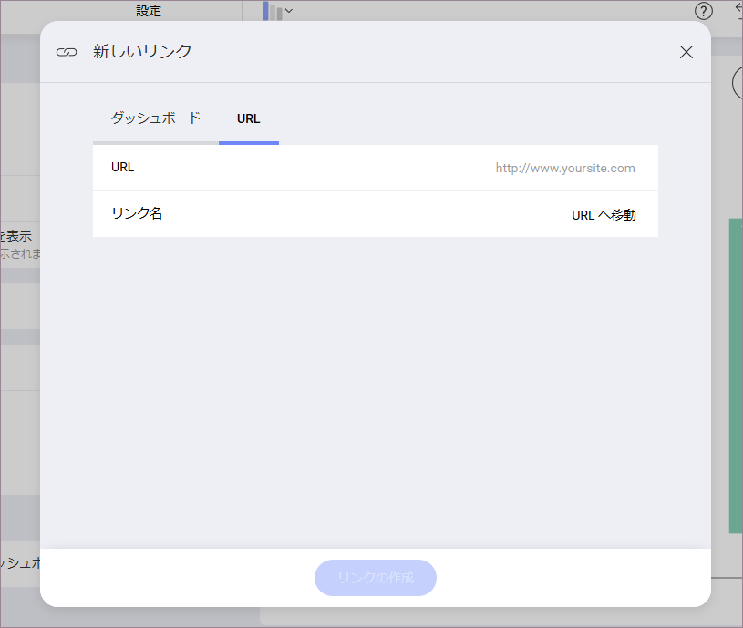

## ダッシュボード リンク

Reveal はダッシュボード リンクをサポートしています。これは、表示形式のグリッド行またはチャート列/バーが選択されたときにトリガーされます。この機能は、高度なドリルダウン ナビゲーションが可能です。表示形式により詳細な情報を表示したい場合、新しいダッシュボードを使用して目的を達成できます。この機能はトップダウン分析パスでとても役立ちます。ビジネスのハイレベルな概要から特定の詳細情報まで簡単にナビゲーションができます。1 つの例として Company 360 ダッシュボードの実装があり、各エリアの KPI (キー パフォーマンス インジケーター) を提供します。表示形式の 1 つを選択して最大化すると、Reveal はすべてのプロジェクトのより詳細な情報を含む他のダッシュボードを開きます。

特定のイベントに操作を関連づけることも可能です。サポートされる操作としてその他の**ダッシュボード**を開くことができます。さらに、**URL を開く**こともできます。これは、ダッシュボード ナビゲーションの一部としてサードパーティ ウェブ アプリケーションとのインタラクションなど拡張性を有効にします。リンクは、表示形式エディターの**設定**セクションの**リンク**から追加できます。

### イベント

**リンク** セクションのコントロールは、操作を実行するために使用されるイベントまたはトリガーを選択します。使用可能なオプション:

  - **値が選択されています**: イベントは、ユーザーがグリッド ビューで行を選択すると常にトリガーされます。チャートなどの他の表示形式では、チャートのデータ アイテムを選択すると常にトリガーされます。これには、表示形式で使用されるチャート タイプに依存する縦棒、横棒、円スライス、またはその他の要素が含まれる場合があります。

  - **表示形式が最大化されます**: このイベントは、ダッシュボード ビューで表示形式が最大化されたときにトリガーされます。

### 操作

１ つのイベントに対して複数の操作を設定できます。イベントが発生される時の実行可能な操作:

  - **ダッシュボード**を開く。この操作を有効にすると、イベントが実行されるときに他のダッシュボードが開きます。選択したダッシュボードにダッシュボード フィルターがある場合、各ダッシュボード フィルターの生成方法を構成する必要があります。2 つのパラメーターを構成する必要があります。

      - イベントがトリガーされると開かれる**ダッシュボード**。

      - グリッド行またはチャート要素を選択した場合にユーザーに表示されるタイトルである**リンク名**。

ターゲット ダッシュボードにフィルターがある場合は、現在のダッシュボードのいずれかのダッシュボード フィルターから必要な値を取得する方法を構成することもできます。

  - **URL** を開く。この操作が有効な場合、デバイス ブラウザーで構成済みの URL を開きます。2 つのパラメーターを定義する必要があります:

      - チャート要素またはテーブル行が選択されると、表示形式がユーザーをリダイレクトする先の **URL**。

      - グリッド行またはチャート要素を選択した場合にユーザーに表示されるタイトルである**リンク名**。

URL の場合は、**変数**を含めることもできます。これにより、表示形式フィールドの値に基づいて、ユーザーにリンクされる URL が動的に作成されます。たとえば、以下の表示形式リンクを見てみましょう。

URL は <http://www.countryreports.org/travel>に設定されており、選択した **変数** は **国** になります。したがって、表示形式で **国のレポートを表示** リンクを選択したユーザーは次のように表示されます:

    http://www.countryreports.org/country/[Country Name].htm

`[Country Name]` は、**国**フィールドの値によって異なります。

