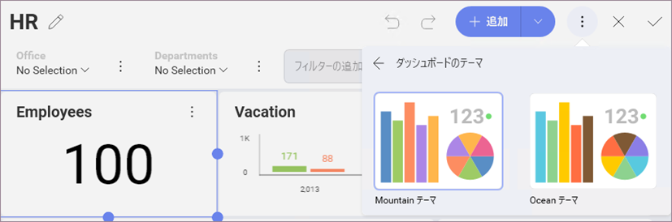

## ダッシュボードのスタイル設定

Reveal は、カラー パレットから色を選択してダッシュボードのスタイルを容易に更新できます。

ダッシュボードのスタイル設定を変更するには、*ダッシュボードの編集モード*に入り、オーバーフロー メニューから*テーマ*を選択します。*Mountain* と *Ocean* テーマから選択できます。

あるいはチャートに基づく表示形式に開始色を変更できます。選択されたダッシュボードのテーマによって設定オプションは異なります。

