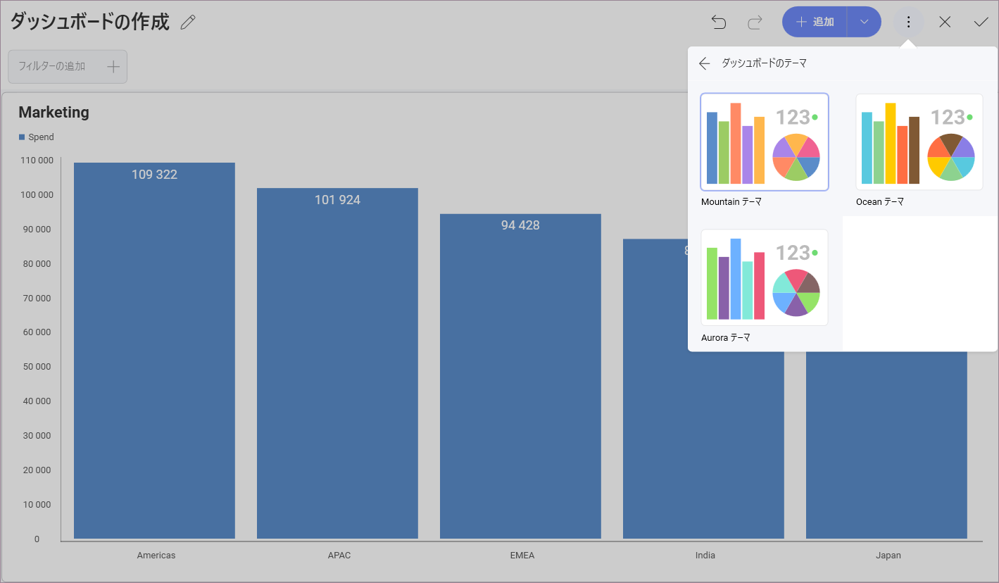
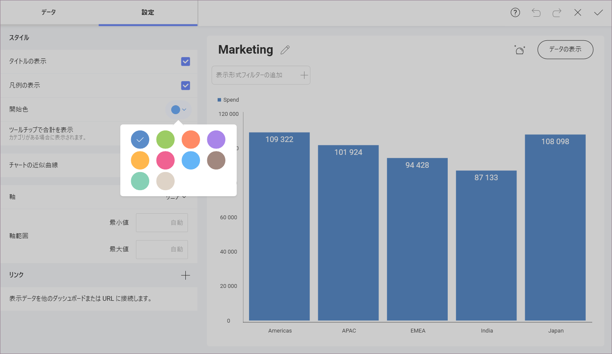

# ダッシュボードのスタイル設定

Reveal は、カラー パレットから色を選択してダッシュボードのスタイルを容易に更新できます。

ダッシュボードのスタイル設定を変更するには、**ダッシュボードの編集モード**に入り、オーバーフロー メニューから [テーマ] を選択します。Here you can choose between *Mountain Theme*, *Ocean Theme* and *Aurora Theme*. 

あるいはチャートに基づく表示形式に開始色を変更できます。選択されたダッシュボードのテーマによって設定オプションは異なります。

