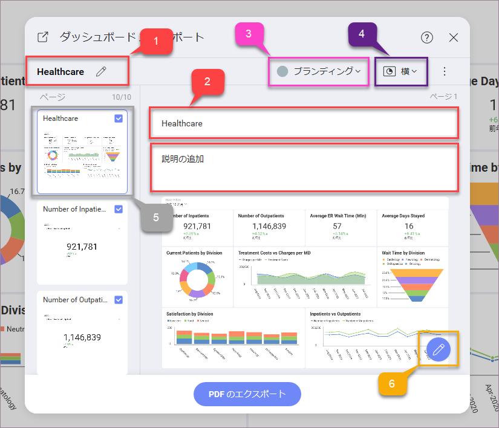

## ダッシュボードを PDF 文書としてエクスポート

Reveal では、ダッシュボードを PDF 文書としてエクスポートできます。各表示形式は、ドキュメントの個別のページに表示されます。

ダッシュボードを PDF 文書としてエクスポートするには、ダッシュボード *ビュー モード*に移動して、オーバーフロー メニューから *[エクスポート]* ⇒ *PDF* を選択します。*[ダッシュボード エクスポート]* ダイアログが開き、ドキュメントをニーズに合わせるため、編集して特定のページに注釈を付けることができます。

### エクスポート設定

*[ダッシュボード エクスポート]* ダイアログでは、次の設定を管理できます:

1.  PDF 文書の**主タイトル**を変更します。デフォルトのタイトルは、ダッシュボードのタイトルです。

2.  **ページのタイトル**を変更し、*[タイトルを入力]* テキスト ボックス (2 番目のボックス) にサブタイトルを追加します。デフォルトのスライドのタイトルは、ページに表示される表示形式のタイトルです。

3.  **ブランド**設定オプションの管理では、以下を選択できます。

    1.  *作成者*とその*会社名* - ドキュメントのページのヘッダー パネルに表示されます。

    2.  *色* (PDF 文書のメイン色) とフッターで表示される会社の*ロゴ* - ここでは、次のオプションのいずれかを選択できます:

          - **Reveal**

           - **ユーザーの組織/チーム** - 組織とすべてのチームのブランディング (ロゴと色) が設定しているオプションとして表示されます。チームのブランド設定にアクセス/変更する方法については、[チームの管理](../../teams/managing-your-team.html)トピックをご覧ください。

          - **カスタム** - 色を選択し、選択した*ロゴ*画像をアップロードします。

            >[!NOTE] **ロゴ画像の要件**。ロゴとしてアップロードする画像は、**5 MB** 以下で、jpg、jpeg、png、gif のいずれかの形式である必要があります。

4.  *横方向*または*縦方向*の**ドキュメントの向き**を選択します。

5.  リストからページを選択してタイトルを変更し、注釈を付け、あるいは右上隅のチェック アイコンを除いてドキュメントを削除することで、**ドキュメント ページを管理できます**。

6.  *鉛筆アイコン*をクリックまたはタップして、選択したページに**注釈**を付けます。**注釈設定**の詳細については、*「ダッシュボードを画像としてエクスポート」* トピックの [「画像に注釈を付ける」](export-as-images.html#annotating) を参照してください。
