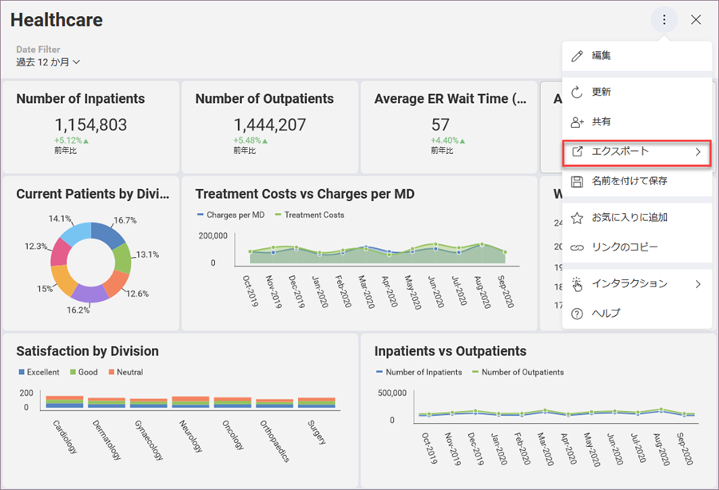

## ダッシュボードをエクスポート

ダッシュボードに表示される情報は、データ ソースの変更に伴って更新されますが、ある時点のデータのスナップショットを共有することもできます。たとえば、予期しない値を強調表示したビジネス インサイトを提供し、注意を促します。

**エクスポート機能にアクセスする**には、右上隅にあるオーバーフロー ボタンを選択し、*[エクスポート]*をクリック/タップします。

### エクスポート形式

ダッシュボードは、以下のオプションを使用して簡単にエクスポートできます。

  - [**画像のエクスポート**](export-as-images.html) - ダッシュボード全体または個別の表示形式のスクリーン キャプチャをエクスポートします。

  - [**PowerPoint のエクスポート**](export-as-powerpoint-presentation.html) - ダッシュボードを PowerPoint プレゼンテーションとしてエクスポートします。

  - [**PDF のエクスポート**](export-as-pdf-document.html) - ダッシュボードを PDF ドキュメントとしてエクスポートします。

  - [**データのエクスポート**](export-as-excel-data-format.html) - ダッシュボードに使用されるデータを **Excel 形式**にエクスポートできます。

  - **ダッシュボードのエクスポート** - Android と iOS のダッシュボードをメール経由でエクスポートするか、もしくはデスクトップと Web ではコンピューター上のファイル (.rdash) としてエクスポートします。

### モバイル デバイスでの、画像とダッシュボードのエクスポート

Android または iOS モバイル デバイスで Reveal を使用する場合、ドキュメントをメール、印刷、またはサードパーティアプリに送信できます。エクスポート形式を選択すると、次のアクション メニューで、保存/共有の設定を選択するよう求められます。

画像のエクスポートの場合、画像に注釈を付ける前または後に、**[画像のエクスポート]**ダイアログに以上と同じオプションがあります。

