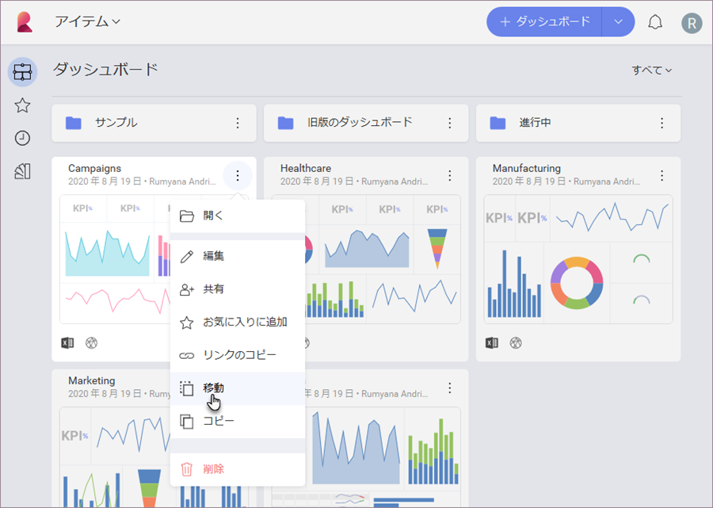
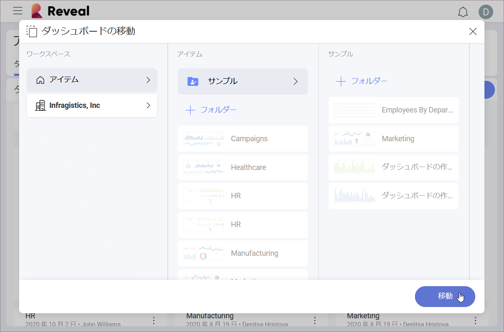

## ダッシュボードの管理

ダッシュボードを個人用スペースで管理する場合でも、チーム内で管理する場合でも、*自分で作成したダッシュボード*、*共有されているダッシュボード*、または*すべて*のいずれかをいつでも選択できます。

### ダッシュボードの整理

Reveal を使用すると、ダッシュボードをさまざまな**フォルダー**や**チーム**に保存して整理できます。それらを 1階層にすることも、グループ化したい場合はネストすることもできます。最初のフォルダーを作成するには、**[+ ダッシュボード]** 分割ボタン (下を参照) の矢印を選択し、**[フォルダーの作成]** を選択します。

新しいフォルダーにダッシュボードを追加するには、フォルダーに名前を付けて **[+ 作成]** をクリック/タップするだけです。  

### ダッシュボードの移動またはコピー

ダッシュボードのオーバーフロー メニュー アクションを開き、ダッシュボードを**フォルダー**または**チーム**間で移動およびコピーを選択します。

**[ダッシュボードの移動]** および **[ダッシュボードをコピー]** 画面では、ダッシュボードの移動/コピー先の 2 つのタイプの宛先を選択可能です:
  - チーム (左側)
  - フォルダー (上部中央)。

