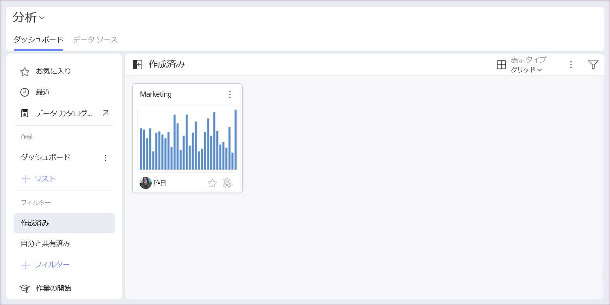

# ダッシュボードの管理

個人用スペースまたはワークスペースでダッシュボードを管理しようとしているかどうかにかかわらず、**[作成済み]** または **[自分と共有済み]** のいずれかをいつでも選択できます。

## ダッシュボードの整理

Reveal を使用すると、ダッシュボードをさまざまな**リスト**および**セクション**に保存および整理できます。セクションはリストを分割したものです。リストには 1 つ以上のセクションを含めることができます。

次の手順でセクションを作成できます:

1. **[ダッシュボード]** の**オーバーフロー** メニューを開きます。
2. **[セクションの追加]** を選択します。
3. 名前を付けて、**[作成]** をクリックまたはタップします。
4. セクションに名前を付けたら、**[+ ダッシュボード]** ボタンを使用してダッシュボードの追加を開始できます。

次の手順でリストを作成できます:

1. **[+ リスト]** ボタンをクリックまたはタップします。
2. リストに名前を付けます。
3. **[作成]** をクリックまたはタップします。
4. リストに名前を付けたら、**[+ ダッシュボード]** ボタンでダッシュボードの追加を開始できます。

## ダッシュボードの移動またはコピー

ダッシュボードのオーバーフロー メニュー アクションを開き、ダッシュボードをコピーするか、**セクション**や**ワークスペース**の間で移動するかを選択します。

ダッシュボードを**データ &amp; 分析のカタログ**に移動することもできます。管理者は、組織全体が表示できるようにダッシュボードを移動できるかどうかを決定します。

