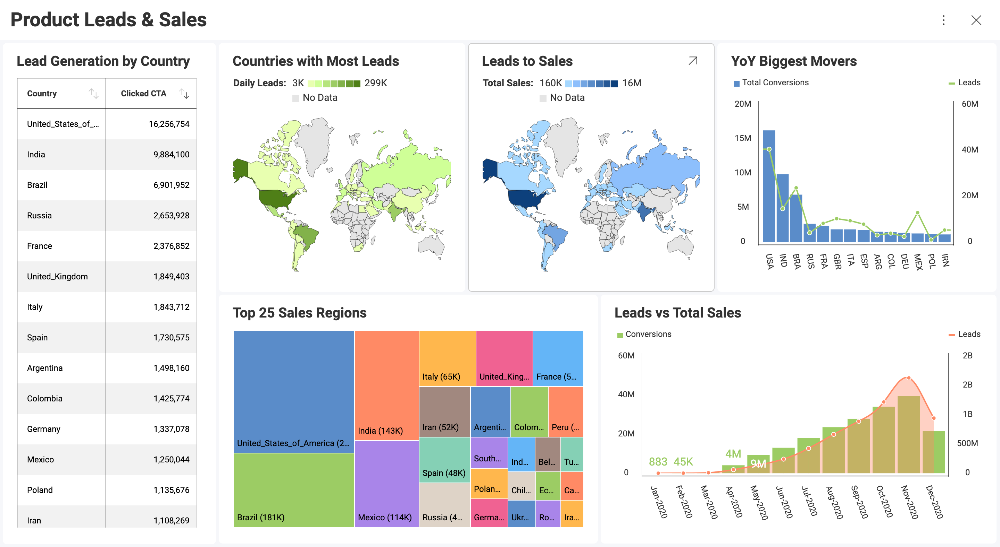

# ダッシュボード

ダッシュボードは、最小限の情報を一目でわかるように表示するための迅速かつ簡単な方法です。これは、ビジネスの状態、メトリックス、またはパフォーマンスを伝えるためにレイアウトされた表示形式のコレクションで構成されるデータ可視化です。各表示形式は、ユーザーがデータを理解できるように、さまざまな関連情報を持つことを目的としています。

## ダッシュボード作成プロセス

  - **KPI 目標**: 自分またはアナリストがダッシュボードに何を示し、何を中心にサイクルを回す必要があるかを決定します。

  - **ダッシュボードの計画**: 情報をグラフィカルにどのように表現しますか? [グリッド](~/jp/data-visualizations/visualization-types/grid-chart.md)、マップ、[ゲージ](~/jp/data-visualizations/visualization-types/gauge-charts.md)、[カテゴリ チャート](~/jp/data-visualizations/visualization-types/category-charts.md)を使用しますか? [フィルター](~/jp/filters/overview.md)を使用しますか?

  - Reveal で使用する**データを準備します**。Reveal で[スプレッドシートを操作する方法](~/jp/datasources/working-files/working-with-spreadsheets.md)の概要を以下に示します。

  - **ダッシュボードの作成**: 完全な手順については、[このトピック](creating-dashboards.md)をご覧ください。

  - **レビューと反復**: ダッシュボードの準備ができた後、ダッシュボードをレビューして、自分またはアナリストが必要と考える変更を加えることができます。

## トピックの概要

Reveal を利用して実行できる機能:

   - [ダッシュボードの作成](creating-dashboards.md)

  - [アップロード可能](uploading-dashboards.md)

  - [ダッシュボードを操作する](dashboards-interactions.md)

  - [ダッシュボードのスタイル](dashboard-styling.md)

  - [ダッシュボードを他のダッシュボードまたは URL のリンク](dashboard-linking.md)

  - [ダッシュボードの共有](sharing-dashboards/share-a-dashboard.md)

  - [現在のダッシュボードの管理](managing-dashboards.md)

  - ダッシュボードを[画像](./exporting-dashboards/export-as-images.md)、[PDF ファイル](./exporting-dashboards/export-as-pdf-document.md)、[PowerPoint プレゼンテーション](./exporting-dashboards/export-as-powerpoint-presentation.md)、または [Excel スプレッドシート](./exporting-dashboards/export-as-excel-data-format.md)として[エクスポート](how-to-export-a-dashboard.md)

[ReportPlus の以前のバージョンで作成されたダッシュボード](Uploading-Dashboards.md)をインポートすることもできます。

## ダッシュボード チュートリアル

チュートリアルで基本をすばやく学び、ダッシュボードを作成するための情報をすばやく得ることができます。

<table>
<colgroup>
<col style="width: 30%" />
<col style="width: 30%" />
</colgroup>
<tbody>
<tr class="odd">
<td>
 

<a href="~/en/dashboard-tutorials/finance-dashboard/getting-started.md">Finance Dashboard</a> 

</td>
<td>
 

<a href="~/en/dashboard-tutorials/manufacturing-dashboard/getting-started.md">Manufacturing Dashboard</a> 

</td>
</tr>
<tr class="even">
<td>
 

<a href="~/en/dashboard-tutorials/sales-dashboard/getting-started.md">Sales Dashboard</a> 

</td>
<td>
 

<a href="~/en/dashboard-tutorials/social-dashboard/getting-started.md">Social Dashboard</a> 

</td>
</tr>
</tbody>
</table>
