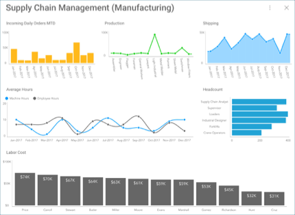

## ダッシュボード

ダッシュボードは、すばやく最小限の情報をシンプルに表示することにより、一目で情報を把握できます。これは、ビジネスのステータス、メトリック、またはパフォーマンスを伝えるために配置された表示形式のコレクションで構成されるデータ 表示形式です。各表示形式は、関連する情報の異なる部分を持っていることを意味しており、ユーザーが自分のデータを理解できるようにします。

### ダッシュボード作成プロセス

  - **KPI 目標**: 自分またはアナリストがダッシュボードに何を示し、何を中心にサイクルを回す必要があるかを決定します。

  - **ダッシュボードの計画**: 情報をグラフィカルにどのように表現しますか? [グリッド](~/jp/data-visualizations/grid-view.md)、マップ [ゲージ](~/jp/data-visualizations/gauge-views.md)、[カテゴリ チャート](~/jp/data-visualizations/category-charts.md)、または[ピラミッド チャート](https://www.infragistics.com/community/blogs/b/infragistics/posts/creating-a-population-pyramid-chart-using-stacked-bar-charts-with-Reveal)を使用しますか? [フィルター](~/jp/filters/overview.md)を使用しますか? Reveal の高度な機能を使用してデータの表示形式を向上する方法については、[このブログ (英語) をご覧ください](https://www.infragistics.com/community/blogs/b/infragistics/posts/8-ways-to-improve-your-data-visualizations)\!

  - Reveal で使用する**データを準備します**。デスクトップと iOS の古いバージョンの場合、Reveal で[スプレッドシートを操作する方法](~/jp/datasources/working-with-spreadsheets.md) の概要を以下に示します。

  - **ダッシュボードの作成**: 完全な手順については、[このトピック](creating-dashboards.md)をご覧ください。

  - **レビューと反復**: ダッシュボードの準備ができた後、ダッシュボードをレビューして、自分またはアナリストが必要と考える変更を加えることができます。

### トピックの概要

Reveal を利用して実行できる機能:

  - [ダッシュボードの作成](creating-dashboards.md)

  - [ダッシュボードのスタイル](dashboard-styling.md)

  - [ダッシュボードを他のダッシュボードまたは URL のリンク](dashboard-linking.md)

  - [ダッシュボードの共有](sharing-dashboards/sharing-dashboards.md)

  - [現在のダッシュボードの管理](managing-dashboards.md)

[ReportPlus の以前のバージョンで作成されたダッシュボード](Uploading-Dashboards.md)をインポートすることもできます。

### ダッシュボード チュートリアル

チュートリアルで基本をすばやく学び、ダッシュボードを作成するための情報をすばやく得ることができます。

<table>
<colgroup>
<col style="width: 30%" />
<col style="width: 30%" />
</colgroup>
<tbody>
<tr class="odd">
<td>
 

<a href="~/jp/dashboard-tutorials/finance-dashboard/overview.md">Finance Dashboard</a> 

</td>
<td>
 

<a href="~/jp/dashboard-tutorials/manufacturing-dashboard/overview.md">Manufacturing Dashboard</a> 

</td>
</tr>
<tr class="even">
<td>
 

<a href="~/jp/dashboard-tutorials/sales-dashboard/overview.md">Sales Dashboard</a> 

</td>
<td>
 

<a href="~/jp/dashboard-tutorials/social-dashboard/overview.md">Social Dashboard</a> 

</td>
</tr>
</tbody>
</table>
