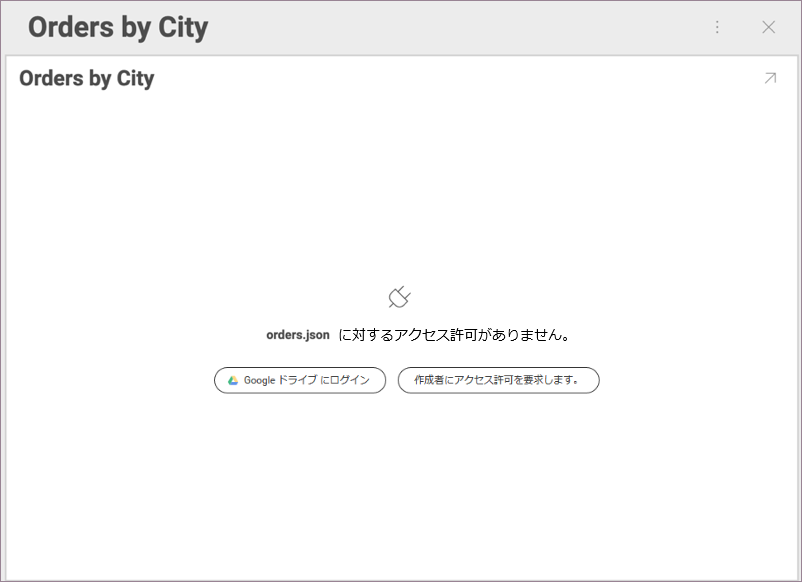

## クラウド ファイルを使用した共有ダッシュボードへのアクセスのリクエスト

共有されているダッシュボードを開こうとすると、次のいずれかの理由により、そのコンテンツを表示できない場合があります。

  - データ ソースとして使用されているクラウド ファイルがクラウド サービスから**削除されました**。

  - ダッシュボードの管理者が、データ ソースとして使用されるクラウド ファイルへのアクセス**許可を取り消しました**。

ファイルが**削除されている**場合、共有ダッシュボードをクリックすると、Reveal は次のメッセージを表示します。

ファイルへのアクセス許可が**取り消された**場合は、次のように表示されます。

### 権限の取り消されたデータ ソース ファイルへのアクセス許可

**[作成者にアクセス許可を要求します]** ボタンをクリックして、拒否されたアクセスについてダッシュボードの管理者に通知します。メール通知も送信されます。

**管理者**が (アプリまたはメールを介して) 通知を開くと、次のダイアログが表示され、データ ソースへの接続を更新するように求められます。

管理者が **[更新]** をクリックすると、アクセスが正常に修正されたかどうかを通知するメッセージが表示されます。

### 取り消された権限の問題に対する代替ソリューション

いつでも**管理者に直接連絡して**、アクセス拒否の問題を解決することができます。

アクセス許可取り消しのシナリオに応じて、2 つの代替ソリューションがあります。

  - 管理者が **Reveal を通じて**権限を取り消しました。

    データ ソースへのアクセスを再び許可するには、共有ダッシュボードのオーバーフロー ボタンをクリック/タップする必要があります。その後、*共有* → *アクセスの許可*を選択します。

  - 管理者は、**クラウド プロバイダー**または **Reveal を通じて**ファイルへのアクセスを取り消しました。

    管理者は、Reveal を終了せずにアクセスを再度有効にできます。これをするには:

    1.  共有ダッシュボードの*ダッシュボード編集*モードを選択します。

    2.  オーバーフロー メニューの **[ファイル アクセスの確認]** ボタンを選択します。

        

    3.  開いたダイアログで **[更新]** を選択します。

        管理者には、接続が復元されたかどうかを通知するメッセージが表示されます。

        **ファイルへのアクセスを復元できなかった**場合は、ファイルがクラウドから削除された可能性があります。

    4. **ファイルへのアクセスが復元された**場合は、*ティック アイコン*を選択して変更を保存します。それ以外の場合、ファイルへのアクセスは他のユーザーに対して拒否されます。