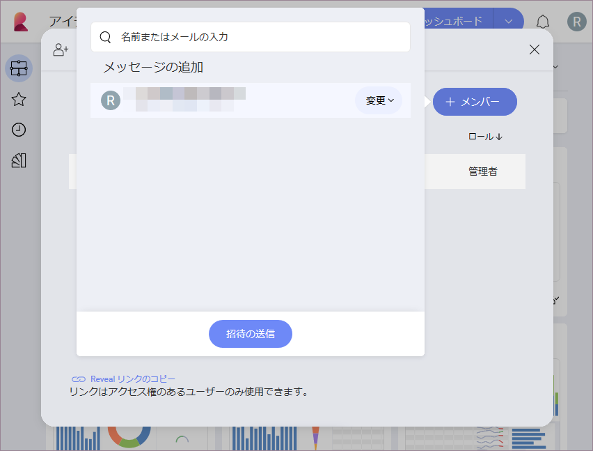
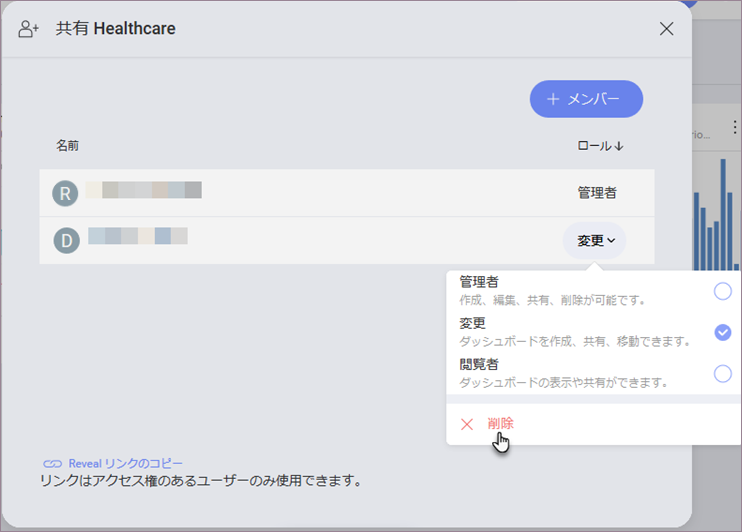

## ダッシュボードの共有

共有ダッシュボードは、チーム間のコラボレーションに最適です。Reveal での共有に関しては、非常に多くの利用シナリオが考えられます。自分の共有権に応じて、他のユーザーやチームに、共有するコンテンツへの異なる[アクセス許可](#access-permissions)を与えることができます。

以下に、3 つの利用可能な共有シナリオにおけるアクセス許可の詳細を示します。

  - [自分が作成したダッシュボードを他のユーザーと共有する](#sharing-dashboards-users)、

  - [チームのダッシュボードを他のユーザーと共有する](#sharing-team-dashboard)、

  - [チーム全体とダッシュボードを共有する](#sharing-dashboard-with-team)。

> [!NOTE]
> **フォルダーを共有**。この記事のダッシュボード共有のルールは、共有フォルダーにも適用されます。

### 独自のダッシュボードを他のユーザーと共有する

作成したダッシュボードを個人ユーザーと共有するには、次のことを行う必要があります。

1.  **[共有] ダイアログ**にアクセスする - ダッシュボードまたはフォルダの右上隅にあるオーバーフロー ボタンを選択し、*[共有]* を選択します。

  

  フォルダーを共有して他の人を追加すると、新しいファイルを共有した人のアカウントおよび*共有*セクションに表示されます。

  

1.  ダッシュボードを共有する**ユーザーを選択する** - 招待するユーザーのメールアドレスを入力し、そのユーザーが共有ダッシュボードを介して**アクセスできるレベル**を設定します。

使用可能なオプションは以下のとおりです:

  - **管理**権限 - ユーザーは、作成、編集、共有、削除を行うことができます。

  - **変更**権限 - ユーザーは、ダッシュボードまたはフォルダーを作成、編集、共有できますが、削除することはできません。

  - **閲覧**権限 - ユーザーは、ダッシュボードとフォルダーを表示および共有することができます。

3.  アクセス レベルを設定した後、*招待を送信する*をクリック/タップします。ダッシュボードは[組織](Teams-Collaboration-Privacy.html#organization-team)のメンバーと自動的に共有されます。他のユーザーは、招待を承諾した後にのみ、ダッシュボードが共有されます。

  

共有メニューにアクセスし、いつでも**ユーザーのアクセスレベルを変更**できます。ダッシュボードを共有したすべてのユーザーとそのアクセスレベルのリストが表示されます。名前の横にあるドロップダウン メニューから新しいアクセス レベルを選択して、アクセス レベルを変更できます。

> [!NOTE]
> 共有ダッシュボードをまだ受け入れていないユーザーの名前は、リストでグレーアウトされます。ダッシュボードを受け入れる前に、アクセス レベルを変更することはできません。

また、[共有] ダイアログにアクセスし、メンバー名の横にあるドロップダウン メニューから *[削除]* を選択して、**いつでもダッシュボードの共有を解除できます**。

### チームのダッシュボードを他のユーザーと共有する

チームのメンバーは、チームのダッシュボードを他のユーザーと共有できます。これを行うには、*[チーム]* タブに移動し、*[ダッシュボード]* セクションからダッシュボードを選択します。次に、[独自のダッシュボードを他のユーザーと共有する](#sharing-dashboards-users)の手順に従います。

チームのダッシュボードと自分で作成したダッシュボードの共有の主な違いは、ダッシュボードを共有するユーザーに与えることができる[アクセス許可](#access-permissions)です。チームでの役割に応じて、1 つ、2 つ、またはすべてのアクセス許可オプションを選択できます。

チームでの役割は次のとおりです。

  - **管理者** - 編集、共有、削除など、チームのダッシュボードへの完全なアクセス権があります。

  - **メンバー** - ダッシュボードとフォルダーを作成、編集、共有できますが、削除することはできません。

  - **閲覧者** - ダッシュボードを表示および共有できます。

ここでは、ダッシュボードを共有するときにすべてのチーム メンバーが付与できるアクセス許可オプションを確認できます。

<table class="tg">
 <tr>
    <th class="tg-oav7" rowspan="2">チームの役割</th>
    <th class="tg-t96r" colspan="3">アクセス許可</th>
  </tr>
  <tr>
    <td class="tg-baqh">管理</td>
    <td class="tg-baqh">変更</td>
    <td class="tg-baqh">閲覧</td>
  </tr>
  <tr>
    <td>管理者</td>
    <td>〇</td>
    <td>〇</td>
    <td>〇</td>
  </tr>
  <tr>
    <td>メンバー</td>
    <td>X</td>
    <td>〇</td>
    <td>〇</td>
  </tr>
  <tr>
    <td>閲覧者</td>
    <td>X</td>
    <td>X</td>
    <td>〇</td>
  </tr>
</table>

〇 - 使用可能

X - 使用不可

### チーム全体とダッシュボードを共有する

作成したダッシュボードまたはチームのダッシュボードを、各チーム メンバー個別に共有するのではなく、チーム全体と共有できます。これを行うには、*[アイテム]*  タブまたは *[チーム]* タブの *[ダッシュボード]* セクションからダッシュボードを選択します。次に、[独自のダッシュボードを他のユーザーと共有する](#sharing-dashboards-users)の手順に従います。

>[!NOTE]
>ダッシュボードは、メンバーであるかどうかに関係なく、[メイン組織に属する](creating-joining-teams.html#organization)任意の公開チームと共有できます。自分がメンバーになっている非公開のチームと共有することもできます。

When setting access permissions for the whole team, you must take into account that these permissions will not be available for everybody in the team. Individual members will receive only the highest permissions possible for their role in the team.

Look at the table below for a quick reference of the permissions every team member can get depending on their role in the team. For example, if you give *Modify* permissions to the whole team, its *Owners* and *Members* will be able to modify the dashboard, but *Viewers* will only receive permissions to view and share the dashboard. This is the highest level of permissions possible for their role in general.   

<table class="tg">
  <tr>
    <th class="tg-9wq8" rowspan="3">チームの役割</th>
    <th class="tg-7btt" colspan="3">チーム全体に与えられたアクセス許可</th>
  </tr>
  <tr>
    <td class="tg-c3ow">管理</td>
    <td class="tg-c3ow">変更</td>
    <td class="tg-c3ow">閲覧</td>
  </tr>
  <tr>
    <td class="tg-7btt" style="text-align: center !important" colspan="3">Permissions Received by Users Depending on Their Role</td>
  </tr>
  <tr>
    <td class="tg-0pky">管理者</td>
    <td class="tg-c3ow">管理</td>
    <td class="tg-c3ow">変更</td>
    <td class="tg-c3ow">閲覧</td>
  </tr>
  <tr>
    <td class="tg-0pky">メンバー</td>
    <td class="tg-c3ow">変更</td>
    <td class="tg-c3ow">変更</td>
    <td class="tg-c3ow">閲覧</td>
  </tr>
  <tr>
    <td class="tg-0lax">閲覧者</td>
    <td class="tg-baqh">閲覧</td>
    <td class="tg-baqh">閲覧</td>
    <td class="tg-baqh">閲覧</td>
  </tr>
</table>

>[!NOTE]
>**チーム メンバーに排他的なアクセス権を与える**チーム メンバーに、そのメンバーシップの役割で許可されているよりも高いダッシュボードへのアクセス レベルを付与する場合は、招待メールのリストに個別にメールを追加し、必要なアクセス許可を設定します。

### 関連項目

クラウド サービスにあるデータソース ファイルを使用してダッシュボードを作成した場合、ダッシュボードを共有するには、このファイルへのアクセスを許可する必要があります。詳細については、[クラウド ファイルをデータソースとするダッシュボードを共有する](sharing-dashboards-datasource-files-cloud-provider.md)をご覧ください。
