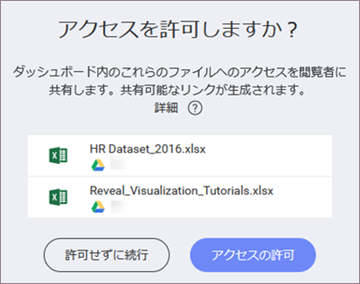

## クラウド ファイルをデータソースとするダッシュボードを共有する

ダッシュボードを他の Reveal ユーザーと共有する場合は、ダッシュボードで表示形式を作成するために使用したデータソースを考慮する必要があります。データソースがクラウド プロバイダーにアップロードされたファイルである場合、ダッシュボードを共有するユーザーは、ファイルへのアクセスを許可しない限り、ダッシュボードを開くことができない場合があります。

クラウド プロバイダーのデータソース ファイルへのアクセスを許可すると、このファイルへの**共有可能なリンク**が作成されます。このファイルをデータソースとして使用するダッシュボードは、他のユーザーと共有すると正しく表示されます。リンク自体は、Reveal ユーザーと共有されませんが、暗号化されてサーバーに保存されます。

次の場合に共有可能なリンクを作成できます:

  - [クラウド プロバイダーにアップロードされたファイル](#cloud-data-source-file) を表示形式のデータソースとして選択する場合。

  - クラウド ファイル データソースを使用する[ダッシュボードを共有する](#grant-access-shared-dashboard)場合。

  - [チームに](#save-dashboard-team)ダッシュボードを保存する場合。

### サポートされるクラウド プロバイダー

次のクラウド プロバイダーにアップロードされたファイルを使用するダッシュボードへのアクセスを許可できます:

  - Google Drive

  - One Drive

  - Dropbox

>[!NOTE] **Box のファイル共有サポート:**
>追加予定!

### クラウド ファイルをデータソースとして選択する場合のアクセス許可の付与

データソースを選択した時点でクラウド ファイルへのアクセスを許可して、表示形式を構築できます。[サポートされているクラウド プロバイダー](#cloud-providers)のいずれかにアップロードされたファイルを選択すると、次のダイアログが表示されます。

**[アクセスの許可]** チェックボックスが選択されていることを確認してください。選択されていない場合、共有可能なリンクは無効になります。

### ダッシュボードの共有時にアクセスを許可する

他のユーザーと共有するときに、共有可能なリンクが無効になっているクラウド ファイルを使用するダッシュボードへのアクセスを許可できます。

1.  ダッシュボードの*オーバーフロー ボタン*をクリック/タップします。

2.  **[共有]** を選択します。

3.  次のダイアログが開きます:

    

    **[アクセスの許可]** をクリック/タップして、[ダッシュボードを共有する](share-a-dashboard.html)ユーザーの選択に進みます。

>[!NOTE] **アクセスは許可されていません。**
>アクセスを許可せずに共有を続行すると、ユーザーはダッシュボードのデータを表示できなくなります。*アクセス要求*機能は、Reveal の将来のバージョンでサポートされる予定です。

### チーム内のクラウド ファイル データソースを含むダッシュボードの保存

クラウド ファイルをデータソースとして使用する 1 つ以上の表示形式を含むダッシュボードをチームのスペースに保存することができます。これらのデータソース ファイルへの共有可能なリンクが作成されていない (無効になっている) 場合、Reveal はアクセスを許可するように求めます。

これにより、チームに保存したダッシュボードをすべてのチーム メンバーが確実に表示できるようになります。

### 関連項目

共有されているダッシュボードのコンテンツが表示されない場合は、[クラウド ファイルを使用した共有ダッシュボードへのアクセスのリクエスト](request-access-shared-dashboards-cloud-files.html)をお読みください。
