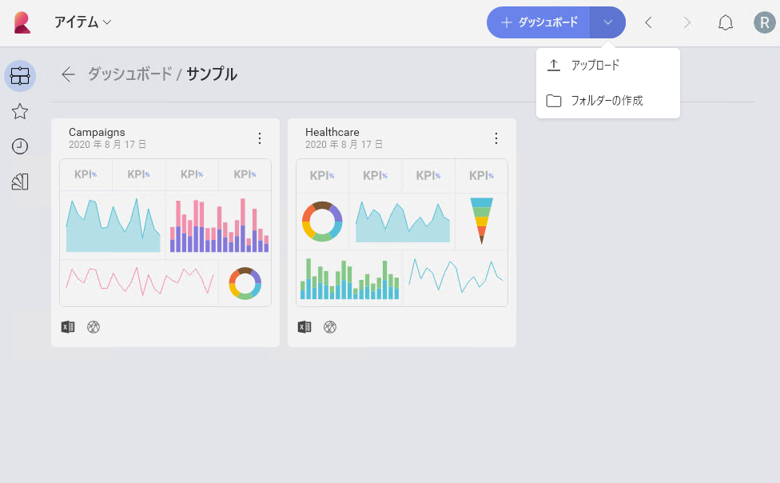

## ダッシュボードのアップロード

Reveal では、直接アップロードしてコンピューター/デバイスに保存されたダッシュボードを操作することもできます。これを行うには、次のステップを実行します。

1.  **[+ ダッシュボード]** 分割ボタンの右側にある矢印を選択し、**[アップロード]** を選択します。

    

2.  ローカル ファイルを表示するダイアログが開きます。アップロードするダッシュボードをダブル クリック/タップします。Reveal ダッシュボードのファイル拡張子は **.rdash** です。
    >[!NOTE]
    >**ReportPlus ダッシュボードのアップロード** Reveal では、ReportPlus で作成されたダッシュボードをアップロードして操作することもできます。ReportPlus ダッシュボードのファイル拡張子は **.rplus** です。

これでダッシュボードがアップロードされ、編集して他のユーザーと共有する準備が整いました。
