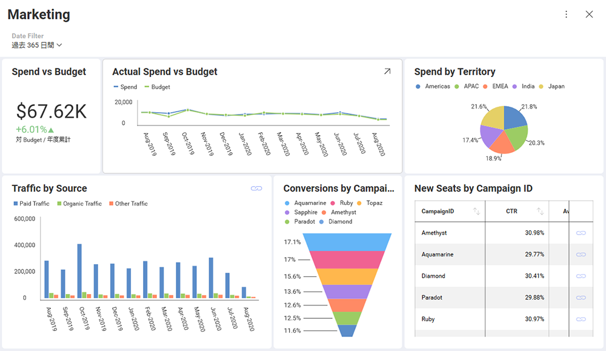

## ダッシュボードの概要

ダッシュボードは、本質的に、すばやく最小限の情報をシンプルに表示することにより、一目で情報を把握できます。これは、ビジネスのステータス、メトリック、またはパフォーマンスを伝えるために配置された表示形式のコレクションで構成されるデータ 表示形式です。各表示形式は、関連する情報の異なる部分を持つことを意図しており、ユーザーが自分のデータを理解できるようにします。

以下の例は、[表示形式のコレクション](~/jp/data-visualizations/What-is-Visualization.html)で構成されるマーケティング ダッシュボードでマーケティング キャンペーンの活動を示します。

