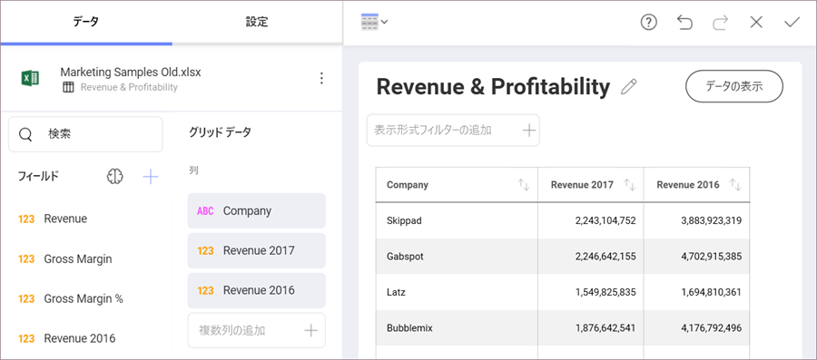
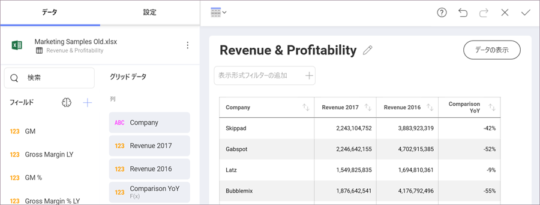

## サンプル、ヒント、および便利なケース

このトピックは、以下の情報を含みます。

  - [ベーシックなサンプル式](#basic-sample-expressions)

  - [Unix 更新日時を使用可能な日付へ変換](#converting-unix-timestamps)

  - [YoY 解析: 売上を 2 年期間の比較](#yoy-analysis-revenue)

### ベーシックなサンプル式

以下は計算フィールドのサンプル式のセットです。

| 関数名              | 関数をテストするためのサンプル データセット                                                               | 式                                                        | サンプル出力                          |
| -------------------------- | --------------------------------------------------------------------------------------------- | ----------------------------------------------------------------- | -------------------------------------- |
| **Opposite Value**         | [HR Dataset](http://download.infragistics.com/reportplus/help/samples/HR%20Dataset_2016.xlsx) | \-[Wage]                                                          | \-36,452.00 (for Joan Baez)            |
| **Age**                    | [HR Dataset](http://download.infragistics.com/reportplus/help/samples/HR%20Dataset_2016.xlsx) | (today()-[BirthDate])/365                                         | 46.12 (for Joan Baez)                  |
| **Name & Department**      | [HR Dataset](http://download.infragistics.com/reportplus/help/samples/HR%20Dataset_2016.xlsx) | [Fullname]& ", " &[Department]                                    | Joan Baez, Development (for Joan Baez) |
| Sales Percentage           | [Retail Store](http://download.infragistics.com/reportplus/help/samples/Retail_Store.xlsx)    | [Sales]\*100/sum([Sales])                                         | 7,20% (for Alabama)                    |
| Sales Percentage 2         | [Retail Store](http://download.infragistics.com/reportplus/help/samples/Retail_Store.xlsx)    | [Sales2]\*100/sum([Sales2])                                       | 5,05% (for Alabama)                    |
| **Sales Percentage Delta** | [Retail Store](http://download.infragistics.com/reportplus/help/samples/Retail_Store.xlsx)    | [Sales Percentage 2]-[Sales Percentage]/([Sales Percentage]\*100) | 4,05% (for Alabama)                    |
| **Name starts with J**     | [HR Dataset](http://download.infragistics.com/reportplus/help/samples/HR%20Dataset_2016.xlsx) | if(find("j",lower([Fullname]),1)=1,"Starts with J",0)             | Starts with J, 0                       |
| **Deviation from Avg**     | [HR Dataset](http://download.infragistics.com/reportplus/help/samples/HR%20Dataset_2016.xlsx) | [Wage]-average([Wage])                                            | \-50476.71 (for Joan Baez)             |

### Unix 更新日時を使用可能な日付へ変換

1970 年 1 月 1 日後の秒によって定義される Unix 時間 (Epoch 時間) はすべてのタイムゾーンを一度に表すために便利です。Unix 更新日時を持つデータ ソースをインポートする場合、[`date`](date.html) 数式を使用して利用可能な日付に変換できます。

`((([Unix Time Stamp]/60)/60)/24)+DATE(1970,1,1)+([Timezone]/24)`

説明:

  - **オリジナルのフィールド**: [Unix Time Stamp]

  - **分に変換**: /60

  - **時に変換**: /60

  - **日に変換**: /24

  - **Epoch 時間の追加**: +DATE(1970,1,1)

  - **タイムゾーンの追加**: +([Timezone]/24)

タイムゾーンを数値として入力するか、数値を持つフィールドを使用できます。GMT 時間が必要です。

### YoY 解析: 売上を 2 年期間の比較

計算フィールドを簡易な YOY 解析を実行するために作成できます。

以下のダッシュボードを参照します。会社の事業部および 2 年間の売上を表示します。

以下の計算フィールドを使用して 2 つの数値を比較できます。「-1」は年の違いを減算します。

`([Revenue 2017]/[Revenue 2016])-1`

数値を使用するか、[パーセンテージとして書式](~/jp/data-visualizations/fields/field-settings.html#numeric-fields)設定できます。

