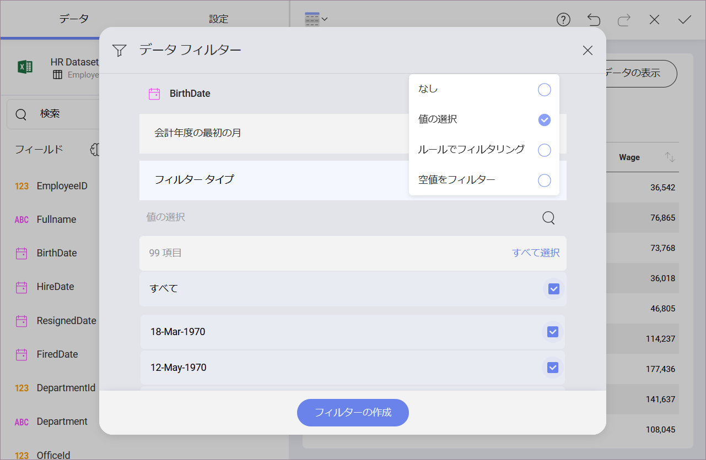

## フィールド フィルターとルール

データセットのフィールドにもフィルターとルールを適用できます。そのためには、データ エディターの下部にある**データ フィルター** プレースホルダーにフィールドを追加する必要があります。次に、ドロップダウンからフィールドを選択して、*データ フィルター* ウィンドウにアクセスします。

### 空値をフィルター

Reveal は特定の列で空値のフィルター構成の設定を有効にすることによって、特定の列に null、または空の値を持つデータ セット内の行をフィルタリングする機能を提供します。

### 値の選択

このタイプのフィルターは、特定のフィールドに表示する値セットの定義をサポートします。これを有効にするには、フィールドを**データ フィルター** プレースホルダーにドラッグアンドドロップします。

*[フィールド設定]* ダイアログに、**[値の選択]** オプションが表示されます。列に使用可能な値のリストを表示し、データセット内に残したい項目のみを選択できます。フィルターによって除外された値を持つ行は表示形式に表示されません。

### ルールでフィルタリング

**[ルールでフィルタリング]** オプションを使用すると、より複雑なルールを定義できます。使用可能なルール オプションは、フィールド タイプによって異なります。

#### 日付フィールドのルール

日付フィールドには、時間ベースのシナリオ、日付範囲の変更、表示形式に表示される情報のフィルタリングをサポートするように設計されたルールが含まれています。

  - カスタム日付範囲

  - 先週、先月、または去年

  - 過去 1 か月

  - 来月、来四半期、または来年

  - 先月、先四半期、または去年

  - 日付までの四半期

  - 今月、今四半期、または今年

  - 今日

  - 過去 1 年間

  - 昨日

デフォルトでは、ルールによるフィルターが数値フィールドで有効になっている場合、「なし」に設定されます。

#### 数値フィールドのルール

整数、小数、通貨などの数値型のフィールドは、次のルール タイプをサポートしています。

  - 平均より上

  - 以上

  - 値より大きい

  - 平均より下

  - 以下

  - 値より小さい

  - 下位の項目

  - 下位の割合

  - 上位の項目

  - 上位の割合

デフォルトでは、ルールによるフィルターが数値フィールドで有効になっている場合、「なし」に設定されます。

#### 文字列フィールドのルール

テキスト列は、次のルール タイプをサポートしています。

  - 含む

  - で終わる

  - 等しい

  - 含まない

  - 等しくない

  - ～で始まる

同様に、これらのルールは 1 つのパラメーターである、ルールが評価で使用する開始値または等しい値を取得し、同じ位置にあるテキストボックスに入力されます。

### 値のフィールドのフィルタリング

**データ エディターの値プレースホルダーにドロップされたフィールドをフィルターすること**もできます。これは、フィールドのリストとは異なる[集計](field-settings.html#numeric-fields)になる可能性があります。

これらのフィールドは、フィールド リストの下部に、それらに適用される集計の名前とともに表示されます。
