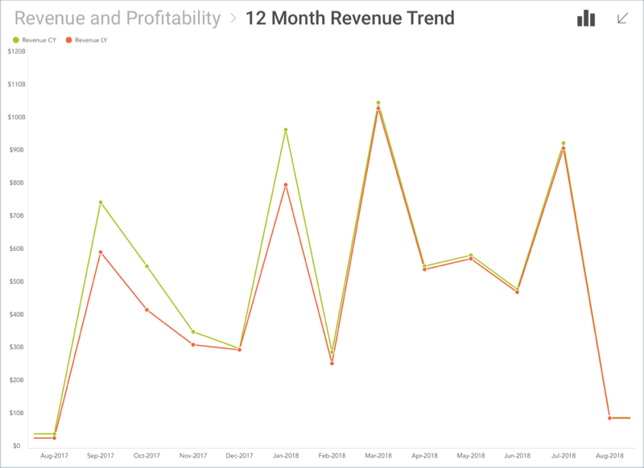
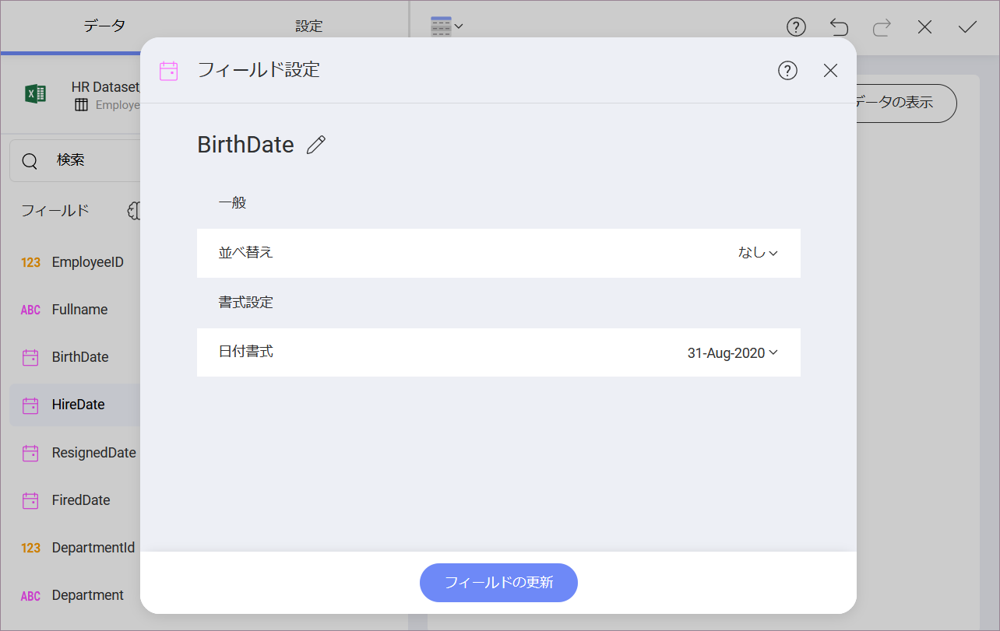
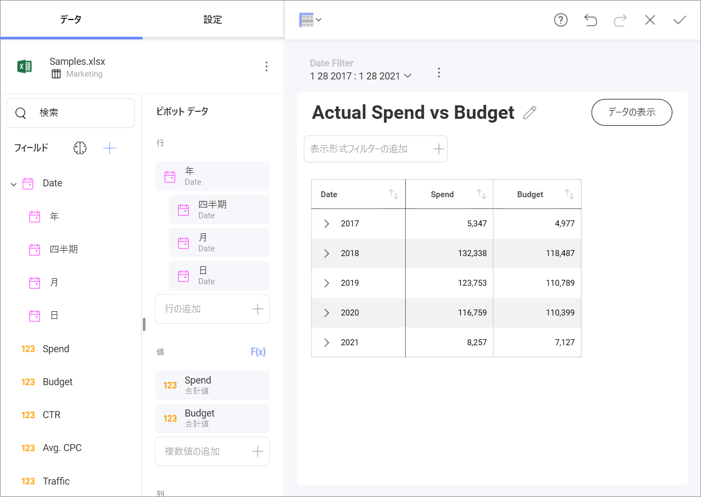
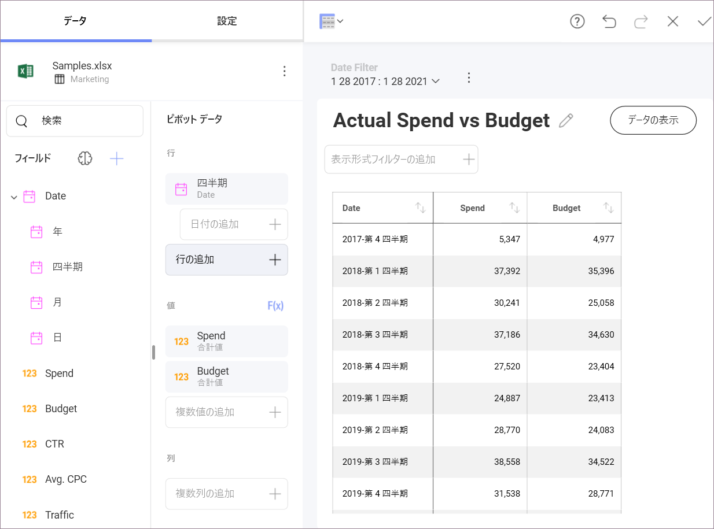
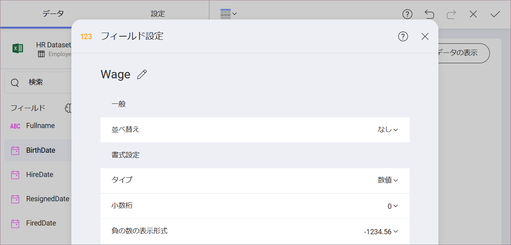

## フィールド設定

このセクションでは、並べ替え、フィルター処理、データの集計などデータセットへの変換を適用するためのさまざまなオプションについて説明します。

データにフォーマットまたはフィルターを適用するには、対応するプレースホルダー (*カテゴリ*、*列*、*ラベル*、*行*、および*値*) で変更する特定のフィールドを選択する必要があります。フィールドには 3 つのタイプがあり、それぞれに独自のフォーマットおよびフィルター オプションがあります:

  - [日付フィールド](#date-fields)

  - [数値フィールド](#numeric-fields)

  - [文字列フィールド](#abc-fields)

>[!NOTE] 
>データ エディターの **[値]** プレースホルダーにドロップされたすべてのフィールドは、数値としてフォーマットされます。

### 日付フィールド

  - **ラベル名の変更**: 表示のみを目的としてフィールド名を変更します。フィールドは常に計算フィールド式で元の名前によって参照されます。名前を変更すると、ラベルを完全に消去し元の値に戻ります。

  - **年度の開始月**: 12 か月の期間が暦年と同じでない場合は、会計年度を使用して、期間の最初の月を選択できます。

  - **並べ替え**: 日付を昇順または降順で並べ替えます。

  - **日付書式**: 日付と時刻書式の定義済みリストから選択して、日付/時刻の値を表示します。

#### Date Fields Hierarchies

Date Fields aggregation is displayed as a hierarchical list in the Fields section. You can find Year, Quarter, Month, Days, and Minutes, depending on the level of granularity of your Date field.

When you drag and drop a Date field in the Pivot Editor, all the hierarchy is automatically displayed.

In addition, dragging a specific hierarchy level will show data for that level only, as shown below.

### 数値フィールド

  - **ラベル名の変更**: 表示のみを目的としてフィールド名を変更します。フィールドは常に計算フィールド式で元の名前によって参照されます。名前を変更すると、ラベルを完全に消去し元の値に戻ります。

  - **集計**: 数値を Reveal で処理する方法 (合計、カウント、平均) を構成します。

  - **並べ替え**: 数値を昇順または降順で並べ替えます。

  - **表示状態**: このフィールドのデータを現在の表示形式で使用するかどうかを選択します。

  - **タイプ**: 数値の形式をパーセンテージ、通貨、または単純な数値のいずれにするかを定義します。**通貨**を選択すると、通貨の種類 (ドル、ユーロ、ポンド、円) を選択するオプションが表示されます。

  - **分数桁**: 表示する小数点以下の桁数を選択します。

  - **負の数**: 括弧内に負の数を囲む、またはマイナスを頭に付けるかどうかを選択します。

  - **大きな数値の書式設定**: 中央のペインの表示形式プレビューに 100 万 を M、千を K で表示します。

  - **桁区切り**: 桁区切り記号を表示するかどうかを選択します。

  - [**条件付き書式**](conditional-formatting.html): これを有効にすると、値に基づいて各セルに異なるフォーマットを提供できます。たとえば、フィールドの下位 50% 範囲内の値は、問題を通知する赤色のアドナーで色を付けることができます。3 つまでの範囲に (一般的には、上部、中央、そして下部の範囲に使用) スタイル規則を設定することができますが制限、比較のタイプ、色、およびインジケーター シンボルをカスタマイズできます。

### 文字列フィールド

  - **ラベル名の変更**: 表示のみを目的としてフィールド名を変更します。フィールドは常に計算フィールド式で元の名前によって参照されます。名前を変更すると、ラベルを完全に消去し元の値に戻ります。

  - **並べ替え**: 日付を昇順または降順で並べ替えます。
