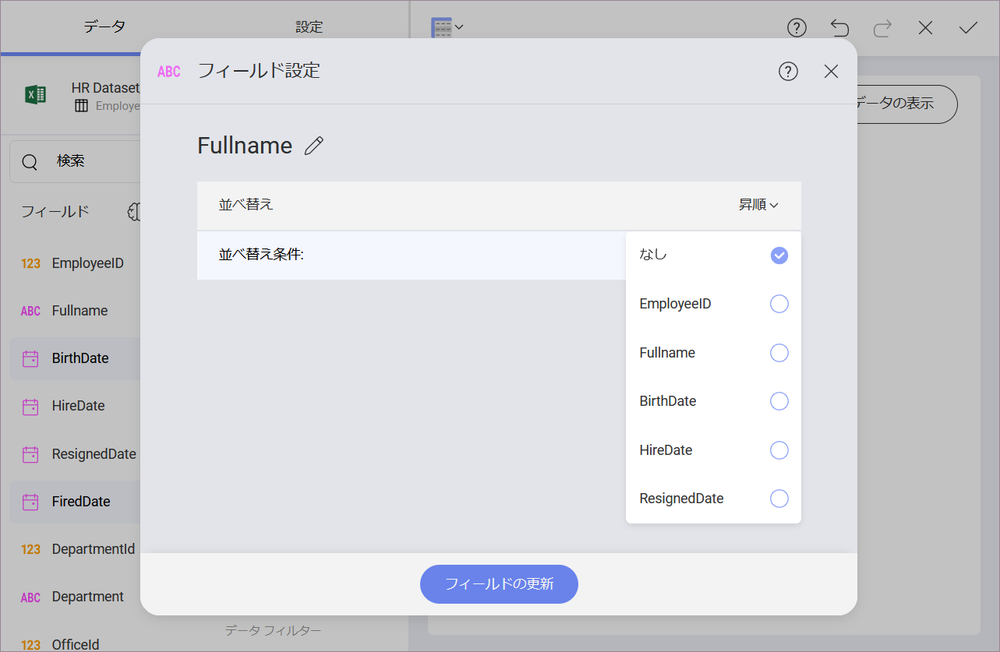
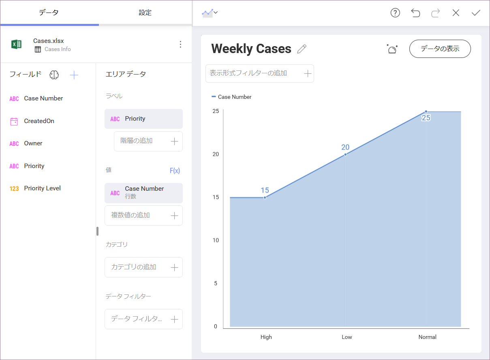
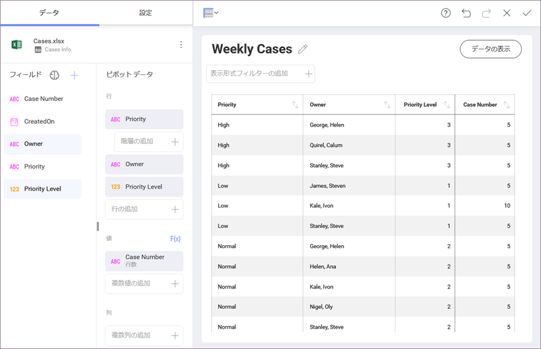
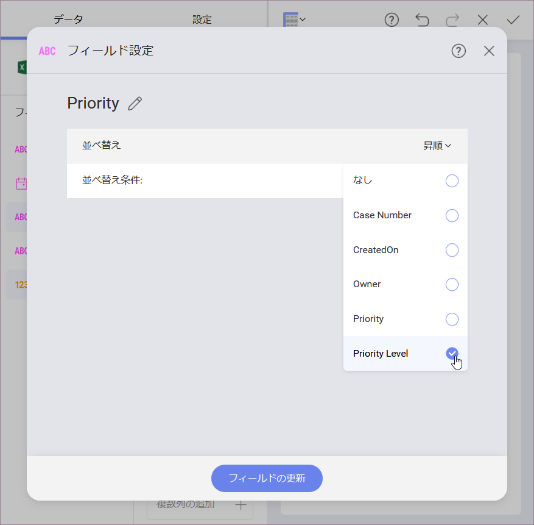
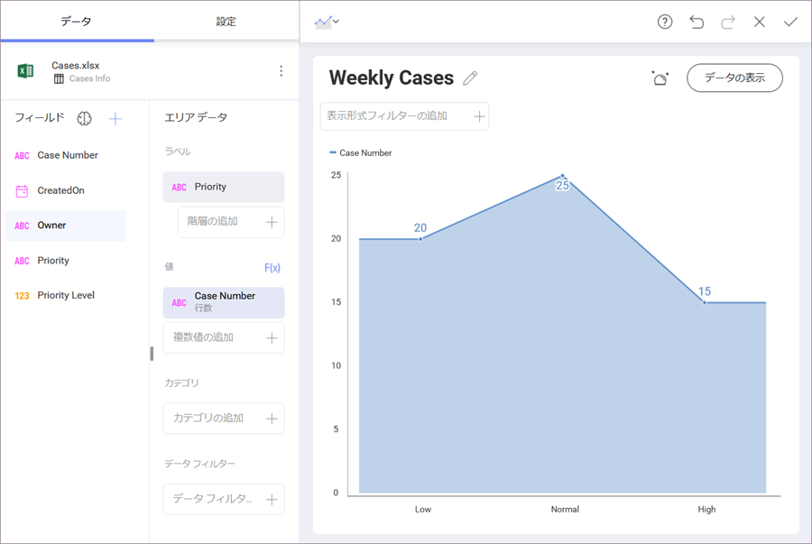
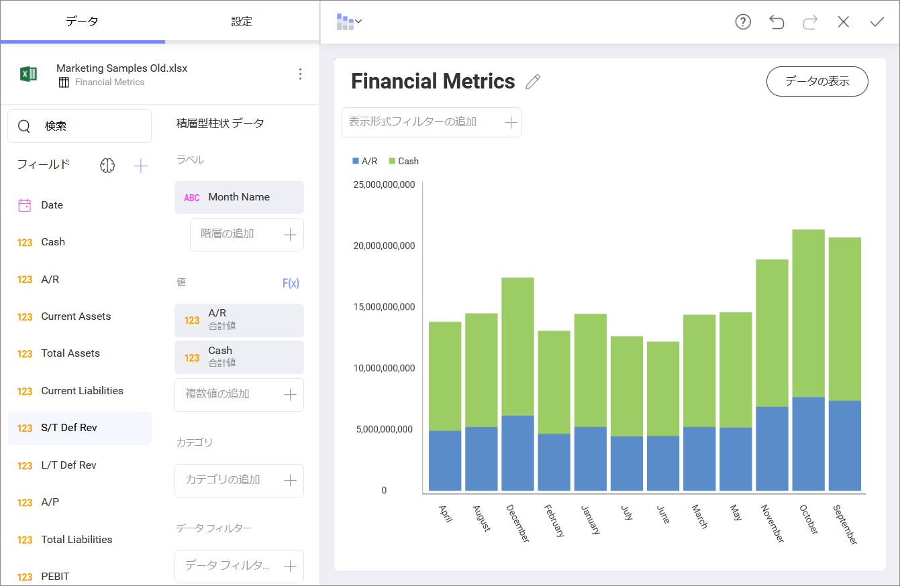
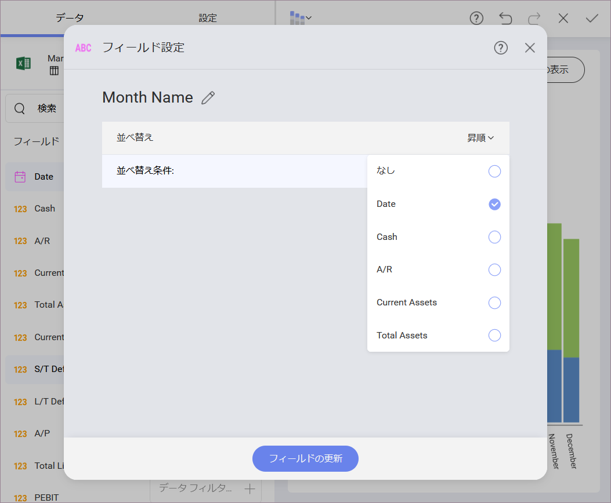
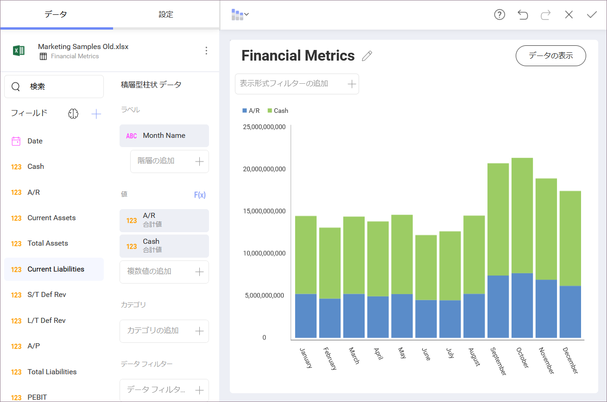

## 並べ替えフィールド

Reveal では、データを昇順または降順に並べ替えることで、 表示形式のデータの表示方法を変更できます。In addition, it is
also possible to further control how a visualization looks with sorting by selected fields in your original data source. 

### Enabling Sort by Field 

The *Sort by field* option is part of the fields settings, but is hidden by default. To enable it: 

1. Select a field under the _Label_ placeholder. 
2. In *Field Settings*, choose _Ascending_ or _Descending_ for _Sorting_. 
3. _Sort by field_ shows under the _Sorting_ setting. You can choose a field from the dropdown on the right (as shown above).

より実用的な情報については、この機能を示す次の例をご覧ください。

  - [企業を優先順位で順序](#by-priority)

  - [文字列日付を時系列で並べ替え](#string-date-chr-order)

### Ordering Support Cases by Priority

There are scenarios where you would like to order a field by using business logic instead of ordering it alphabetically. 
For example, the following is a visualization, which displays new support cases during the week, in ascending order.

The _Priority_ field is a text field so it's ordered A-Z by default. However, if we use business logic, _Priority_ values should be ordered as follows: _Low_ - _Normal_ - _High_. To achieve this, you should have a _Priority Level_ column in your data set showing the numeric representation of the priority status (see below). 

Organize the information in your chart by priority level without actually
dragging and dropping *Priority Level* field into the data editor by using the
*Sort By* field option.

Your resulting widget, therefore, will place new cases with *Low*
priority first, ordered A-Z, *Normal* priority cases after those, and, lastly, *High* priority ones.

  

### 文字列日付を時系列で順序

次の表示形式を見てみましょう。ここでは、 [積層型柱状チャート](~/jp/visualization-tutorials/stacked-charts.md#create-stacked-chart)で企業の現金と売掛金の増加をプロットしています。

値は、**月名** (文字列フィールド) で並べ替えされています。ただし、月はデフォルトでアルファベット順に並べ替えされているため、結果の表示形式は分析には適しません。

ただし、書式を変更し、**「年の月」**の順に情報を並べ替えることで、**月の名前**の表示方法を変更できます。Y 軸 (**年の月**) に 1-12 の数値を表示する必要はないかもしれませんが、それでもその順序を優先する必要があります。データ エディターのラベル プレースホルダーで **[月の名前]** フィールドを選択し、目的の並べ替えを選択します。

この後、**フィールドの更新**を選択します。情報は時系列順に並べ替えられます。

