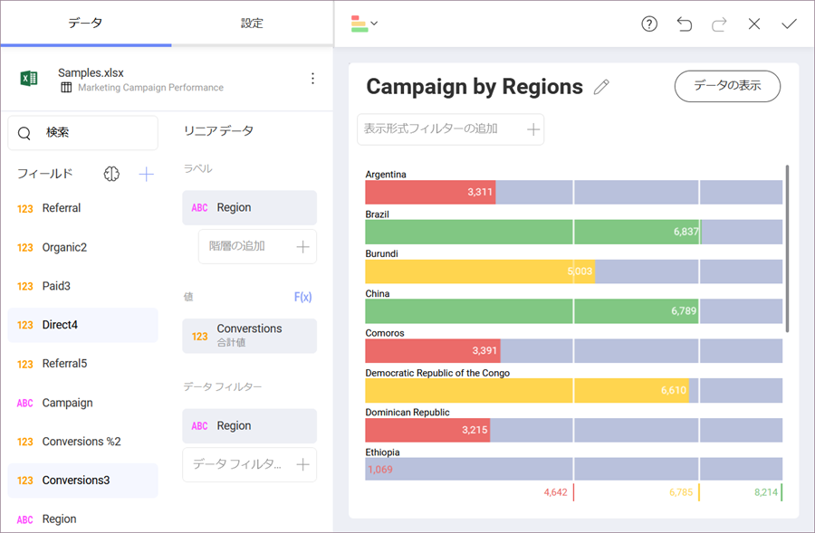
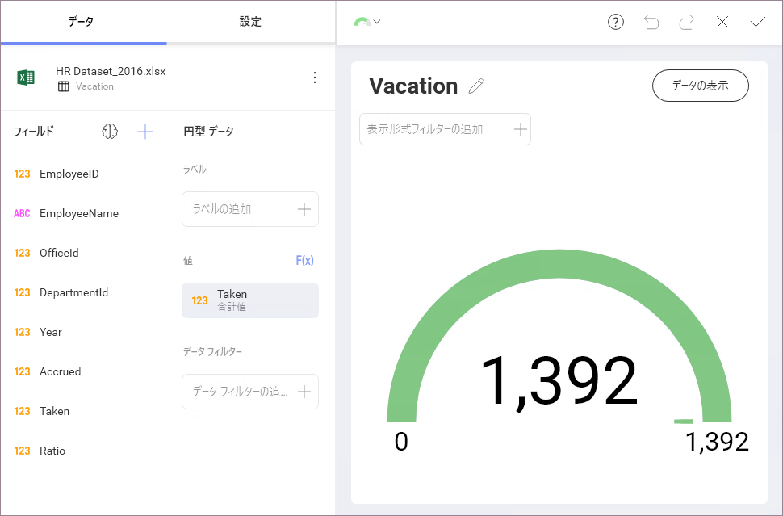
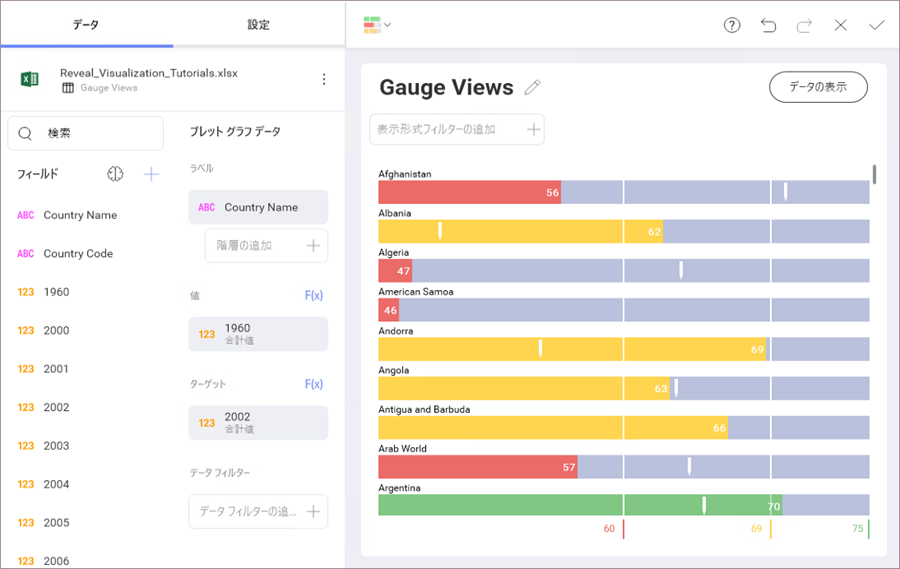

## ゲージ ビュー

ゲージ ビューは単一値を表示します。または、それらを範囲しきい値と比較した値のリストを表示します。ゲージはまた、他の範囲の条件付き書式設定を可能にします。5 つの異なるスタイルがあります: [リニア](linear-gauge.md)、[円形](circular-gauge.md)、[テキスト](text-gauge.md)、[KPI](kpi-gauge.md)、[ブレット グラフ](bullet-graph.md)。

### リニア ゲージ

リニア ゲージは、ラベル、*ラベル*のプレースホルダーの設定から取得された値、および設定*値*のプレースホルダーの値が表示されます。値は、四角形としてチャート化され、バンド内または隣りに数値形式で表示されます。

このゲージ タイプは、行の値を並べて比較することに適しています。

### 円形ゲージ

ラジアル ゲージは、バンドの最小しきい値と最大しきい値、および現在の値を表示します。現在の範囲の色で背景も塗りつぶします。

### テキスト ゲージ

テキスト ゲージは、大きなフォントで Value 列データを表示します。このタイプは、非常に優先度の高いメトリックに適しています。デフォルトでは、いずれかのフィルターが適用されていない限り、選択データ行が異なるようにゲージは最初のデータ行の値列のデータを可視化します。

### ブレット グラフ

ブレット グラフ ゲージは、リニア ゲージに似ていて、*ラベル*のプレースホルダーからラベルを表示し、*値*のプレースホルダーから値を表示します。値は水平線でチャート化され、数字形式で右側にも表示されます。

ブレット グラフは新しいビジュアル インジケーターをリニア ゲージに追加します。*ターゲット* プレースホルダーの目標値をベースにした垂直マークです。これは新しいインジケーターで数値列から取得されます。このビューを構成するには **2 つの数値列とテキスト列が必要**です。

このブレット は、値を左右に並べて比較する際に便利です。また、目標値 (垂直マーク) に対する値 (水平線) からパフォーマンスを評価できます。

#### バンドの構成

各ゲージ タイプは、条件付き書式で使用されるような一般的なバンドの範囲の構成を持っています。構成ダイアログ要件:

  - **制限**。これらの値は自動的に指定された値の列のデータセット内の最高値/最低値として設定されますが、定数値を使用して手動でオーバーライドすることができます。

  - **バンド構成**。このセクションは、ユーザーは 3 つのスペースで範囲を分割するために 2 つのしきい値を設定する必要があります。しきい値は、パーセンテージとして定義または定数値として定義することができます。また、ここに各バンドに関連付ける色を定義する必要があります。デフォルトでは上部のバンドは緑、中央は黄、下部は赤です。

*バンド構成は、Reveal を通じて適用されたフォーマットではなく*、**元のデータに基づいています**。上の円形ゲージでは、表示形式が数値を表示するようにフォーマットされていても、元のデータはパーセンテージで表されています。したがって、選択された**値比較タイプ**は**パーセンテージ**であり、範囲は数値ではなくパーセンテージとして定義されます。
