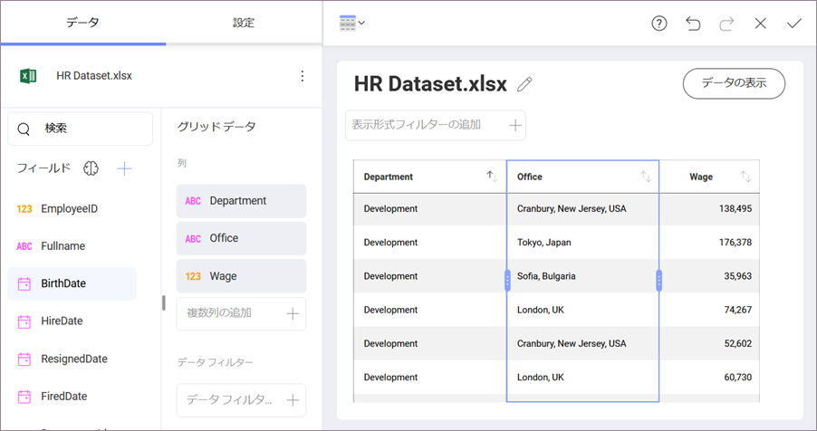
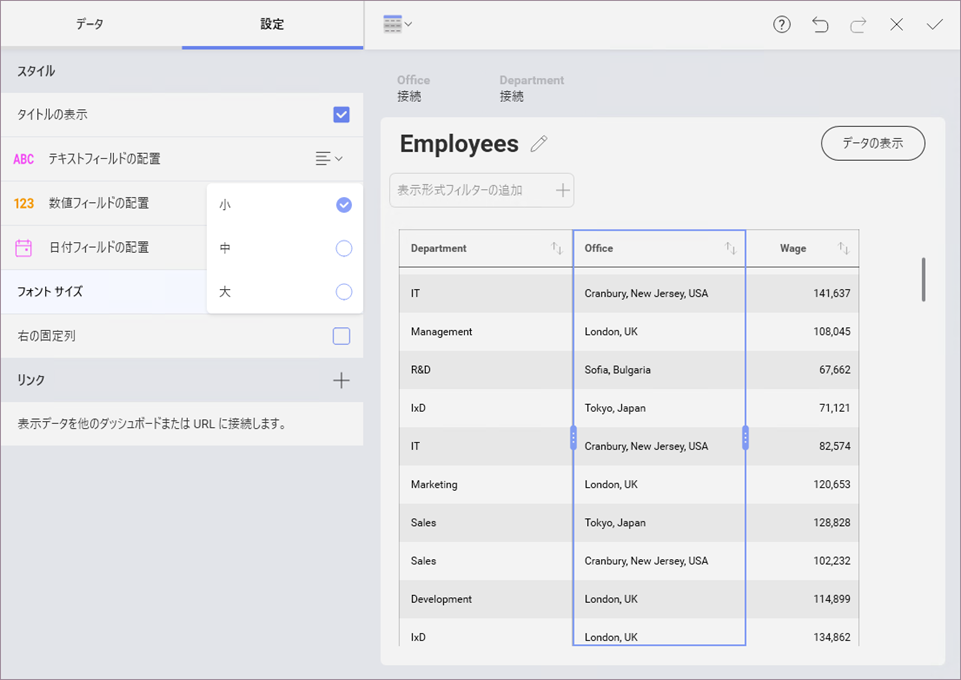
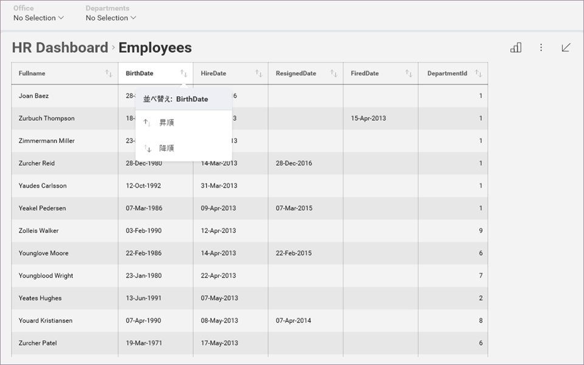
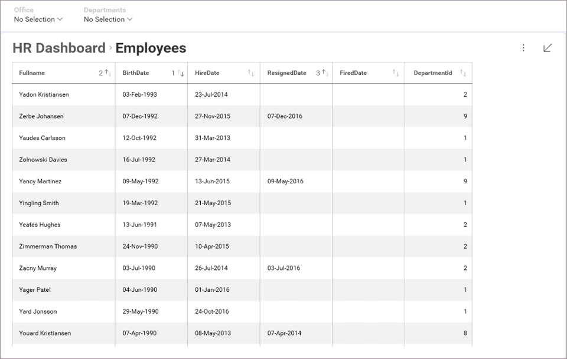
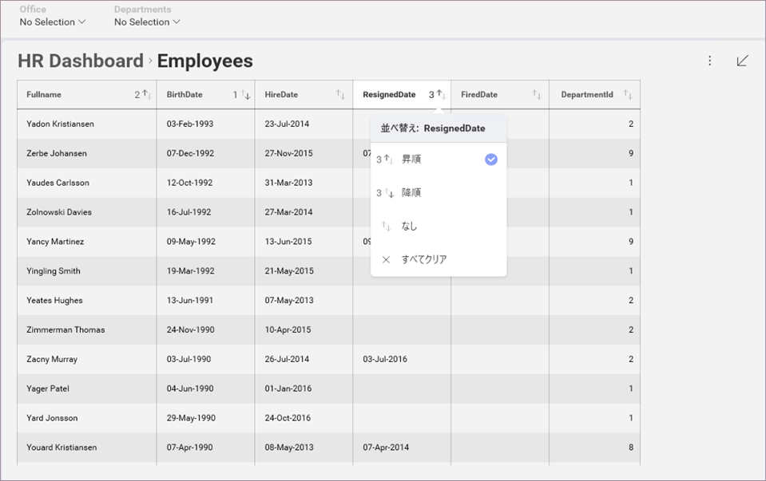

## グリッド ビュー

### 表示形式エディターでグリッド ビューを操作する 

グリッド ビューは、情報を行列で表す表示データのデフォルト可視化オプションです。グリッドヘッダーを選択してグリッド内の**列の幅を変更する**ことができます。それによってグリッド内の列を強調表示し、列ヘッダーのサイズ変更ハンドルをドラッグします。列幅を変更するには右または左へスライドさせます。

**設定**でフォント サイズを変更できます。デフォルト サイズは *[小]* です。*中サイズ*では 2px 大きくなり、*大サイズ*は 4px 大きくなります。

先頭列を固定配置に設定するには、**設定**の下の*先頭列の固定*オプションをチェックします。これは、特に多くの列を処理する場合に便利です。

>[!NOTE]
>行数および列が 10 より小さい場合、グリッド ビューはダッシュボードに適しています。少量のデータを扱っている場合、数字だけを表示するのが適切な方法となる場合があります。

### ダッシュボード ビュー モードで列を並べ替え

[ダッシュボード ビュー モード](~/jp/dashboards/index.md#view-edit-mode)でグリッド ビューの列の並べ替え (昇順や降順) を変更できます。列名の横にある矢印ボタンを選択して変更できます。

複数の並べ替え条件を適用できます。既存の列ヘッダーの横に小さな番号が表示されます。矢印の方向は、昇順または降順のどちらの並べ替えを適用したかを判断するのに役立ちます。

並べ替えオプションは、[すべてクリア] または [なし] で削除できます。他に削除されていない並べ替えオプションがある場合、順序は列ヘッダーの横の番号によって決定されます。

