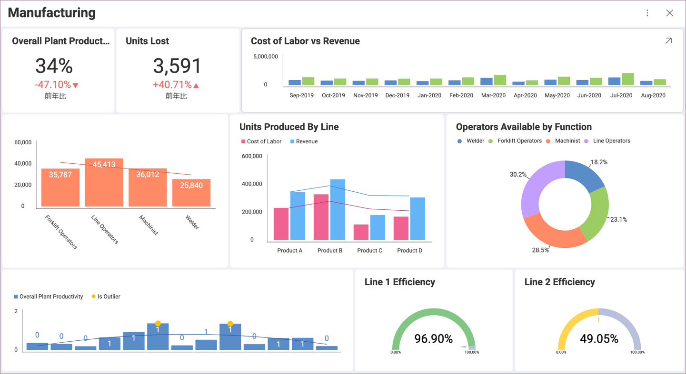

## データ表示形式

Reveal は、さまざまな表示形式を提供することにより、ビジネス データから可能な限り多くの気付きを得るのに役立ちます。

### 表示形式の概要

Add description here.

### 適切なチャート タイプの選択

### トピックの概要 - delete 

表示形式タイプはいくつかあります。

  - [グリッド ビュー](visualization-types/grid-chart.html)

  - [ピボット テーブル](visualization-types/pivot-table.html)

  - [テキスト ビュー](visualization-types/text-view.html)

  - [画像ビューアー](visualization-types/image-chart.html)

  - [ブレット グラフ](visualization-types/gauge-charts.html#bullet-graph)、[円形](visualization-types/gauge-charts.html#circular-gauge)、[KPI](visualization-types/kpi-gauge.html)、[リニア](visualization-types/gauge-charts.html#linear-gauge)、および [テキスト](visualization-types/gauge-charts.html#text-gauge) ゲージを含むゲージ ビュー。

  - [カテゴリ](visualization-types/category-charts.html)、[コンボ](visualization-types/combo-charts.html)、[ファイナンシャル](visualization-types/financial-charts.html)、[ラジアル](visualization-types/radial-charts.html)、[散布とバブル](visualization-types/scatter-bubble-charts.html)、[スパークライン](visualization-types/sparkline-charts.html)など、いくつかの種類のチャート。

  - [テキスト ボックス表示形式](visualization-types/text-box.html)

### 次の手順

Creating a vis in the Visualizations editor - link 

### 表示形式チュートリアル - delete; leave only a link to the Overview

このセクションでは、Reveal の表示形式の作成手順を説明します。すべてのセクションのデータ ビジュアライゼーションに使用しているデータソースは、[こちら](http://download.infragistics.com/reportplus/help/samples/Reveal_Visualization_Tutorials.xlsx)からダウンロードしてください。表示形式がサポートされる各ウィジェットの情報については、ヘルプの [データ表示] セクションを参照してください。

<table>
<colgroup>
<col style="width: 20%" />
<col style="width: 20%" />
<col style="width: 20%" />
<col style="width: 20%" />
<col style="width: 20%" />
</colgroup>
<tbody>
<tr class="odd">
<td>
 

<a href="~/en/visualization-tutorials/simple-charts.md">エリア。</a> 

</td>
<td>
 

<a href="~/en/visualization-tutorials/simple-charts.md">棒</a> 

</td>
<td>
 

<a href="~/en/visualization-tutorials/gauge-views.md">ブレット グラフ</a> 

</td>
<td>
 

<a href="~/en/visualization-tutorials/candlestick-chart.md">ローソク足</a> 

</td>
<td>
 

<a href="~/en/visualization-tutorials/gauge-views.md">円形</a> 

</td>
</tr>
<tr class="even">
<td>
 

<a href="~/en/visualization-tutorials/simple-charts.md">柱状</a> 

</td>
<td>
 

<a href="~/en/visualization-tutorials/simple-charts.md">ドーナツ型</a> 

</td>
<td>
 

<a href="~/en/visualization-tutorials/simple-charts.md">ファンネル</a> 

</td>
<td>
 

<a href="~/en/visualization-tutorials/image-view.md">画像</a> 

</td>
<td>
 

<a href="~/en/visualization-tutorials/kpi-gauge.md">KPI</a> 

</td>
</tr>
<tr class="odd">
<td>
 

<a href="~/en/visualization-tutorials/simple-charts.md">折れ線</a> 

</td>
<td>
 

<a href="~/en/visualization-tutorials/gauge-views.md">リニア</a> 

</td>
<td>
 

<a href="~/en/visualization-tutorials/ohlc-chart.md">OHLC チャート</a> 

</td>
<td>
 

<a href="~/en/visualization-tutorials/simple-charts.md">円</a> 

</td>
<td>
 

<a href="~/en/visualization-tutorials/simple-charts.md">ラジアル</a> 

</td>
</tr>
<tr class="even">
<td>
 

<a href="~/en/visualization-tutorials/sparkline-charts.md">スパークライン</a> 

</td>
<td>
 

<a href="~/en/visualization-tutorials/simple-charts.md">スプライン</a> 

</td>
<td>
 

<a href="~/en/visualization-tutorials/simple-charts.md">スプライン エリア</a> 

</td>
<td>
 

<a href="~/en/visualization-tutorials/stacked-charts.md">積層型エリア</a> 

</td>
<td>
 

<a href="~/en/visualization-tutorials/stacked-charts.md">積層型棒</a> 

</td>
</tr>
<tr class="odd">
<td>
 

<a href="~/en/visualization-tutorials/stacked-charts.md">積層型柱状</a> 

</td>
<td>
 

<a href="~/en/visualization-tutorials/simple-charts.md">ステップ エリア</a> 

</td>
<td>
 

<a href="~/en/visualization-tutorials/simple-charts.md">ステップ折れ線</a> 

</td>
<td>
 

<a href="~/en/visualization-tutorials/gauge-views.md">テキスト</a> 

</td>
<td>
 

<a href="~/en/visualization-tutorials/text-view.md">テキスト ビュー</a> 

</td>
</tr>
</tbody>
</table>
