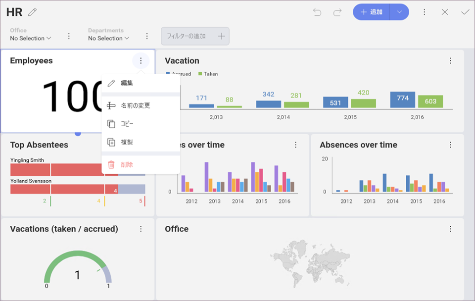

# 表示形式の再利用

表示形式を再利用してダッシュボードの作成をスピード アップできます。必要な表示形式を**コピーし貼り付けて**ください。

## 表示形式の複製

ダッシュボード内で元の表示形式と同じものを作成します。既にカスタマイズした表示形式を複製して、複製したデータ セットを調整します。たとえば、以下のチャートはすべてのオフィスの雇用を示し、特定のものを別に表示します。

## 表示形式のコピーと貼り付け

ダッシュボード内、またはダッシュボード間の任意の表示形式をコピーし貼り付けることができます。注: 他のダッシュボードの表示形式を使用して新しいダッシュボードを作成できます。

## 考慮点

新しい表示形式は元の表示形式と**同じ名前**になります。

[ダッシュボード編集モード](../dashboards/overview.html)の表示形式のオーバーフロー メニューから **[名前の変更]** を選択できます。鉛筆アイコンを使用して、[表示形式エディター](../data-visualizations/visualizations-editor.html)でタイトルを変更することもできます。

元の表示形式に**データ エディターのデータ**がある場合、新しい表示形式にもこのデータが使用されます。必要に応じて、データ エディターからフィールドを削除します。
