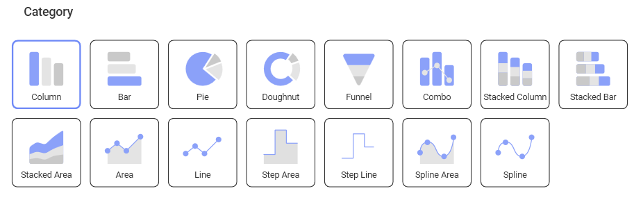
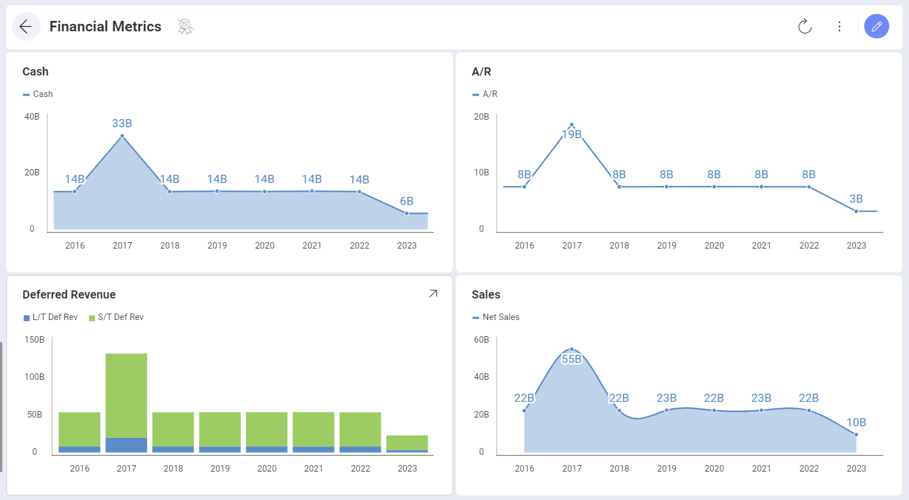
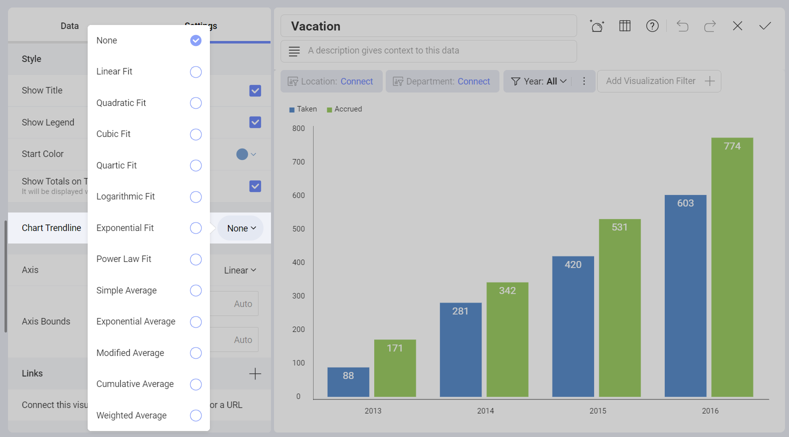
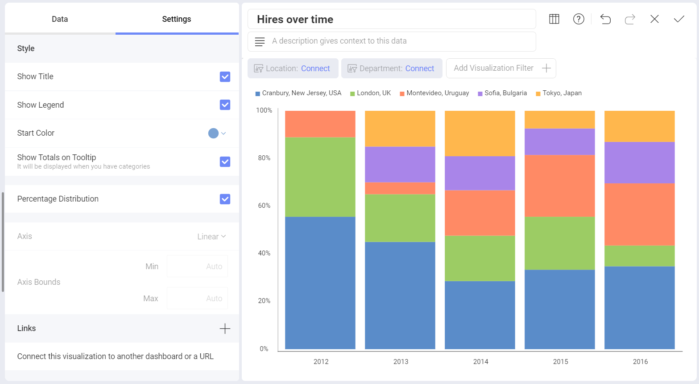
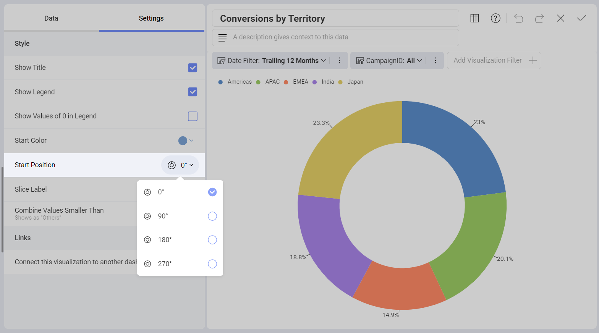
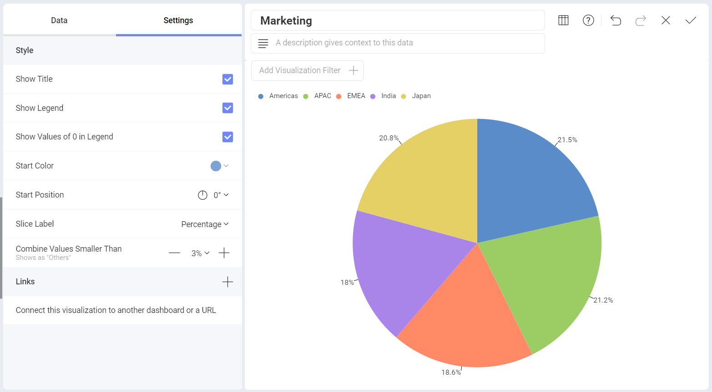

# カテゴリ チャート

これらのチャートを使用して、カテゴリを定量的情報に関連付けます。

データに適している限り、表示形式オプション メニューに表示されたチャート アイコンをどれでも選択できます。Reveal はデータセットの最初の数字の列を選択し、選択したチャート タイプのデータ系列の要件と一致させようと試みます。

たとえば、柱状チャートでは、すべての数値列がチャートに追加されます。Reveal の列の自動選択は、チャートの設定の構成で変更できます。

## チャートの近似曲線

チャートの設定でトレンドラインの表示を有効にできます。このラインはアルゴリズムに基づいてチャートにラインを表示します。近似曲線でデータセットの傾向を把握し、意思決定のためのしきい値を定義できます。
サポートされるトレンドラインは、二次フィット、キュービック フィット、四次フィット、対数フィット、指数フィト、べき乗フィット、単純平均、指数平均、修正平均、累加平均、加重平均です。

## パーセンテージの配分

積層型シリーズ チャートにもこの機能を構成できます。0-100 のデフォルト スケールを上書きして、チャートで値のパーセンテージ配分を表示形式できます。

## 開始位置とスライス ラベル

円チャートおよびドーナツ チャートでチャートのスライスを回転する開始位置を構成し、データの表示順序を変更できます。

ファンネル、円チャート、およびドーナツ型チャート、値やパーセンテージ、またはその両方を同時に表示するスライス ラベルを構成できます。

## 値 0 の要素を表示するために円チャートおよびドーナツ チャートの凡例を有効化

円およびドーナツ チャートの表示形式の凡例には、[ラベル] に選択されたフィールドのすべてのデータ (値 0 の要素を含む) を表示するオプションがあります。

この設定を有効にするには、以下の画像のように、表示形式エディターの [設定] に移動し、[0 (ゼロ) 値を凡例に表示] を選択します。

