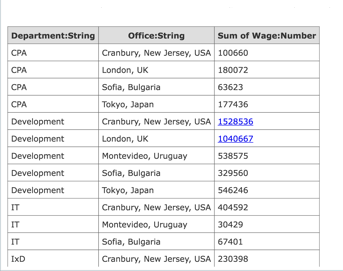
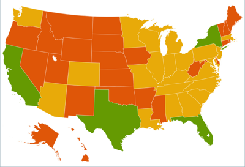
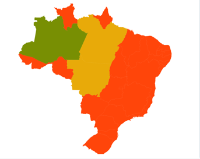
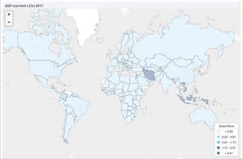
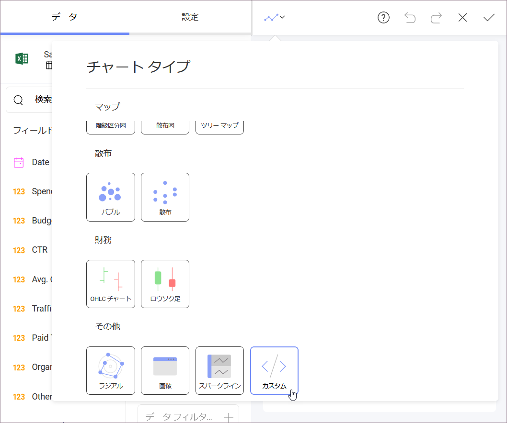
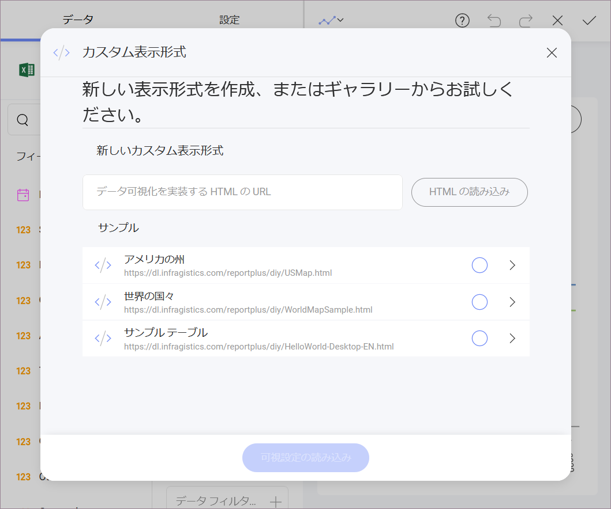

# カスタム表示形式

Reveal は、グリッド チャート、ゲージ チャート、マップなどのチャート タイプなど、複数の表示形式コンポーネントを提供します。ただし、既成またはサポートされる方法以外の表示形式を使用したい場合があります。そのような場合に Reveal ではカスタムに表示するコンポーネントがサポートされており、Reveal ダッシュボードの一部として表示形式に表示します。

## サンプル DIY 表示形式

<table class="tg">
<thead>
  <tr>
    <th class="tg-x3gl"> カスタム フォント、タイトル、および幅のテーブル </th>
    <th class="tg-x3gl"> 州別の米国の人口の Cloropleth マップ </th>
  </tr>
</thead>
<tbody>
  <tr>
    <td class="tg-spkm"> 州別のブラジルの人口の Cloropleth マップ </td>
    <td class="tg-2ovq"> 世界の GDP の Cloropleth マップ </td>
  </tr>
</tbody>
</table>

## カスタム表示形式の使用方法

1. **[カスタム] 表示形式を選択する**。 

   このオプションを見つけるには、ウィジェット エディター内の表示形式セクションを開きます。

   

2. **実装をポイントする**。  

   必要なカスタム表示形式を生成する Web ページの URL を追加します。

   

   URL はパブリック アクセス可能であり、HTTPS:// プロトコルを使用する必要があることに注意してください。さらに、カスタム HTML で参照される各リソースは同じプロトコルを使用する必要があります。

## カスタム Web ページと Reveal
これらのカスタム Web ページは、サポートされるデータ ソースから Reveal で取得したデータにアクセスできます。カスタム表示形式は、それを目的に Javascript API とインタラクティブに動作します。

カスタム Web ページは、パブリック URL アドレスまたはイントラネットの内部共有場所として参照できます。

>[!NOTE]
>**Reveal Web の制限/要件**
>Reveal Web は、コンポーネントがパブリック URL でホストされているカスタム表示形式のみを描画できます。

ここに、カスタム HTML 表示形式に関する[**ステップバイステップのチュートリアル**](diy-visualization-step-by-step.md)があります。この基本的な HelloWorld サンプルは、Reveal から取得したデータセットを使用してテーブルを生成します。
