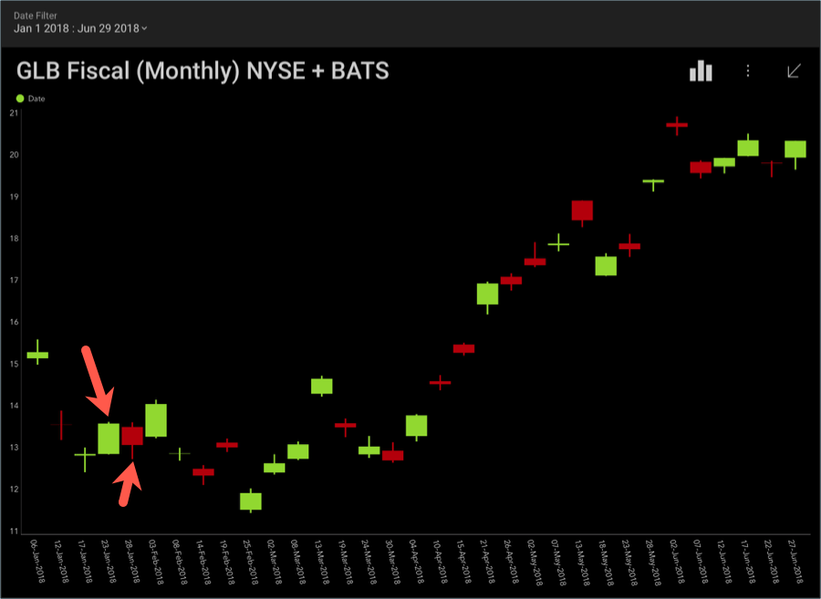

## 財務チャート

財務チャートは、終日の株価の動き (始値と終値、最高値と最低値) を表すために使用されます。

各ロウソクまたは OHLC セクションの色は、終値が開始値を下回っているか上回っているかを表すためのものです。

たとえば、上のスクリーンショットでは、1 月 23 日の終値が始値より高くなっています。しかし、ロウソクの赤色が示すように、1 月 28 日の終値は始値より低くなっています。
