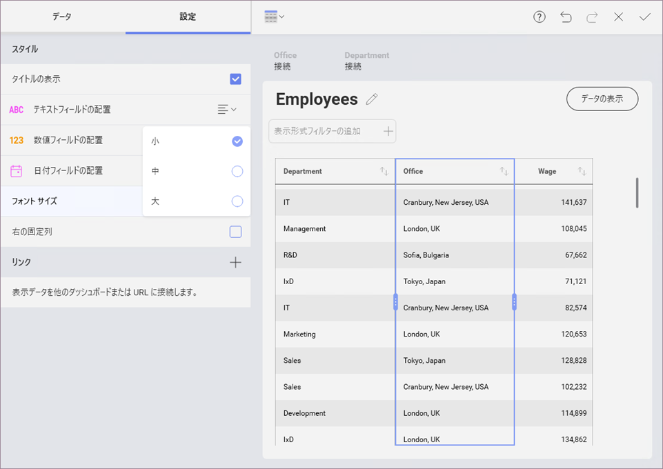
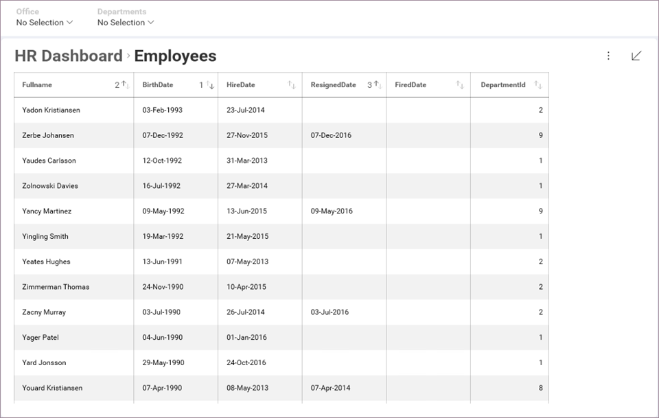

## グリッド チャート

### 表示形式エディターでグリッド チャートを操作する 

グリッド チャートは、データを表示するためのデフォルトの視覚化オプションであり、情報を行列で表示します。グリッド ヘッダーを選択してグリッド内の**列の幅を変更する**ことができます。それによってグリッド内の列を強調表示し、列ヘッダーのサイズ変更ハンドルをドラッグします。列幅を変更するには右または左へスライドさせます。

**[設定]** で [フォント サイズ] を変更できます。デフォルト サイズは [小] です。[中] サイズでは 2px 大きくなり、[大] サイズは 4px 大きくなります。

先頭列を固定配置に設定するには、**[設定]** の下の [最初の固定列] オプションをチェックします。これは、特に多くの列を処理する場合に便利です。

>[!NOTE]
>行数および列が 10 より小さい場合、グリッド チャートはダッシュボードに適しています。少量のデータを扱っている場合、数字だけを表示するのが適切な方法となる場合があります。

### ダッシュボード ビュー モードで列を並べ替える

**ダッシュボード ビュー モード**でグリッド チャートの列の並べ替え (昇順や降順) を変更できます。列名の横にある矢印ボタンを選択して変更できます。

複数の並べ替え条件を適用できます。既存の列ヘッダーの横に小さな番号が表示されます。矢印の方向は、昇順または降順のどちらの並べ替えを適用したかを判断するのに役立ちます。

並べ替えオプションは、[すべてクリア] または [なし] で削除できます。他に削除されていない並べ替えオプションがある場合、順序は列ヘッダーの横の番号によって決定されます。

